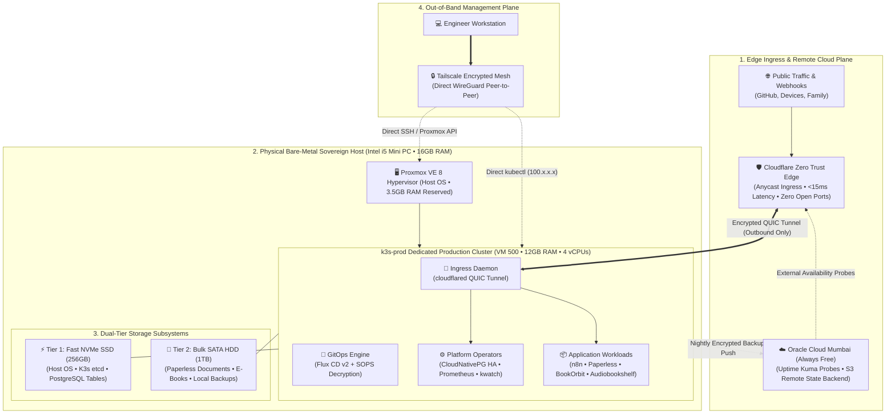
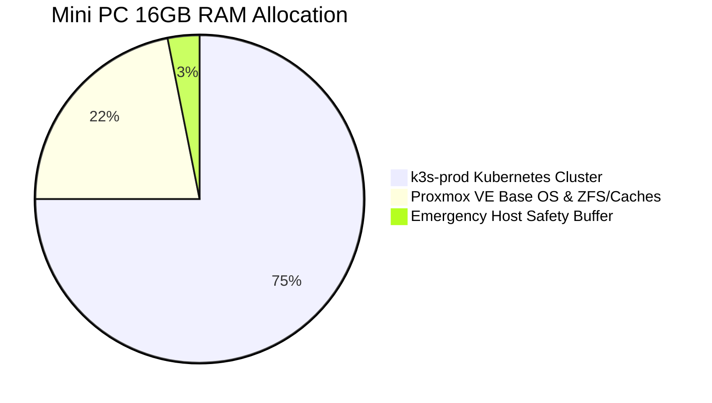

# Homelab-Ops: Sovereign Cloud Infrastructure & GitOps Platform

<p align="center">
  
  
  
  
  
  
  
  
  
  
</p>

---

## 🧭 Executive Overview: The Project at a Glance

**Homelab-Ops** is a production-grade, self-healing **Sovereign Cloud Platform** engineered on physical bare-metal hardware in Mumbai, India, extended by an out-of-band Always Free tenancy on Oracle Cloud Infrastructure (OCI).

This platform is built to solve the real-world dilemmas every platform engineer faces when deploying production systems on constrained resources:

1. **Carrier-Grade NAT (CGNAT) Traversal:** Securely accepting external webhooks and user traffic without exposing home router ports or leasing expensive public IPv4 addresses.
2. **Deterministic GitOps Continuous Delivery:** Managing platform operators and applications declaratively with **Flux CD v2** and **Mozilla SOPS**, eliminating manual configuration drift and keeping secrets encrypted in Git.
3. **Dual-Tier Hardware Economics:** Overcoming disk I/O bottlenecks on a single Mini PC by partitioning high-IOPS NVMe flash for database engines and durable SATA mechanical disks for multi-terabyte media and document archives.
4. **Resilient 3-2-1 Disaster Recovery & FinOps:** Operating a self-healing cluster with zero recurring cloud subscription costs (₹0.00/month) backed by independent, off-site availability probes and cloud-replicated encrypted snapshots.

---

## 🏛️ System Architecture Topology

The diagram below outlines the core architectural boundaries—separating public edge routing, isolated bare-metal compute, tiered storage, and the out-of-band management plane:



---

## 📖 The Engineering Story: From Bare Metal to Sovereign GitOps

### Act I: The Bare-Metal Foundation
Every robust platform begins with hardware reality. The physical core is an ultra-efficient Intel Core i5 Mini PC with 16GB DDR4 RAM, a 256GB NVMe SSD, and a 1TB SATA mechanical drive. 

To turn this single machine into a resilient cloud, **Proxmox VE 8** was installed as the bare-metal Type-1 hypervisor. By budgeting resources strictly—reserving 3.5GB of RAM for the host kernel, ZFS/ext4 caches, and backup snapshot compression—a dedicated virtual machine (`k3s-prod`) was allocated **12GB RAM and 4 vCPUs**, giving Kubernetes workloads plenty of memory buffer while guarding the physical machine against out-of-memory (OOM) kernel panics.

### Act II: Breaking the CGNAT Barrier (Zero Trust Ingress)
Residential internet connections rarely provide static public IP addresses; worse, they are almost universally trapped behind **Carrier-Grade NAT (CGNAT)**, making traditional port-forwarding impossible or hazardous.

* **Early Experiments:** Early iterations routed traffic through a cloud VM in South Carolina running WireGuard. While functional, it introduced ~500ms cross-continental latency and accrued recurring monthly compute and NAT charges.
* **The Sovereign Solution:** The architecture shifted to **Cloudflare Zero Trust Anycast Tunnels (`cloudflared`)**. Operating as an in-cluster daemon, `cloudflared` initiates outbound-only QUIC connections to Cloudflare's nearest edge data centers (Mumbai, Delhi, Chennai). Public webhooks and traffic terminate at the edge in **<15ms**, protected by Cloudflare WAF and DDoS mitigation, with **zero open inbound ports on the home firewall**.

### Act III: GitOps Continuous Delivery & In-Git Secrets
Operating a homelab through ad-hoc `kubectl apply` commands or imperative Ansible scripts leads to configuration drift and operational fog.

The modern platform adopts a pure **GitOps Continuous Delivery** model powered by **Flux CD v2**:
* The cluster continuously synchronizes its desired state from this Git repository every 10 minutes.
* Workload reconciliation is deterministically ordered: platform foundations (storage classes, operators, ingress daemons) must become healthy before application workloads are scheduled (`apps` depends on `platform`).
* Sensitive tokens and database passwords are encrypted declaratively using **Mozilla SOPS + Age**. Because secrets remain encrypted in Git, they can be safely reviewed in pull requests, while the in-cluster Flux decryptor hydrates them into memory without leaving plaintext traces on physical disks.

### Act IV: Storage Economics & Stateful High Availability
Single-node virtualization often stumbles when high-IOPS database queries compete with heavy background disk writes:
* **Storage Tiering:** Fast NVMe storage is dedicated strictly to the OS, K3s state, and PostgreSQL data files. Multi-terabyte document indexing (Paperless-ngx) and audio/book streaming libraries are routed directly to the high-capacity 1TB SATA mechanical disk.
* **Database Modernization:** Rather than deploying fragile, static database pods, relational data is managed by the **CloudNativePG Operator**. The operator provides automated PostgreSQL lifecycle management, health monitoring, self-healing failover, and Write-Ahead Log (WAL) archiving.

### Act V: Out-of-Band Resilience & True 3-2-1 Disaster Recovery
A monitoring system running inside the cluster it is supposed to monitor cannot alert you when the cluster itself dies. Furthermore, local backups are useless if the physical host suffers hardware failure.

To achieve enterprise-grade resilience at **₹0.00 cloud cost**, the architecture integrates **Oracle Cloud Infrastructure (OCI) Always Free tier (Mumbai)**:
* **Out-of-Band Probes:** An independent lightweight VM in OCI Mumbai runs **Uptime Kuma**, continuously polling public endpoints (`https://docs.vijaysingh.cloud`, `https://hooks.vijaysingh.cloud`) over the public internet and dispatching alerts to Slack/Discord if homelab broadband or power fails.
* **Offsite State & Backups:** Terraform state is stored securely in an OCI Object Storage S3-compatible bucket, and nightly encrypted Restic backups are pushed offsite, fulfilling the **3-2-1 backup rule** (3 copies, 2 media types, 1 offsite).

---

## ⚡ Core Architecture Pillars

| Architectural Pillar | Core Technologies | How It Solves the Problem |
| :--- | :--- | :--- |
| **Zero-Trust Edge & Ingress** | Cloudflare Zero Trust, `cloudflared`, Traefik | Traverses CGNAT with outbound-only QUIC tunnels; provides edge WAF and reduces latency to <15ms. |
| **GitOps Continuous Delivery** | Flux CD v2, Kustomize, GitHub | Pull-based reconciliation loop eliminates configuration drift; deterministic ordering ensures zero failed boots. |
| **In-Git Secret Decryption** | Mozilla SOPS, Age Cryptography | Secrets versioned declaratively in Git with asymmetric encryption; decrypted exclusively in-memory by Flux. |
| **Dual-Tier Storage Strategy** | NVMe Flash (256GB), SATA Mechanical (1TB) | Isolates high-IOPS database operations from bulk document indexing and media streaming workloads. |
| **Stateful Resilience & HA** | CloudNativePG (PostgreSQL Operator) | Self-healing relational database clustering with automated failover and continuous WAL archiving. |
| **Out-of-Band Observability** | OCI Mumbai, Uptime Kuma, Prometheus, kwatch | Independent external heartbeat monitoring and pod crash notifications; operates even during power/ISP outages. |

---

## 📦 Application Fleet & Workload Catalog

All services are containerized, declared in Git, and routed through Cloudflare Zero Trust:

```
Platform & Security
├── cloudflared             # High-availability Anycast edge ingress tunnel
├── postgres-operator       # CloudNativePG enterprise PostgreSQL lifecycle operator
├── homepage                # Homelab Command Center (Live CPU/RAM & status portal)
├── monitoring              # Prometheus metrics scraping & Grafana telemetry
├── kwatch                  # Instant Discord/Slack notifier for crashed pods
└── docs                    # MkDocs Material engineering handbook (docs.vijaysingh.cloud)

Operations & Workflow Automation
├── n8n                     # Hardened event-driven workflow automation engine
└── pdf-generator           # Automated document compilation microservice

Sovereign Documents & Media (1TB HDD Tier)
├── paperless-ngx           # OCR document ingestion, tagging, and search archive
├── bookorbit               # Multi-user digital book library & sync manager
└── audiobookshelf          # Audiobook and podcast streaming server

Productivity & Personal Health
├── miniflux                # Ultra-fast, lightweight Go RSS reader
├── linkding                # Bookmarking service with tag search
└── ryot / wger             # Fitness analytics and workout tracking platform
```

---

## 🖥️ Physical Hardware & Resource Budgeting



* **Physical Node:** Intel Core i5 Mini PC (4 Cores / 8 Threads)
* **Total Host RAM:** 16,384 MB (16 GB DDR4)
* **Production Cluster Allocation (`k3s-prod` VM 500):**
  - **Memory:** 12,288 MB (12 GB RAM) — gives >60% memory headroom for peak OCR ingestion and database queries.
  - **Compute:** 4 vCPUs dedicated to Kubernetes scheduler.
  - **Storage:** 50GB NVMe root disk + 1TB SATA HDD attached virtual disk.
* **Proxmox VE Host OS Allocation:**
  - **Memory:** 3,500 MB (3.5 GB RAM) reserved for Debian kernel, KVM hypervisor daemons, and `vzdump` backup compression.
  - **Storage:** ~20GB NVMe root partition for hypervisor binaries and ISOs.

---

## 📚 Deep-Dive Engineering Documentation

To explore the low-level configurations, decision rationales, and incident post-mortems, navigate through the specialized engineering guides:

### 1. Architecture Decision Records (ADRs)
* **[Comprehensive ADR Register](process/architecture_decision_records.md)** — 16 formal Architecture Decision Records detailing every major technical pivot (ADR-001 through ADR-016).

### 2. Execution Phases & Implementation Manuals
* **[Phase 1: Architecture Baseline](docs/execution-phases/01-phase-1-architecture-baseline.md)** — Hardware allocation baseline and architectural blueprint alignment.
* **[Phase 2: Codebase Pruning & Debt Elimination](docs/execution-phases/02-phase-2-codebase-pruning.md)** — Purging idle lab planes and reclaiming 7.5GB RAM.
* **[Phase 3: OCI Remote State Backend](docs/execution-phases/03-phase-3-oci-remote-state.md)** — Migrating Terraform state to Oracle Cloud S3-compatible object storage.
* **[Phase 4: Proxmox Host Consolidation](docs/execution-phases/04-phase-4-proxmox-consolidation-k3s-resizing.md)** — Resizing `k3s-prod` to 12GB RAM and configuring SATA drive mounts.
* **[Phase 5: Cloudflare Ingress Modernization](docs/execution-phases/05-phase-5-gcp-decommissioning-cloudflare-ingress.md)** — Terminating paid cloud relays and deploying zero-latency edge tunnels.
* **[Phase 6: GitOps Bootstrap & SOPS Secrets](docs/execution-phases/06-phase-6-gitops-bootstrap-sops.md)** — Bootstrapping Flux CD v2 and configuring Age asymmetric encryption.
* **[Phase 7: Application Fleet Deployment](docs/execution-phases/07-phase-7-application-fleet-deployment.md)** — Onboarding CloudNativePG, Paperless, and Uptime Kuma monitoring.

### 3. Engineering Guides & Post-Mortems
* **[Proxmox Bare-Metal Setup](docs/02-proxmox-setup.md)** & **[Proxmox Recovery Guide](docs/99-proxmox-recovery-guide.md)**
* **[Terraform Modularization](docs/10-terraform-modularization.md)** & **[Secret Hydration Patterns](docs/12-secret-management-hydration.md)**
* **[K3s Optimization & Security](docs/14-k3s-optimization-and-security.md.md)** & **[WAN Debugging Post-Mortem](docs/08-debugging-wan-connectivity.md)**

---

## 🛠️ Quick Operator Runbook

### Secret Encryption Workflow (SOPS + Age)
```bash
# Encrypt an updated Kubernetes Secret manifest before committing to Git
sops --encrypt --in-place kubernetes/apps/n8n/secret.enc.yaml

# Directly edit an encrypted secret file using your default editor
sops kubernetes/apps/n8n/secret.enc.yaml
```

### GitOps Synchronization
```bash
# Force immediate reconciliation of the platform layer
flux reconcile kustomization platform --with-source

# Force immediate reconciliation of the application layer
flux reconcile kustomization apps --with-source
```

### Out-of-Band Host Administration (Tailscale Mesh)
```bash
# Direct SSH access to the Proxmox VE hypervisor
ssh root@100.108.178.93

# Direct SSH access to the Production K3s node
ssh devops@192.168.1.30

# Inspect active Cloudflare tunnel connections
kubectl logs -n cloudflared -l app.kubernetes.io/name=cloudflared --tail=50
```

---

## 👤 Engineering Leadership & Contacts

**Vijay Singh** — DevOps & Platform Engineer  
* **GitHub:** [@vsingh55](https://github.com/vsingh55)  
* **Documentation Portal:** [https://docs.vijaysingh.cloud](https://docs.vijaysingh.cloud)  
* **Homelab Command Center:** [https://home.vijaysingh.cloud](https://home.vijaysingh.cloud)  
* **System Status & Uptime:** [https://status.vijaysingh.cloud](https://status.vijaysingh.cloud)  

---

<p align="center">
  <sub>Engineered with precision, operational discipline, and pride in sovereign platform engineering.</sub>
</p>