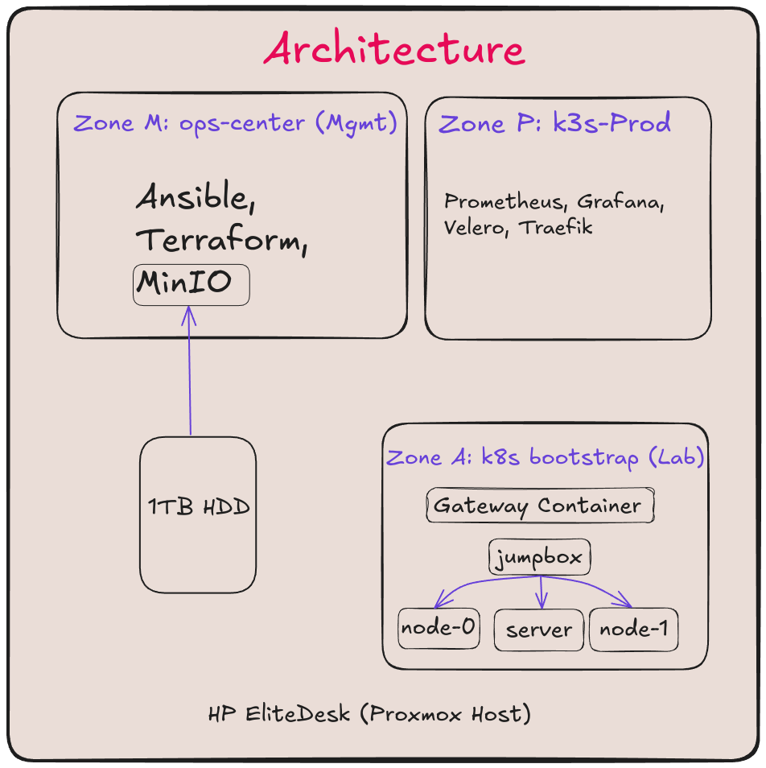

# 🚀 Homelab-Ops: Hybrid Cloud Platform


> **A production-grade DevOps portfolio demonstrating "Infrastructure as Code" principles in a Hybrid Cloud environment (Proxmox + GCP).**

## 📖 Overview
**Homelab-Ops** is an engineering initiative to build a resilient, secure, and automated platform for hosting internal tools (Observability, Documents, Automation). It solves the "CGNAT Barrier" by establishing a **Site-to-Site WireGuard Mesh** between an on-premise Proxmox cluster and a Google Cloud Edge Gateway.

### 🏗 Architecture


* **Zone A (Cloud Edge):** GCP Spot Instances acting as the public ingress and VPN anchor.
* **Zone B (On-Prem Core):** Proxmox VE running K3s (Kubernetes) for workloads and LXC for routing.
* **Connectivity:** WireGuard mesh with automated self-healing (Watchdog).

## Technology Stack
| Layer | Technologies |
| :--- | :--- |
| **Infrastructure** | Terraform (GCP), Proxmox VE, Docker, LXC |
| **Configuration** | Ansible, Jinja2, Cloud-Init |
| **Security** | Ansible Vault (AES-256), WireGuard, SSH Keys |
| **Orchestration** | K3s (Kubernetes), Docker Compose |
| **Observability** | Prometheus, Grafana, Node Exporter |

## Key Features (v2.0.0)
* **Vault Hydration Pattern:** Automated injection of secrets from Ansible Vault into Terraform variables.
* **Self-Healing Network:** `watchdog-vpn.sh` detects cloud preemption and repairs the VPN tunnel automatically.
* **FinOps Optimized:** Uses GCP Spot instances to keep cloud costs <$5/month.
* **Zero-Trust Access:** No public ports exposed on the home router; all access is via the encrypted tunnel.

## Project Structure
```text
├── configuration/       # Ansible Playbooks, Roles, and Vault
├── infrastructure/      # Terraform Code (GCP & On-Prem Modules)
├── apps/               # Docker/K8s Manifests (Paperless, Traefik)
├── docs/               # Architecture Decision Records (ADRs)
└── scripts/            # Automation utilities (Watchdog, Sync)
```
## Quick Start
### 1. Hydrate Secrets

```Bash

# Generates terraform.tfvars from encrypted Vault
cd configuration
ansible-playbook playbooks/hydrate_infra.yml 
```

### 2. Provision Infrastructure

```Bash
cd infrastructure/gcp
terraform init && terraform apply
```

### 3. Configure Nodes

```Bash
cd configuration
ansible-playbook playbooks/setup_hybrid_vpn.yml
```
Author: Vijay Singh