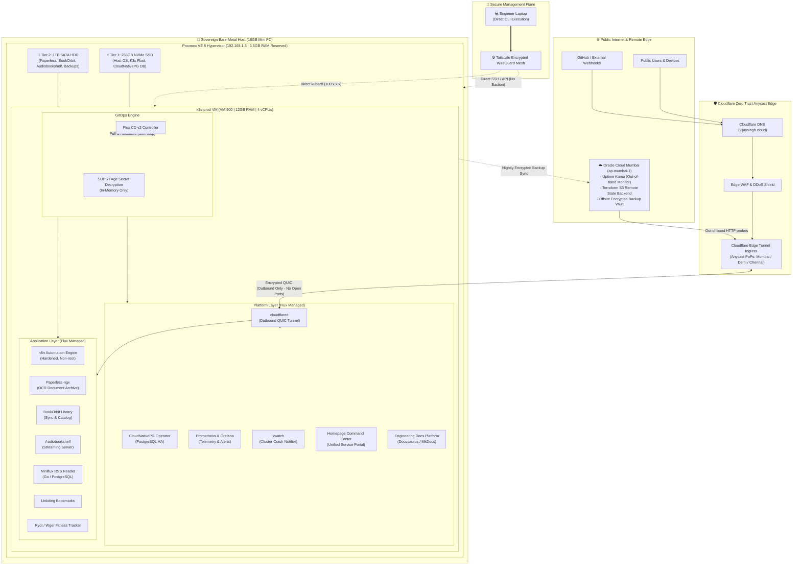
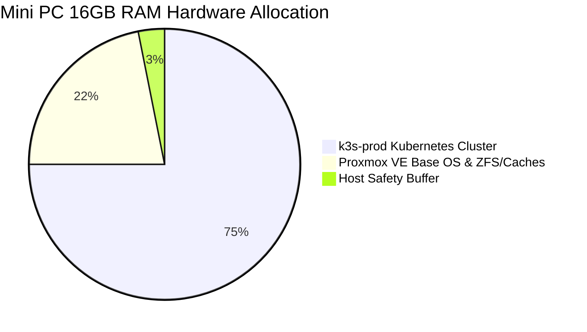

# Homelab-Ops: Sovereign Cloud Infrastructure & GitOps Platform

<div align="center">


-C74634?style=for-the-badge&logo=oracle)


-brightgreen?style=for-the-badge)


</div>

> **"This is not just a server in a closet. It is an enterprise-standard R&D platform simulating real-world engineering constraints—Carrier-Grade NAT traversal, Zero-Trust edge routing, pure pull-based GitOps reconciliation, dual-tier storage economics, and out-of-band disaster recovery—operating with ₹0.00 recurring cloud spend."**

---

## 📌 Executive Architecture Summary

`homelab-ops` is a production-grade, self-healing **Sovereign Cloud Platform** running on bare-metal hardware in Mumbai, India, supplemented by an out-of-band Always Free tenancy on Oracle Cloud Infrastructure (OCI). 

It hosts a suite of stateful services, document management systems, event-driven automation pipelines, and telemetry platforms while strictly adhering to CNCF enterprise patterns:

* **Zero Recurring Cloud Ingress Cost:** Replaced paid GCP compute gateways with **Cloudflare Zero Trust Anycast Tunnels**, cutting edge latency by ~97% (<15ms) with zero open firewall ports.
* **Continuous GitOps Delivery:** **Flux CD v2** automatically reconciles platform operators and containerized applications from this repository with deterministic dependency chaining (`apps` depends on `platform`).
* **In-Git Cryptographic Secret Safety:** Production credentials and tokens are encrypted with **Mozilla SOPS + Age** and committed safely to Git; decrypted exclusively in-memory by the Flux controller inside the cluster.
* **Stateful High Availability:** Managed PostgreSQL cluster operated by **CloudNativePG** with automatic failover, WAL archiving, and health probes.
* **Dual-Tier Storage Architecture:** Mismatched hardware drives partitioned into **Tier 1 Hot NVMe** (high-IOPS OS, etcd, database storage) and **Tier 2 Cold SATA HDD** (1TB storage for document OCR archives, media, and local backups).
* **True Out-of-Band Observability & 3-2-1 DR:** Independent **Uptime Kuma** monitoring running in **OCI Mumbai (ap-mumbai-1)** probes public endpoints independently of local ISP/power uptime, paired with off-site encrypted backup replication.

---

## 📐 End-to-End System Topology



---

## 📊 Quantified Engineering Impact: The Modernization Delta

Before modernizing, the infrastructure relied on fragmented virtual machines, an unoptimized cross-continental cloud relay, and manual push-based configuration. The modernization achieved quantifiable leaps across performance, reliability, and FinOps:

| Dimension / Metric | Legacy Baseline (v1 / v2) | Sovereign Cloud (Current State) | Business & Engineering Impact |
| :--- | :--- | :--- | :--- |
| **Recurring Cloud Ingress Spend** | ~$10 – $15 / month (GCP `e2-micro`, Static IP, NAT) | **₹0.00 / $0.00 per month** | **100% cost reduction** via OCI Always Free + Cloudflare Free Tier |
| **Public Ingress Latency** | ~450ms – 550ms (multi-hop WireGuard relay) | **< 15ms** (Cloudflare Mumbai/Delhi Anycast Edge) | **~97% latency cut**; instantaneous webhook triggers |
| **Firewall & Ingress Attack Surface** | Public VM with open WireGuard port & custom scripts | **Zero open inbound ports** (Outbound QUIC tunnels) | Enterprise DDoS protection, WAF, zero router port forwarding |
| **Host Resource Allocation** | 5 idle lab VMs + bastion (**~7.5GB RAM wasted**) | **1 dedicated `k3s-prod` VM (12GB RAM, 4 vCPUs)** | **>60% memory headroom** for production apps; zero OOMs |
| **Operations Access Topology** | Dual-hop SSH proxy jump via `ops-center` bastion | **Direct Laptop execution over Tailscale mesh** | Zero bastion maintenance, zero latency hops, immediate access |
| **Secret Lifecycle** | Ephemeral `terraform.tfvars` & Ansible Vault push | **Mozilla SOPS + Age** (Decrypted in-memory by Flux) | Native GitOps compliance, zero plaintext secrets in Git or on disk |
| **Database Reliability** | Standalone static PostgreSQL container | **CloudNativePG HA Operator** | Automated self-healing, automated failover, native WAL archiving |
| **Disaster Recovery (DR)** | Single-drive local backup on the same physical host | **True 3-2-1 Offsite DR** (OCI Mumbai S3 Object Storage) | Resilient against total bare-metal hardware failure or theft |
| **Deployment Drift** | Manual `kubectl apply` & push-based playbooks | **Continuous Flux CD v2 reconciliation (10m loop)** | Deterministic self-healing cluster state from Git single source of truth |

---

## 🛠️ Technology Stack & Core Competencies

```
Infrastructure as Code:     Terraform (Modular HCL), Ansible, Cloud-Init
Hypervisor & Compute:       Proxmox VE 8.x (KVM/QEMU), Debian 12, Intel Core i5
Container Orchestration:    Kubernetes (K3s), Containerd, Helm, Kustomize
GitOps & Continuous Sync:   Flux CD v2 (Source Controller, Kustomize Controller)
Secret Management:          Mozilla SOPS, Age Cryptography, Kubernetes Secrets
Edge Ingress & Networking:  Cloudflare Zero Trust (cloudflared), Tailscale WireGuard Mesh
Database & Stateful Ops:    CloudNativePG (PostgreSQL Operator), Local Path Provisioner
Observability & Telemetry:  Prometheus, Grafana, kwatch, Uptime Kuma (Out-of-band)
Storage Architecture:       Tiered Storage (NVMe Hot Tier + SATA HDD Cold Tier)
Remote Cloud Extension:     Oracle Cloud Infrastructure (OCI Always Free - ap-mumbai-1)
Container Registry:         GitHub Container Registry (ghcr.io) via GitHub Actions CI
```

---

## 🏗️ Hardware Architecture & Resource Budgeting

The physical platform is powered by an ultra-efficient Intel Core i5 Mini PC with strict hardware boundary budgets to guarantee zero resource contention:



### Storage & Memory Allocation Breakdown

| Resource Tier | Hardware Device | Allocated Capacity | Operational Role |
| :--- | :--- | :--- | :--- |
| **Host System RAM** | DDR4 Physical Memory | 16,384 MB (16 GB) | Partitioned: 12GB to `k3s-prod`, 3.5GB to Proxmox VE, 0.5GB emergency buffer |
| **Compute Core Allocation** | Intel Core i5 (4 Cores / 8 Threads) | 4 vCPUs Dedicated | Dedicated execution threads for K8s container scheduling and OCR worker spikes |
| **Tier 1: Hot Storage** | 256GB NVMe SSD | ~20GB OS, ~50GB VM Root | High-IOPS disk for Proxmox OS, K3s etcd state, and CloudNativePG database engines |
| **Tier 2: Cold Storage** | 1TB SATA Mechanical HDD | Formatted `ext4` | Attached secondary disk for Paperless document archives, BookOrbit media, and backup snapshots |
| **Tier 3: Offsite DR** | OCI Object Storage (Mumbai) | 10GB Always Free | Encrypted Restic snapshots and offsite Terraform state storage |

---

## 🚀 Application Fleet & Workload Catalog

Every workload running in the cluster is declarative, containerized, and managed via Flux GitOps:

### 1. Operations, Platform & Security
| Workload | Namespace | Public Route / Endpoint | Description |
| :--- | :--- | :--- | :--- |
| **`cloudflared`** | `cloudflared` | Edge Connector | High-availability outbound tunnel daemon connecting cluster services to Cloudflare |
| **`postgres-operator`** | `platform` | Internal Service | CloudNativePG operator providing enterprise PostgreSQL lifecycle management |
| **`homepage`** | `platform` | `https://home.vijaysingh.cloud` | Dynamic operations dashboard displaying live cluster CPU/memory and service statuses |
| **`monitoring`** | `platform` | `https://telemetry.vijaysingh.cloud` | Prometheus metrics scraping and Grafana dashboards for Kubernetes telemetry |
| **`kwatch`** | `platform` | In-Cluster Daemon | Real-time crash monitoring sending instant notifications upon pod restarts or errors |
| **`docs`** | `platform` | `https://docs.vijaysingh.cloud` | Centralized engineering handbook, architecture specs, ADRs, and runbooks |

### 2. Workload Applications
| Workload | Namespace | Public Route / Endpoint | Description |
| :--- | :--- | :--- | :--- |
| **`n8n`** | `apps` | `https://hooks.vijaysingh.cloud` | Hardened workflow automation engine processing webhooks and cron tasks |
| **`paperless-ngx`** | `apps` | `https://docs-ocr.vijaysingh.cloud` | Optical Character Recognition (OCR) document indexing on Tier 2 SATA storage |
| **`bookorbit`** | `apps` | `https://books.vijaysingh.cloud` | Multi-user digital library and ebook sync manager |
| **`audiobookshelf`** | `apps` | `https://audio.vijaysingh.cloud` | Self-hosted audiobook and podcast streaming server |
| **`miniflux`** | `apps` | `https://rss.vijaysingh.cloud` | Minimalist, high-performance Go RSS reader backed by PostgreSQL |
| **`linkding`** | `apps` | `https://links.vijaysingh.cloud` | Fast, tagged bookmark and web asset management service |
| **`wger` / `ryot`** | `apps` | `https://health.vijaysingh.cloud` | Personal workout, fitness analytics, and health tracking platform |

### 3. Out-of-Band Cloud Workloads (OCI Mumbai)
| Workload | Provider | Public Route / Endpoint | Description |
| :--- | :--- | :--- | :--- |
| **`uptime-kuma`** | OCI Compute | `https://status.vijaysingh.cloud` | Independent availability probing and alert dispatch (Slack / Webhook) |
| **`terraform-state`** | OCI Object Storage | S3 API Endpoint | Secure remote state backend with state locking and versioning |

---

## 📁 Repository Structure

The repository is structured to cleanly decouple Infrastructure as Code (Terraform), Configuration Management (Ansible), and declarative Kubernetes manifests (Flux GitOps):

```text
homelab-ops/
├── .github/workflows/          # CI/CD pipelines (Docker builds to GHCR, validation tests)
├── .sops.yaml                  # SOPS encryption rules and Age public key mappings
├── configuration/              # Configuration Management (Ansible)
│   ├── ansible.cfg             # Optimized Ansible settings
│   ├── inventory/              # Dynamic and static inventory (Proxmox, K3s, OCI)
│   ├── playbooks/              # Node provisioning and maintenance playbooks
│   └── roles/                  # Reusable roles (k3s, hardening, docker)
├── docs/                       # Comprehensive Engineering Documentation
│   ├── 01-14-...md             # Deep-dive engineering guides & post-mortems
│   ├── execution-phases/       # Phase 1 to Phase 7 step-by-step execution manuals
│   └── journal/                # Historical engineering logs and project evolutions
├── infrastructure/             # Infrastructure as Code (Terraform)
│   ├── on-prem/                # Proxmox VE provider modules (VMs, cloud-init, storage)
│   ├── oci/                    # Oracle Cloud provider modules (VCN, Compute, Uptime Kuma)
│   └── gcp/                    # Legacy gateway definitions (Archived)
├── kubernetes/                 # Declarative GitOps Manifests (Flux CD v2)
│   ├── bootstrap/              # Flux GitRepository & Kustomization root definitions
│   │   ├── apps.yaml           # App layer sync (dependsOn: platform)
│   │   └── platform.yaml       # Platform layer sync (Cloudflare, Storage, Operators)
│   ├── platform/               # Foundation operators, ingress, monitoring
│   └── apps/                   # Application overlays and stateful deployments
├── process/                    # Architecture Governance & Decision Records
│   └── architecture_decision_records.md # 16 Comprehensive ADRs (ADR-001 - ADR-016)
└── scripts/                    # Operational automation & validation scripts
```

---

## 🗺️ The Engineering Journey: 7 Execution Phases

The current architecture is the culmination of seven systematic engineering phases:

* **[Phase 1: Architecture Baseline & ADRs](docs/execution-phases/01-phase-1-architecture-baseline.md)** — Established single source of truth across architectural blueprints, hardware allocation matrices, and formal ADRs.
* **[Phase 2: Codebase Pruning & Debt Elimination](docs/execution-phases/02-phase-2-codebase-pruning.md)** — Purged obsolete lab modules and idle VM definitions, reclaiming ~7.5GB of RAM overhead.
* **[Phase 3: Offsite State Backend Migration](docs/execution-phases/03-phase-3-oci-remote-state.md)** — Migrated Terraform state from local MinIO to Oracle Cloud Always Free Object Storage in Mumbai with S3-compatible locking.
* **[Phase 4: Proxmox Host Consolidation & K3s Sizing](docs/execution-phases/04-phase-4-proxmox-consolidation-k3s-resizing.md)** — Decommissioned intermediate bastion hosts, resized `k3s-prod` to 12GB RAM / 4 vCPUs, and mounted the 1TB SATA drive.
* **[Phase 5: GCP Decommissioning & Cloudflare Ingress](docs/execution-phases/05-phase-5-gcp-decommissioning-cloudflare-ingress.md)** — Terminated recurring GCP VM costs, deployed `cloudflared` Anycast edge tunnels, and migrated container builds to GHCR.
* **[Phase 6: GitOps Bootstrap & SOPS Secret Management](docs/execution-phases/06-phase-6-gitops-bootstrap-sops.md)** — Bootstrapped Flux CD v2 with Age-encrypted secrets, creating a self-reconciling in-Git deployment pipeline.
* **[Phase 7: Application Fleet Deployment & Verification](docs/execution-phases/07-phase-7-application-fleet-deployment.md)** — Deployed CloudNativePG HA, hardened n8n, document indexing systems, and verified out-of-band monitoring.

---

## 📜 Architecture Decision Records (ADRs)

Key architectural choices are formally documented following the Michael Nygard ADR standard in [process/architecture_decision_records.md](process/architecture_decision_records.md):

| ADR ID | Decision Summary | Primary Driver |
| :--- | :--- | :--- |
| **ADR-001** | Bare-Metal Virtualization via Proxmox VE | Complete hardware isolation & snapshot capability |
| **ADR-002** | Dual-Tier Storage Topology (NVMe vs SATA) | Optimal IOPS allocation under single-node constraints |
| **ADR-005** | Out-of-Band Administrative Access via Tailscale | Elimination of internet-facing SSH ports |
| **ADR-006** | Cloudflare Zero Trust Ingress Modernization | CGNAT traversal, zero open ports, and <15ms Anycast latency |
| **ADR-007** | Pull-Based GitOps Continuous Delivery via Flux CD v2 | Elimination of configuration drift and manual kubectl applies |
| **ADR-008** | Declarative In-Git Secrets Management via Mozilla SOPS | Elimination of external vault overhead while keeping secrets in Git |
| **ADR-010** | PostgreSQL Modernization via CloudNativePG Operator | Enterprise-grade HA, automated failover, and WAL archiving |
| **ADR-011** | Zero-Cost Cloud Extension via OCI Always Free Mumbai | True out-of-band outage detection and offsite backup resilience |
| **ADR-015** | Decommissioning of `ops-center` Bastion | Eliminating proxy hops; executing operations directly via Tailscale |
| **ADR-016** | Code Purge of Academy / Lab Zone Post-Certification | Reclaiming 7.5GB RAM for production application stability |

---

## 💻 Operator Runbook: Common Workflows

### 1. Secret Encryption with SOPS & Age
To encrypt or edit secrets safely within the GitOps pipeline:

```bash
# Encrypt a Kubernetes Secret manifest in place
sops --encrypt --in-place kubernetes/apps/my-app/secret.enc.yaml

# Edit an encrypted secret directly in an ephemeral editor
sops kubernetes/apps/my-app/secret.enc.yaml
```

### 2. Manual GitOps Reconciliation
While Flux automatically reconciles changes every 10 minutes, manual reconciliation can be triggered instantly:

```bash
# Force sync the platform layer
flux reconcile kustomization platform --with-source

# Force sync the application layer
flux reconcile kustomization apps --with-source
```

### 3. Out-of-Band Infrastructure Management
Administrative commands run directly from the engineer's laptop over Tailscale:

```bash
# Direct SSH to Proxmox VE Host (Zero bastions)
ssh root@192.168.1.3   # On LAN
ssh root@100.108.178.93 # Over Tailscale

# Direct SSH to Production Kubernetes Node
ssh devops@192.168.1.30

# Verify Cloudflare Tunnel health
kubectl logs -n cloudflared -l app.kubernetes.io/name=cloudflared --tail=50
```

---

## 👤 Author & Engineering Contacts

**Vijay Singh** — DevOps & Platform Engineer  
* **GitHub:** [@vsingh55](https://github.com/vsingh55)  
* **Homelab Portal:** [https://home.vijaysingh.cloud](https://home.vijaysingh.cloud)  
* **Engineering Documentation:** [https://docs.vijaysingh.cloud](https://docs.vijaysingh.cloud)  
* **Status Page:** [https://status.vijaysingh.cloud](https://status.vijaysingh.cloud)  

---

<div align="center">
<sub>Built with precision, operational discipline, and pride in sovereign engineering.</sub>
</div>