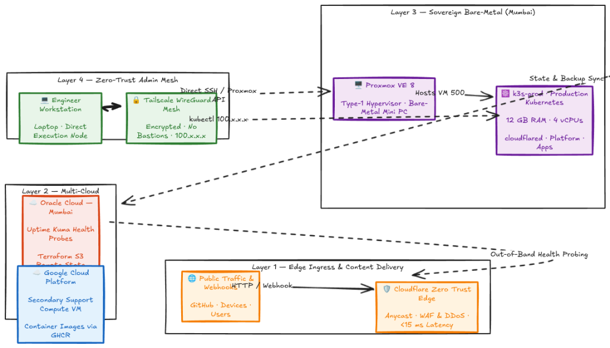
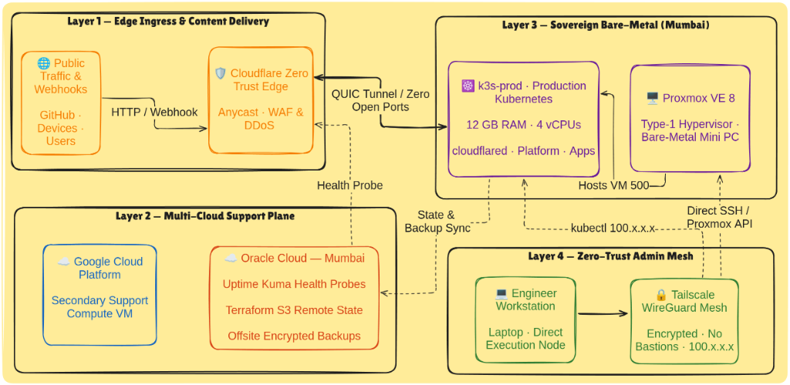
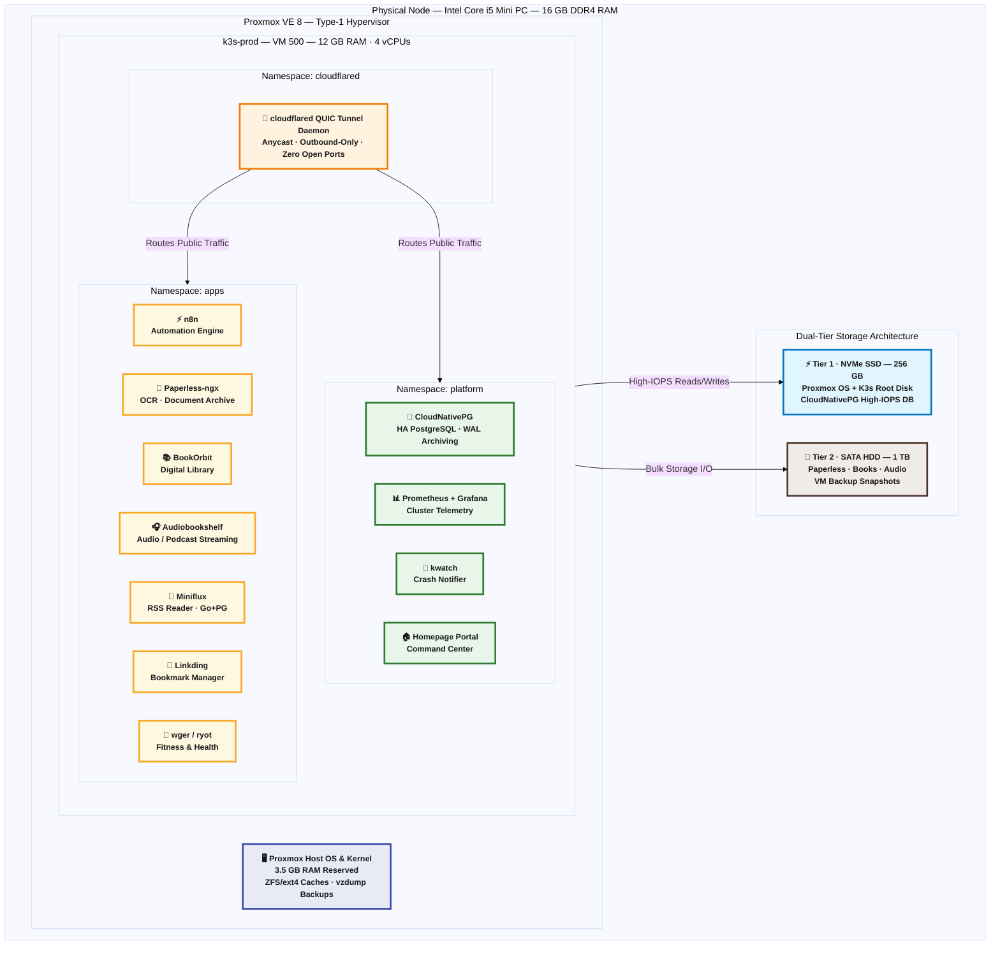
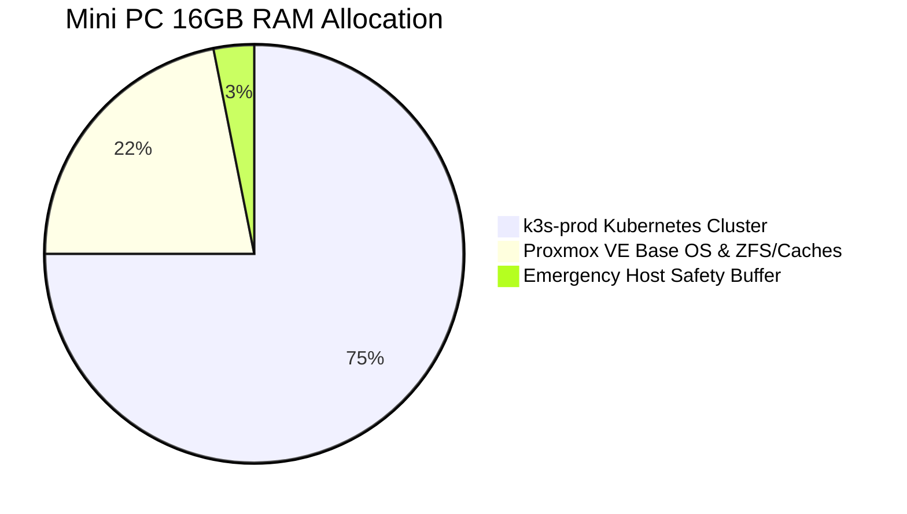

# Homelab-Ops: Sovereign Cloud Infrastructure & GitOps Platform

<p align="center">
  
  
  
  
  
  
  
  
  
  
</p>

---

## 🧭 Executive Overview: The Project at a Glance

**Homelab-Ops** is a production-grade, self-healing **Sovereign Cloud Platform** engineered on physical bare-metal hardware in Mumbai, India, integrated with supporting cloud infrastructure in **Oracle Cloud Infrastructure (OCI)** and **Google Cloud Platform (GCP)**.

This platform simulates enterprise-scale infrastructure engineering while operating under strict real-world constraints:

1. **Carrier-Grade NAT (CGNAT) Traversal:** Securely accepting external webhooks and public user traffic without exposing home router ports or relying on static IPv4 leasing.
2. **Deterministic GitOps Continuous Delivery:** Managing platform operators and applications declaratively with **Flux CD v2** and **Mozilla SOPS**, eliminating configuration drift and keeping secrets versioned safely in Git.
3. **Dual-Tier Hardware Economics:** Overcoming disk I/O bottlenecks on a single Mini PC by partitioning high-IOPS NVMe flash for database engines and durable SATA mechanical disks for multi-terabyte media and document archives.
4. **Hybrid Multi-Cloud Resilience:** Supplementing the on-premise sovereign cluster with cloud infrastructure across **Oracle Cloud Infrastructure (OCI)** and **Google Cloud Platform (GCP)** for out-of-band availability monitoring, remote state locking, and secondary cloud compute.

---

## 🏛️ Architecture & System Design

To provide complete architectural clarity without visual clutter, the platform is organized into three distinct structural diagrams:

### 1. Global Multi-Cloud & Network Ingress Topology
*How external traffic, edge security, multi-cloud support, and the secure administrative mesh are organized:*

<table>
  <tr>
    <th align="center">🖼️ Version 1</th>
    <th align="center">🖼️ Version 2</th>
  </tr>
  <tr>
    <td align="center"></td>
    <td align="center"></td>
  </tr>
</table>

---

### 2. Sovereign Bare-Metal & Cluster Architecture
*How physical hardware, hypervisor resource fencing, and tiered storage are partitioned:*



---

### 3. Declarative GitOps & Secret Lifecycle Pipeline
*How code changes flow automatically from Git into production without configuration drift:*

```mermaid
%%{init: {'theme': 'base', 'themeVariables': {'fontSize': '16px', 'fontFamily': 'Inter, Segoe UI, sans-serif'}, 'flowchart': {'curve': 'basis', 'nodeSpacing': 60, 'rankSpacing': 85}}}%%
flowchart LR

    %% ── GLOBAL COLOUR SYSTEM ─────────────────────────────────────
    classDef vcsStyle      fill:#E8EAF6,stroke:#3949AB,stroke-width:3px,color:#1A1A1A,font-size:14px,font-weight:bold;
    classDef controlStyle  fill:#E3F2FD,stroke:#1565C0,stroke-width:3px,color:#1A1A1A,font-size:14px,font-weight:bold;
    classDef secretStyle   fill:#EDE7F6,stroke:#512DA8,stroke-width:3px,color:#1A1A1A,font-size:14px,font-weight:bold;
    classDef gateStyle     fill:#F3E5F5,stroke:#512DA8,stroke-width:2px,color:#1A1A1A,font-size:13px;
    classDef platformStyle fill:#E8F5E9,stroke:#2E7D32,stroke-width:3px,color:#1A1A1A,font-size:14px,font-weight:bold;
    classDef appsStyle     fill:#FFF8E1,stroke:#F9A825,stroke-width:3px,color:#1A1A1A,font-size:14px,font-weight:bold;
    classDef liveStyle     fill:#F3E5F5,stroke:#6A1B9A,stroke-width:3px,color:#1A1A1A,font-size:14px,font-weight:bold;

    %% ── SOURCE OF TRUTH ──────────────────────────────────────────
    subgraph VCS["Version Control System"]
        GitRepo["📦 GitHub Repository
vsingh55 / homelab-ops
Encrypted Secrets · Declarative Manifests"]
    end
    class GitRepo vcsStyle;

    %% ── IN-CLUSTER GITOPS ENGINE ─────────────────────────────────
    subgraph ClusterGitOps["In-Cluster GitOps Engine — Flux CD v2"]
        direction TB
        SourceCtrl["📡 Source Controller
Polls Git Every 10 min
Detects & Fetches New Commits"]
        KustCtrl["⚙️ Kustomize Controller
Dependency Chaining
Ordered Reconciliation"]
        SOPS["🔐 SOPS + Age Decryption
In-Memory Secret Hydration
Zero Plaintext on Disk"]
    end
    class SourceCtrl,KustCtrl controlStyle;
    class SOPS secretStyle;

    %% ── DEPLOYMENT STAGES ────────────────────────────────────────
    subgraph DeploymentStages["Deterministic Deployment Order"]
        direction TB
        StagePlatform["1️⃣ Platform Foundation
cloudflared · CloudNativePG
Storage Classes · Monitoring"]
        HealthGate{"✅ Health Gate
All platform pods
must be Ready"}
        StageApps["2️⃣ Application Fleet
dependsOn: platform checked
n8n · Paperless · BookOrbit · Miniflux"]
    end
    class StagePlatform platformStyle;
    class HealthGate gateStyle;
    class StageApps appsStyle;

    %% ── LIVE CLUSTER STATE ───────────────────────────────────────
    subgraph ClusterState["Active Production State"]
        LivePods["🚀 Healthy Running Workloads
Self-Healing · Zero Config Drift
Continuous Reconciliation Loop"]
    end
    class LivePods liveStyle;

    %% ── PIPELINE FLOW ────────────────────────────────────────────
    GitRepo       -- "Pull: New Commit Detected" --> SourceCtrl
    SourceCtrl    -- "Fetch Manifests"           --> KustCtrl
    KustCtrl      -- "Decrypt Secrets"           --> SOPS
    SOPS          -- "Apply Manifests"           --> StagePlatform
    StagePlatform -- "Health Check"              --> HealthGate
    HealthGate    == "Gate Passed"               ==> StageApps
    StageApps     -- "Schedule Workloads"        --> LivePods
    LivePods      -. "Drift Correction"          .-> KustCtrl
```



---

## 📖 The Engineering Story: From Bare Metal to Sovereign GitOps

### Act I: The Bare-Metal Foundation
Every robust platform begins with physical constraints. The on-premise foundation is an ultra-efficient Intel Core i5 Mini PC with 16GB DDR4 RAM, a 256GB NVMe SSD, and a 1TB SATA mechanical drive. 

To convert this single machine into an enterprise platform, **Proxmox VE 8** was chosen as the Type-1 hypervisor. By budgeting host resources strictly—reserving 3.5GB of RAM for the Debian kernel, memory caching, and backup snapshot compression—a dedicated virtual machine (`k3s-prod`) was allocated **12GB RAM and 4 vCPUs**, ensuring high memory headroom for Kubernetes workloads while safeguarding the physical host against out-of-memory (OOM) kernel panics.

### Act II: Conquering the Network (Zero Trust Ingress)
Residential internet connections rarely provide static public IP addresses and are almost universally bound behind **Carrier-Grade NAT (CGNAT)**, making traditional port-forwarding impossible or insecure.

* **The Evolution:** Early iterations explored cloud gateway relays. While functional, routing cross-continental traffic introduced latency hops and incurred ongoing NAT maintenance.
* **The Production Standard:** The platform upgraded to **Cloudflare Zero Trust Anycast Tunnels (`cloudflared`)**. Operating as an in-cluster deployment, `cloudflared` initiates outbound-only QUIC connections to Cloudflare's nearest edge data centers (Mumbai, Delhi, Chennai). Public webhooks and traffic terminate at the edge in **<15ms**, protected by Cloudflare WAF and DDoS mitigation, with **zero open inbound ports on the home firewall**.

### Act III: GitOps Continuous Delivery & In-Git Secrets
Operating infrastructure through manual `kubectl apply` commands or ad-hoc scripts leads to configuration drift and operational opacity.

The modern platform runs on pure **GitOps Continuous Delivery** powered by **Flux CD v2**:
* The cluster continuously synchronizes its desired state from this Git repository.
* Workload reconciliation is deterministically ordered: platform foundations (storage classes, operators, ingress daemons) must report healthy before application workloads are scheduled (`apps` depends on `platform`).
* Sensitive tokens and database passwords are encrypted declaratively using **Mozilla SOPS + Age**. Because secrets remain encrypted in Git, they can be safely reviewed in pull requests, while the in-cluster Flux decryptor hydrates them into memory without leaving plaintext traces on physical disks.

### Act IV: Storage Economics & Stateful High Availability
Single-node virtualization often stumbles when high-IOPS database queries compete with heavy background disk writes:
* **Storage Tiering:** Fast NVMe storage is dedicated strictly to the OS, K3s state, and PostgreSQL data files. Multi-terabyte document indexing (Paperless-ngx) and audio/book streaming libraries are routed directly to the high-capacity 1TB SATA mechanical disk.
* **Database Modernization:** Rather than deploying fragile, static database pods, relational data is managed by the **CloudNativePG Operator**. The operator provides automated PostgreSQL lifecycle management, health monitoring, self-healing failover, and Write-Ahead Log (WAL) archiving.

### Act V: Multi-Cloud Resilience (Oracle Cloud & Google Cloud Support)
A monitoring system running inside the cluster it is supposed to monitor cannot alert you when the cluster itself dies. Furthermore, local backups are vulnerable if the physical host suffers hardware failure.

To achieve enterprise-grade resilience, the architecture integrates **Oracle Cloud Infrastructure (OCI)** and **Google Cloud Platform (GCP)** support instances:
* **Out-of-Band Health Probes:** An independent cloud VM in OCI Mumbai runs **Uptime Kuma**, continuously polling public endpoints (`https://docs.vijaysingh.cloud`, `https://hooks.vijaysingh.cloud`) over the public internet and dispatching alerts to Slack/Discord if homelab broadband or power fails.
* **Remote State & Offsite Backup:** Terraform state is stored securely with remote locking in an OCI Object Storage S3-compatible backend, and nightly encrypted Restic backups are pushed offsite, fulfilling the **3-2-1 backup rule** (3 copies, 2 media types, 1 offsite).
* **Multi-Cloud Compute Support:** Supporting cloud virtual machines across OCI and GCP provide compute targets for auxiliary services and remote operations.

---

## ⚡ Core Architecture Pillars

| Architectural Pillar | Core Technologies | How It Solves the Problem |
| :--- | :--- | :--- |
| **Zero-Trust Edge & Ingress** | Cloudflare Zero Trust, `cloudflared`, Traefik | Traverses CGNAT with outbound-only QUIC tunnels; provides edge WAF and reduces latency to <15ms with zero open router ports. |
| **GitOps Continuous Delivery** | Flux CD v2, Kustomize, GitHub | Pull-based reconciliation loop eliminates configuration drift; deterministic ordering ensures zero failed boots. |
| **In-Git Secret Decryption** | Mozilla SOPS, Age Cryptography | Secrets versioned declaratively in Git with asymmetric encryption; decrypted exclusively in-memory by Flux. |
| **Dual-Tier Storage Strategy** | NVMe Flash (256GB), SATA Mechanical (1TB) | Isolates high-IOPS database operations from bulk document indexing and media streaming workloads. |
| **Stateful Resilience & HA** | CloudNativePG (PostgreSQL Operator) | Self-healing relational database clustering with automated failover and continuous WAL archiving. |
| **Multi-Cloud Support Plane** | OCI Mumbai, GCP Support VM, Uptime Kuma | Independent external heartbeat monitoring and remote state locking; operates even during power or ISP outages. |

---

## 📦 Application Fleet & Workload Catalog

All services are containerized, declared in Git, and routed through Cloudflare Zero Trust:

```
Platform & Security
├── cloudflared             # High-availability Anycast edge ingress tunnel
├── postgres-operator       # CloudNativePG enterprise PostgreSQL lifecycle operator
├── homepage                # Homelab Command Center (Live CPU/RAM & status portal)
├── monitoring              # Prometheus metrics scraping & Grafana telemetry
├── kwatch                  # Instant Discord/Slack notifier for crashed pods
└── docs                    # MkDocs Material engineering handbook (docs.vijaysingh.cloud)

Operations & Workflow Automation
├── n8n                     # Hardened event-driven workflow automation engine
└── pdf-generator           # Automated document compilation microservice

Sovereign Documents & Media (1TB HDD Tier)
├── paperless-ngx           # OCR document ingestion, tagging, and search archive
├── bookorbit               # Multi-user digital book library & sync manager
└── audiobookshelf          # Audiobook and podcast streaming server

Productivity & Personal Health
├── miniflux                # Ultra-fast, lightweight Go RSS reader
├── linkding                # Bookmarking service with tag search
└── ryot / wger             # Fitness analytics and workout tracking platform
```

---

## 🖥️ Physical Hardware & Resource Budgeting



* **Physical Node:** Intel Core i5 Mini PC (4 Cores / 8 Threads)
* **Total Host RAM:** 16,384 MB (16 GB DDR4)
* **Production Cluster Allocation (`k3s-prod` VM 500):**
  - **Memory:** 12,288 MB (12 GB RAM) — gives >60% memory headroom for peak OCR ingestion and database queries.
  - **Compute:** 4 vCPUs dedicated to Kubernetes scheduler.
  - **Storage:** 50GB NVMe root disk + 1TB SATA HDD attached virtual disk.
* **Proxmox VE Host OS Allocation:**
  - **Memory:** 3,500 MB (3.5 GB RAM) reserved for Debian kernel, KVM hypervisor daemons, and `vzdump` backup compression.
  - **Storage:** ~20GB NVMe root partition for hypervisor binaries and ISOs.

---

## 📚 Standard Engineering Documentation & ADRs

Following CNCF and enterprise platform standards, all architecture decisions and technical specifications are documented in the `docs/` hierarchy:

### 1. Architecture Decision Records (ADRs)
* **[Architecture Decision Records (ADRs)](docs/adr/README.md)** — 16 formal Architecture Decision Records documenting every pivotal architectural decision (ADR-001 through ADR-016), following the Michael Nygard standard.

### 2. Execution Phases & Implementation Manuals
* **[Phase 1: Architecture Baseline](docs/execution-phases/01-phase-1-architecture-baseline.md)** — Hardware allocation baseline and architectural blueprint alignment.
* **[Phase 2: Codebase Pruning & Debt Elimination](docs/execution-phases/02-phase-2-codebase-pruning.md)** — Purging idle lab planes and reclaiming 7.5GB RAM.
* **[Phase 3: OCI Remote State Backend](docs/execution-phases/03-phase-3-oci-remote-state.md)** — Migrating Terraform state to Oracle Cloud S3-compatible object storage.
* **[Phase 4: Proxmox Host Consolidation](docs/execution-phases/04-phase-4-proxmox-consolidation-k3s-resizing.md)** — Resizing `k3s-prod` to 12GB RAM and configuring SATA drive mounts.
* **[Phase 5: Cloudflare Ingress Modernization](docs/execution-phases/05-phase-5-gcp-decommissioning-cloudflare-ingress.md)** — Terminating paid cloud relays and deploying zero-latency edge tunnels.
* **[Phase 6: GitOps Bootstrap & SOPS Secrets](docs/execution-phases/06-phase-6-gitops-bootstrap-sops.md)** — Bootstrapping Flux CD v2 and configuring Age asymmetric encryption.
* **[Phase 7: Application Fleet Deployment](docs/execution-phases/07-phase-7-application-fleet-deployment.md)** — Onboarding CloudNativePG, Paperless, and Uptime Kuma monitoring.

### 3. Engineering Guides & Post-Mortems
* **[Proxmox Bare-Metal Setup](docs/02-proxmox-setup.md)** & **[Proxmox Recovery Guide](docs/99-proxmox-recovery-guide.md)**
* **[Terraform Modularization](docs/10-terraform-modularization.md)** & **[Secret Hydration Patterns](docs/12-secret-management-hydration.md)**
* **[K3s Optimization & Security](docs/14-k3s-optimization-and-security.md.md)** & **[WAN Debugging Post-Mortem](docs/08-debugging-wan-connectivity.md)**

---

## 🛠️ Quick Operator Runbook

### Secret Encryption Workflow (SOPS + Age)
```bash
# Encrypt an updated Kubernetes Secret manifest before committing to Git
sops --encrypt --in-place kubernetes/apps/n8n/secret.enc.yaml

# Directly edit an encrypted secret file using your default editor
sops kubernetes/apps/n8n/secret.enc.yaml
```

### GitOps Synchronization
```bash
# Force immediate reconciliation of the platform layer
flux reconcile kustomization platform --with-source

# Force immediate reconciliation of the application layer
flux reconcile kustomization apps --with-source
```

### Out-of-Band Host Administration (Tailscale Mesh)
```bash
# Direct SSH access to the Proxmox VE hypervisor
ssh root@100.108.178.93

# Direct SSH access to the Production K3s node
ssh devops@192.168.1.30

# Inspect active Cloudflare tunnel connections
kubectl logs -n cloudflared -l app.kubernetes.io/name=cloudflared --tail=50
```

---

## 👤 Engineering Leadership & Contacts

**Vijay Singh** — DevOps & Platform Engineer  
* **GitHub:** [@vsingh55](https://github.com/vsingh55)  
* **Documentation Portal:** [https://docs.vijaysingh.cloud](https://docs.vijaysingh.cloud)  
* **Homelab Command Center:** [https://home.vijaysingh.cloud](https://home.vijaysingh.cloud)  
* **System Status & Uptime:** [https://status.vijaysingh.cloud](https://status.vijaysingh.cloud)  

---

<p align="center">
  <sub>Engineered with precision, operational discipline, and pride in sovereign platform engineering.</sub>
</p>