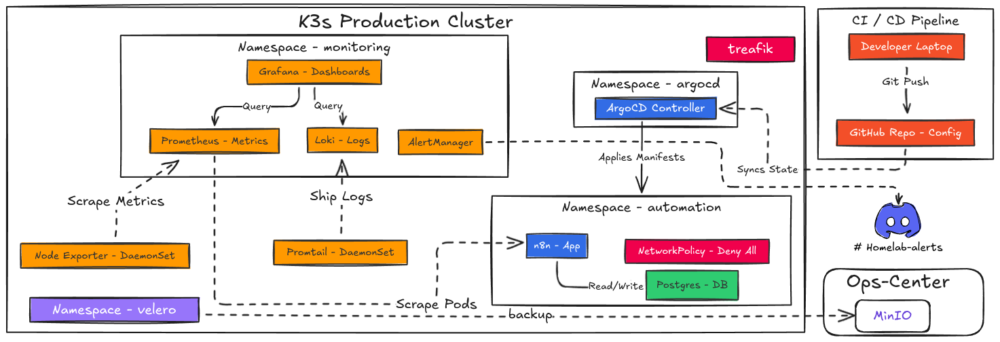
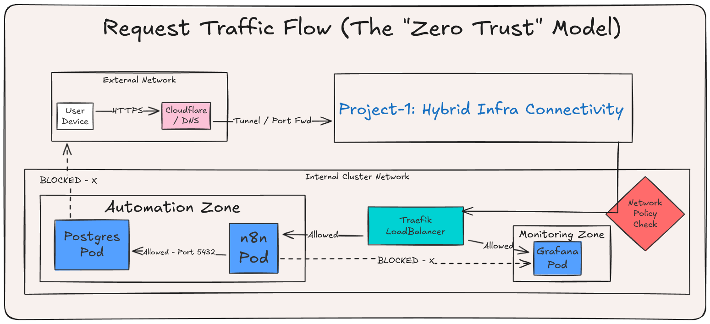

# Operation Ironclad: Optimization, Security & Stability

**Date:** 2026-01-17
**Focus:** Cost Optimization, Zero-Trust Networking, and Workload Hardening.
**Status:** ✅ Completed
**System:** K3s Cluster (`k3s-prod`) running `n8n` Workload on Proxmox VE (Home Lab).

## 1. The Situation (The "Before" State)
After deploying the initial K3s cluster and n8n workload, several critical production issues emerged:
* **Memory Pressure:** The 8GB Production Node was nearing 90% utilization due to Observability sidecars.
* **Security Gaps:** The `n8n` workload was running as `root`, and the cluster network was flat (any pod could talk to any pod).
* **Instability:** The application lacked Health Probes, leading to silent failures.
* **Broken Alerts:** AlertManager failed to parse Discord templates, causing silent alarm failures during outages.

## 2. Technical Implementation

### A. Resource Optimization (Reclaiming 1GB+ RAM)
I analyzed `crictl stats` and identified Prometheus and Grafana Sidecars as the heaviest consumers.
* **Action:** Enforced hard memory limits on Grafana sidecars (100Mi limit).
* **Action:** Reduced Prometheus data retention from 15d to 5d and enabled WAL Compression.
* **Result:** `k3s-prod` memory usage dropped from ~70% to ~40%, creating headroom for future projects.

### B. Workload Hardening (n8n)
To meet Enterprise Security Standards, we refactored the Deployment:
* **Non-Root Execution:** Enforced `runAsUser: 1000`.
    * *Challenge:* The app crashed with `Permission Denied` on the volume.
    * *Solution:* Implemented an `initContainer` to recursively `chown` the volume before startup.
* **Self-Healing:** Added Liveness (Restart if dead) and Readiness (Traffic gating) probes.
    * *Liveness:* `http-get /healthz` (delay: 30s).

### C. Zero-Trust Networking (Network Policies)
We moved from a "Flat Network" to a "Default Deny" posture in the `automation` namespace.
* **Policy 1:** Block ALL incoming traffic by default.
* **Policy 2 (Ingress):** Explicitly allow Traefik (Ingress Controller) to reach port 5678.
* **Policy 3 (Egress):** Explicitly allow `n8n` to talk to:
    * `postgres` (Port 5432).
    * `kube-dns` (UDP/TCP Port 53) - *Critical fix after initial DNS resolution failures.*
* **Policy 4 (Internal):** Explicitly allow `postgres` to receive traffic from `n8n`.

### D. Observability Fixes
* **False Positives:** Silenced `KubeScheduler` and `KubeController` alerts (incompatible with K3s architecture).
* **Alert Routing:** Fixed Jinja2 template errors in `values.yaml.j2` to ensure Discord notifications render correctly.

## 3. Architecture Status
The cluster now operates with a segregated network model. Workloads are isolated, resource-capped, and monitored with verified alerting pipelines.

## 4. Current Metrics
* **CPU Usage:** Stable at ~20% on the Production Node.
* **Memory Usage:** Stable at ~40% on the Production Node.
* **Security:** Workloads run as non-root users with strict network policies.
* **Stability:** n8n workload self-heals and recovers from failures automatically.

## 5. Next Steps
* **n8n + GitOps Enhancements:** 
  * Managing the deployment.yaml, service.yaml, and network-policy.yaml via GitOps (e.g., ArgoCD).
  * Version controlling the actual JSON workflow files inside n8n. 
* **Disaster Recovery:** Implement Velero backups for the K3s cluster and n8n workload.
* **Scaling:** Plan for Horizontal Pod Autoscaling based on CPU/Memory metrics. 
* **Security Audits:** Regularly review and update Network Policies as new workloads are added.
* **Observability Enhancements:** Integrate Prometheus with Grafana dashboards for real-time monitoring of n8n workflows.
* **Cost Review:** Analyze cloud egress costs related to webhook traffic and optimize as needed.
* **Performance Testing:** Conduct load testing on n8n to ensure it can handle peak traffic scenarios.