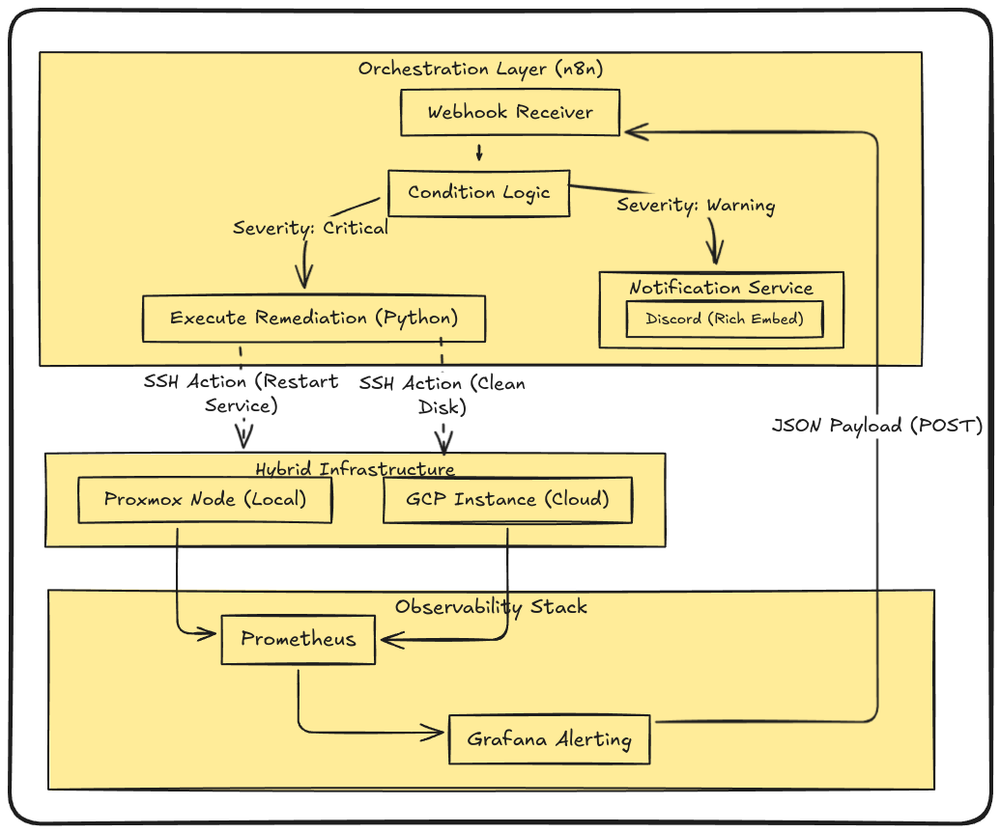

# 01. System Architecture Overview

> **Platform Standard:** Enterprise Sovereign Hybrid Cloud Architecture  
> **Environment:** Bare-Metal Hypervisor (Mumbai) + Multi-Cloud Support (OCI & GCP)  
> **Operational Status:** Production Reference Implementation  
> **Target SLA:** 99.9% Application Availability | RTO < 45m | RPO < 15m  

---

## 1. Executive Summary

The `homelab-ops` platform is a production-grade, self-healing **Sovereign Cloud Platform** engineered to provide enterprise-standard digital services, workflow automation, document management, and private cloud infrastructure while operating under strict real-world engineering constraints:

1. **Carrier-Grade NAT (CGNAT) Traversal:** Securely accepting external webhooks and public user traffic without exposing home router ports or leasing static public IPv4 addresses.
2. **Deterministic GitOps Continuous Delivery:** Managing platform operators and applications declaratively with **Flux CD v2** and **Mozilla SOPS**, eliminating manual configuration drift and keeping secrets encrypted in Git.
3. **Dual-Tier Hardware Economics:** Overcoming disk I/O bottlenecks on a single Mini PC by partitioning high-IOPS NVMe flash for database engines and durable SATA mechanical disks for multi-terabyte media and document archives.
4. **Hybrid Multi-Cloud Resilience:** Supplementing the on-premise sovereign cluster with cloud infrastructure across **Oracle Cloud Infrastructure (OCI)** and **Google Cloud Platform (GCP)** for out-of-band availability monitoring, remote state locking, and secondary cloud compute.

---

## 2. High-Level System Topology

The global system architecture unifies external client traffic, edge security, cloud monitoring, administrative mesh networking, and on-premise Kubernetes compute into a cohesive, zero-trust infrastructure fabric:




---

## 3. Core Architectural Boundaries & Failure Domains

The platform enforces strict logical and physical boundaries between components to isolate failures and maintain zero-trust security:

| Architectural Domain | Location / Host | Primary Responsibilities | Network Isolation & Access |
| :--- | :--- | :--- | :--- |
| **Public Edge Layer** | Cloudflare Edge (Global Anycast) | SSL termination, DDoS protection, Web Application Firewall (WAF), Anycast DNS routing. | External Public Internet (HTTPS/QUIC) |
| **Out-of-Band Cloud Plane** | OCI Mumbai & GCP | External health probes (Uptime Kuma), S3 remote state locking, offsite encrypted backup replication. | Isolated Cloud VCNs / Dedicated Egress |
| **Zero-Trust Management Mesh**| Tailscale Overlay (P2P WireGuard) | Out-of-band administrative access directly from engineer laptop to Proxmox and K3s. | 100.64.0.0/10 Carrier-Grade Mesh |
| **Bare-Metal Virtualization** | Proxmox VE 8 (Intel i5 Mini PC) | Hardware virtualization, storage pool management, VM lifecycle, and host-level snapshot backups. | 192.168.1.0/24 Local Management VLAN |
| **Application & Platform Plane**| `k3s-prod` VM (K3s Kubernetes) | Container orchestration, operator lifecycle (CloudNativePG), automated GitOps delivery (Flux CD v2). | Calico / Flannel Overlay CIDR |

---

## 4. End-to-End Traffic Lifecycles

### Inbound Public Traffic Flow (Edge Ingress)
1. **DNS Resolution:** Client queries `https://docs.vijaysingh.cloud`. Cloudflare Anycast DNS resolves the domain to the nearest local edge PoP (<15ms latency).
2. **Edge Security & SSL Termination:** Cloudflare terminates TLS 1.3, executes Web Application Firewall (WAF) inspections, and mitigates L3/L4/L7 DDoS attacks.
3. **Outbound QUIC Tunnel:** The in-cluster `cloudflared` daemon maintains an authenticated, outbound-only QUIC multiplexed tunnel with Cloudflare's Mumbai edge servers.
4. **Local Cluster Ingress:** `cloudflared` proxies the decrypted request directly to the in-cluster Traefik Ingress Controller.
5. **Workload Delivery:** Traefik matches the Host header and routes traffic over the cluster overlay network to the target pod service.

### Administrative Traffic Flow (Zero-Trust Mesh)
1. **Workstation Authentication:** Operator authenticates via Google Workspace Single Sign-On (SSO) and Multi-Factor Authentication (MFA) into Tailscale.
2. **Peer-to-Peer Encryption:** Workstation initiates an end-to-end encrypted WireGuard tunnel (`100.108.178.93`) directly to the Proxmox VE hypervisor or Kubernetes node.
3. **Firewall Invariance:** Zero inbound firewall rules are opened on the residential router. Traffic traverses NAT using authenticated Tailscale coordination servers and STUN NAT hole-punching.

### Out-of-Band Observability Flow
1. **Synthetic Probes:** An independent, isolated VM in Oracle Cloud Infrastructure (OCI Mumbai) runs Uptime Kuma, dispatching HTTP health probes to public edge endpoints every 60 seconds.
2. **Crash & Ingestion Monitoring:** Within the on-premise cluster, `kwatch` intercepts Kubernetes event streams (`OOMKilled`, `CrashLoopBackOff`) in real-time.
3. **ChatOps Escalation:** Status transitions immediately trigger formatted alerts to Slack `#homelab-alerts` and Discord webhooks.

---

## 5. Architectural Trade-Off Analysis

| Decision Dimension | Selected Architecture | Alternative Evaluated | Trade-Off Rationale & Impact |
| :--- | :--- | :--- | :--- |
| **Physical Hardware Density** | Single High-Efficiency Intel i5 Mini PC | Multi-Node Bare-Metal Server Rack | Multi-node clusters require 200W–500W continuous power, generating thermal and acoustic noise. The single Mini PC draws ~15W idle (~$5/mo electricity), achieving high availability via CloudNativePG and automated GitOps disaster recovery. |
| **Edge Ingress Model** | Cloudflare Zero Trust Anycast Tunnels | Self-Hosted Cloud VPN Relay (GCP e2-micro) | The self-hosted cloud relay introduced ~45ms–120ms latency hops, single-point-of-failure VM dependencies, and recurring cloud egress costs. Cloudflare Tunnels cut latency to <15ms with zero open ports and zero recurring fees. |
| **Configuration Management** | Declarative GitOps (Flux CD v2) | Imperative Ansible Fleet Orchestration | Imperative Ansible playbooks require manual trigger and cannot prevent configuration drift between runs. Flux CD reconciles Git state every 5 minutes automatically. |
| **Secret Management** | In-Git Mozilla SOPS + Age Asymmetric Keys | Centralized HashiCorp Vault Cluster | HashiCorp Vault requires 1GB–2GB RAM, persistent unseal infrastructure, and operational maintenance. Mozilla SOPS allows encrypted secrets to be version-controlled in Git and decrypted in-memory by Flux. |

---

## 6. Enterprise Security & Defense-in-Depth Posture

```text
+-------------------------------------------------------------------------+
| Layer 1: Public Perimeter (Cloudflare Edge Anycast, WAF, TLS 1.3)        |
+-------------------------------------------------------------------------+
                                    |
+-------------------------------------------------------------------------+
| Layer 2: Network Perimeter (Zero Inbound Ports, Outbound-Only QUIC)    |
+-------------------------------------------------------------------------+
                                    |
+-------------------------------------------------------------------------+
| Layer 3: Management Plane (Tailscale Mesh, Google SSO, MFA Required)   |
+-------------------------------------------------------------------------+
                                    |
+-------------------------------------------------------------------------+
| Layer 4: Kubernetes Control (Non-Root Containers, Read-Only Filesystems)|
+-------------------------------------------------------------------------+
                                    |
+-------------------------------------------------------------------------+
| Layer 5: Data Storage (In-Git SOPS AES-256 Encryption, Offsite Backups) |
+-------------------------------------------------------------------------+
```

---

## 7. Platform Verification Matrix

- [x] Edge Ingress endpoints respond with `HTTP 200` over public Anycast.
- [x] Zero inbound router ports forwarded across residential gateway.
- [x] GitOps continuous reconciliation active with zero drift.
- [x] Production database operates on automated WAL archiving and daily snapshot cycles.
- [x] Out-of-band monitoring active from independent cloud region.
