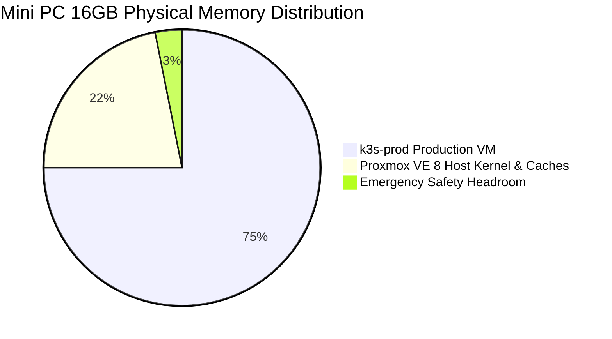

# 02. Physical Hardware & Virtualization Architecture

> **Target Standard:** Bare-Metal Hypervisor & Host Resource Fencing  
> **Host OS:** Proxmox VE 8.x (Debian 12 Bookworm)  
> **Physical Hardware:** Intel Core i5 Mini PC  

---

## 1. Hardware Specification

The sovereign on-premise foundation runs on an energy-efficient Mini PC engineered for 24/7 reliability, minimal thermal output, and whisper-quiet operation:

| Component | Hardware Specification | Role in Architecture |
| :--- | :--- | :--- |
| **Processor (CPU)** | Intel Core i5 (4 Physical Cores / 8 Threads) | Virtualized compute execution for Kubernetes scheduler, container runtimes, and OCR indexing. |
| **Physical RAM** | 16,384 MB (16 GB) DDR4 Non-ECC | Hard-budgeted between hypervisor kernel daemons and the primary Kubernetes workload VM. |
| **Primary Storage (Tier 1)** | 256GB M.2 NVMe PCIe SSD | High-IOPS low-latency pool for Proxmox OS, K3s etcd state, and CloudNativePG database tables. |
| **Secondary Storage (Tier 2)**| 1TB 2.5" SATA Mechanical HDD | High-capacity bulk storage for Paperless document archives, digital books, media, and local VM snapshots. |
| **Networking** | 1x 1Gbps Realtek Ethernet NIC | Direct physical uplink to residential local area network (LAN). |
| **Power Consumption** | ~15W Idle / ~35W Peak Load | Ultra-low operational power draw (~₹400 / ~$5 USD per month in electricity). |

---

## 2. Resource Fencing & Memory Budget

Running a production-grade Kubernetes cluster on a 16GB host requires disciplined memory fencing. An unconstrained cluster will inevitably trigger an Out-Of-Memory (OOM) condition on the physical hypervisor, leading to host kernel panics and storage corruption.



### Allocation Breakdown
* **`k3s-prod` Virtual Machine (VM 500):**
  - **Memory:** `12,288 MB` (12 GB RAM)
  - **vCPUs:** `4 vCPUs` (Host CPU Type pass-through)
  - **Rationale:** Allocating 12GB provides a >60% memory buffer for internal workloads (~4.5GB active consumption), leaving ample headroom for memory-intensive Paperless OCR pipelines and database indexing spikes.
* **Proxmox VE Host OS Reserved:**
  - **Memory:** `3,500 MB` (3.5 GB RAM)
  - **Rationale:** Reserved for the Debian 12 base kernel, KVM hypervisor daemons, network bridging, and in-memory buffer cache for `vzdump` backup compression.
* **Host Emergency Safety Buffer:**
  - **Memory:** `~596 MB` (0.5 GB RAM)
  - **Rationale:** Prevents physical host starvation during heavy I/O or background ZFS/ext4 flush operations.

---

## 3. Storage Architecture & Drive Mapping

To prevent disk I/O starvation, the host enforces a strict separation between high-IOPS flash storage and bulk mechanical storage:

```text
Physical Host (Proxmox VE 8)
├── /dev/nvme0n1 (256GB NVMe SSD)
│   ├── pve-root              # Proxmox Host Base OS (~20GB)
│   └── local-lvm             # LVM-Thin Storage Pool
│       └── vm-500-disk-0     # k3s-prod VM Root Virtual Disk (50GB ext4)
│
└── /dev/sda (1TB SATA HDD)
    └── backup-hdd            # Directory Storage Mount (/mnt/hdd)
        ├── dump/             # vzdump Proxmox VM Snapshots (ZSTD compressed)
        └── vm-500-disk-1     # k3s-prod Data Virtual Disk (Attached to /mnt/data)
```

* **Root Disk (`vm-500-disk-0`):** Hosted on `local-lvm` (NVMe). High random read/write IOPS ensure instantaneous pod scheduling, etcd consensus stability, and rapid PostgreSQL query execution.
* **Bulk Data Disk (`vm-500-disk-1`):** Hosted on `backup-hdd` (SATA HDD). Passthrough as a secondary virtual disk to `k3s-prod`, formatted `ext4`, and mounted at `/mnt/data` inside Kubernetes for long-term document archives and media libraries.
