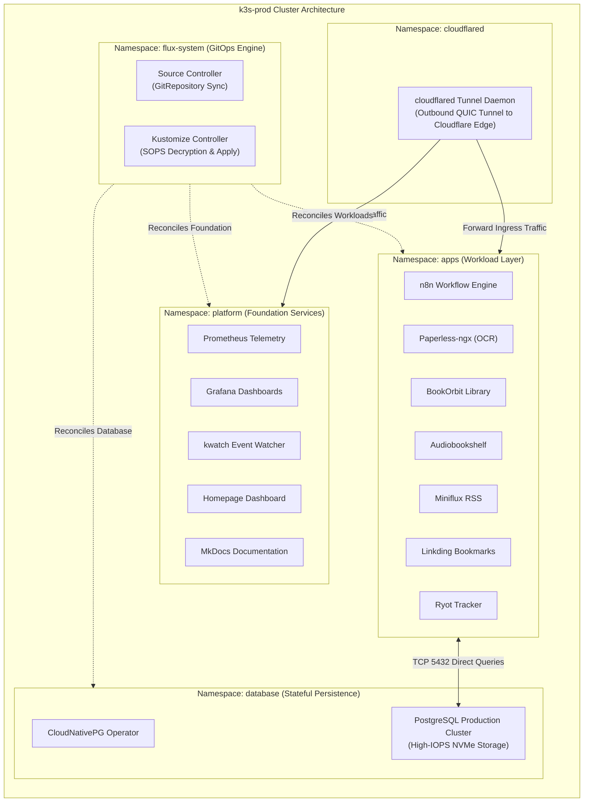
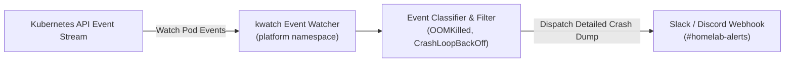

# 03. Kubernetes & K3s Cluster Architecture

> **Platform Standard:** Single-Node Production Kubernetes (CNCF Certified K3s)  
> **Node Identity:** `k3s-prod` (Virtual Machine 500)  
> **Compute Budget:** 12GB RAM, 4 vCPUs, Debian 12 Guest OS  
> **Runtime Engine:** containerd v1.7+ with native cgroups v2 enforcement  

---

## 1. Cluster Overview & Engineering Rationale

The core application platform runs on **K3s**, a lightweight, fully compliant Kubernetes distribution optimized for resource efficiency, operational simplicity, and low memory footprint:

| Architectural Component | Engine / Implementation | Engineering Rationale |
| :--- | :--- | :--- |
| **Control Plane Datastore** | Embedded SQLite Datastore | Eliminates the 500MB+ RAM overhead of running a full etcd cluster on a single node, while providing atomic transaction guarantees and instant recovery. |
| **Container Runtime** | `containerd` v1.7+ | Industry-standard OCI runtime enforcing strict cgroup v2 memory limits and CPU throttling across all pods. |
| **Network CNI** | Flannel (Host-Gateway / VXLAN) | Minimal overhead container networking providing seamless pod-to-pod routing across cluster namespaces. |
| **Ingress Controller** | Embedded Traefik Ingress Controller | Lightweight reverse proxy terminating in-cluster routing from the `cloudflared` edge daemon to Kubernetes Services. |
| **Storage Provisioner** | Rancher Local Path Provisioner | Dynamically provisions PersistentVolumes directly on host NVMe and SATA block mounts with zero distributed storage overhead. |
| **Continuous Delivery** | Flux CD v2 (GitOps) | Reconciles cluster state every 5 minutes directly from the Git repository, decrypting SOPS secrets in-memory. |

---

## 2. Namespace Topology & Isolation

The cluster isolates platform infrastructure from end-user workloads using strict namespace boundaries:

---

## 3. Production Workload Fleet Inventory

| Workload Name | Namespace | Public Ingress URL | Storage Tier | Workload Function |
| :--- | :--- | :--- | :--- | :--- |
| **Homepage** | `platform` | `https://home.vijaysingh.cloud` | NVMe (Tier 1) | Centralized platform navigation portal and real-time service health board. |
| **Platform Docs** | `platform` | `https://docs.vijaysingh.cloud` | NVMe (Tier 1) | Material MkDocs documentation portal and architecture handbook. |
| **PostgreSQL** | `database` | Internal Service Only | NVMe (Tier 1) | Centralized, operator-managed database cluster for applications. |
| **Paperless-ngx** | `apps` | `https://paperless.vijaysingh.cloud` | Hybrid (NVMe + SATA) | Document indexing, Optical Character Recognition (OCR), and searchable archive. |
| **n8n** | `apps` | `https://n8n.vijaysingh.cloud` | NVMe (Tier 1) | Event-driven workflow automation engine and webhook ingestion handler. |
| **Audiobookshelf**| `apps` | `https://audio.vijaysingh.cloud` | SATA HDD (Tier 2) | Self-hosted audiobook streaming server and multi-device sync. |
| **BookOrbit** | `apps` | `https://books.vijaysingh.cloud` | SATA HDD (Tier 2) | Digital book catalog, metadata fetcher, and reading companion. |
| **Miniflux** | `apps` | `https://rss.vijaysingh.cloud` | NVMe (Tier 1) | Lightweight, privacy-focused RSS news aggregator. |
| **Linkding** | `apps` | `https://links.vijaysingh.cloud` | NVMe (Tier 1) | Minimalist bookmark manager with automatic archive caching. |
| **Ryot** | `apps` | `https://ryot.vijaysingh.cloud` | NVMe (Tier 1) | Personal life-tracking and fitness metrics tracker. |

---

## 4. Storage Provisioning inside Kubernetes

Storage volumes are dynamically and statically mapped to the physical storage tiers:

| Storage Class | Physical Media | Path on Host | Workloads Bound | IOPS Profile |
| :--- | :--- | :--- | :--- | :--- |
| **`local-path`** (Default) | 256GB NVMe SSD | `/var/lib/rancher/k3s/storage` | PostgreSQL database tables, Redis caches, Homepage configuration, Miniflux DB. | High Random Read/Write (>150k IOPS) |
| **`local-path-hdd`** | 1TB SATA HDD | `/mnt/data/` | Paperless media originals, BookOrbit e-book archive, Audiobookshelf streaming media. | High Sequential Throughput (~120MB/s) |

---

## 5. In-Cluster Self-Healing & Event Monitoring

To ensure complete operational visibility into container health, the `platform` namespace runs **`kwatch`**:

- **Instant Alert Dispatch:** Monitors all pod status changes across every namespace; alerts dispatch within 3 seconds of a crash.
- **Log Extraction:** Automatically captures the last 50 lines of container stdout/stderr before restart, enabling immediate triage without requiring manual `kubectl logs` commands.
- **Operator Integration:** Works alongside CloudNativePG automated failover to guarantee immediate notice of database failover events.
