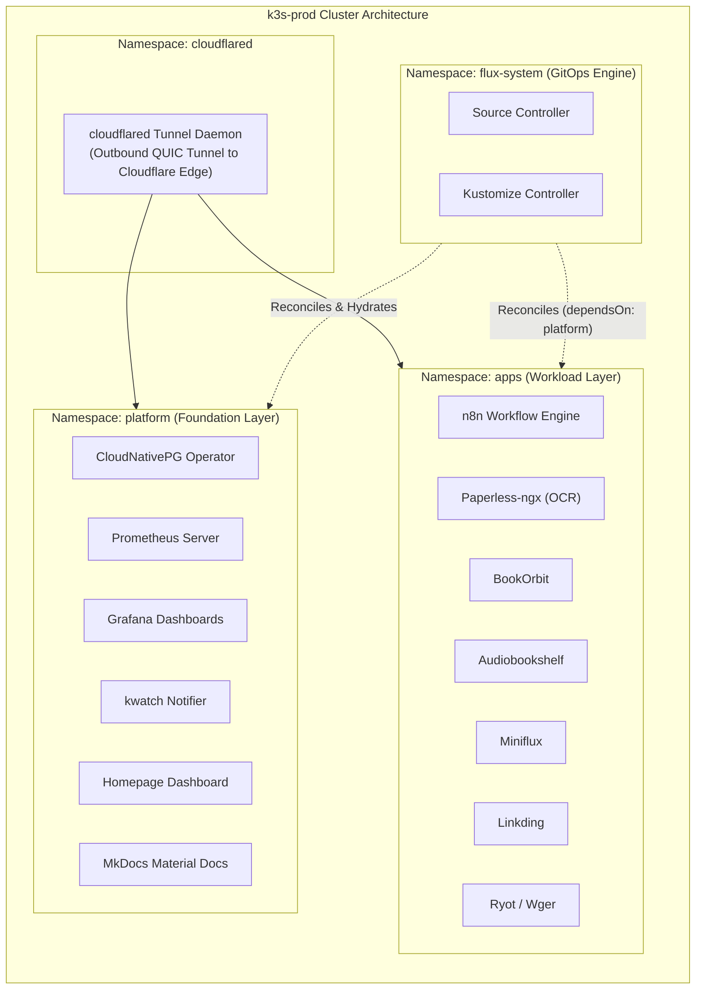

# 03. Kubernetes & K3s Cluster Architecture

> **Target Standard:** Single-Node Production Kubernetes (CNCF Certified K3s) 
> **Node Identity:** `k3s-prod` (VM 500) 
> **Specs:** 12GB RAM, 4 vCPUs, Debian 12 Guest OS 

---

## 1. Cluster Overview

The core application platform runs on **K3s**, a lightweight, fully compliant Kubernetes distribution designed for resource efficiency and operational simplicity:

- **Engine:** K3s v1.30+ (single-node embedded SQLite/etcd datastore).
- **Container Runtime:** `containerd` with native cgroup v2 support.
- **Network CNI:** Flannel (Host-Gateway / VXLAN mode).
- **Ingress Controller:** Embedded Traefik Ingress Controller (handling in-cluster routing from the Cloudflare edge daemon).
- **Storage Provisioner:** Rancher Local Path Provisioner (mapping PersistentVolumeClaims directly to NVMe and SATA host directories).

---

## 2. Namespace Topology & Isolation

The cluster isolates platform foundations from application workloads using strict namespace boundaries:

---

## 3. Storage Provisioning inside Kubernetes

Storage volumes are dynamically and statically mapped to the physical storage tiers:

| Storage Tier | Physical Drive | Kubernetes StorageClass / Volume | Workloads Bound |
| :--- | :--- | :--- | :--- |
| **Tier 1 (Hot NVMe)** | 256GB SSD | `local-path` (default) | PostgreSQL database tables (CloudNativePG), K3s internal state, Redis caches, Homepage config. |
| **Tier 2 (Cold SATA)** | 1TB HDD | `local-path-hdd` / PersistentVolume | Paperless-ngx document originals & archive, BookOrbit ebook catalog, Audiobookshelf media files. |

---

## 4. Self-Healing & Crash Monitoring (`kwatch`)

To ensure immediate visibility into pod crashes or unexpected container restarts, the `platform` namespace runs **`kwatch`**:

- Monitors all Kubernetes events in real-time (`CrashLoopBackOff`, `OOMKilled`, `ImagePullBackOff`).
- Dispatches formatted crash logs and container state directly to Discord / Slack channels within seconds of occurrence.
- Works in tandem with out-of-band Uptime Kuma monitoring for end-to-end operational visibility.
