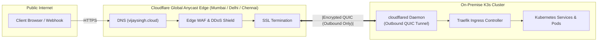

# 04. Zero-Trust Networking & Edge Ingress

> **Target Standard:** Zero-Trust Ingress & Anycast Edge Traversal 
> **Protocols:** Outbound QUIC Tunnels, WireGuard P2P Mesh 
> **Security Posture:** Zero Inbound Ports Open on Firewall 

---

## 1. The Networking Challenge: Carrier-Grade NAT (CGNAT)

Residential Internet Service Providers (ISPs) universally assign non-routable private IPv4 addresses behind Carrier-Grade NAT (CGNAT). Under CGNAT:
1. The subscriber does not have a public IPv4 address.
2. Standard router port-forwarding (e.g. forwarding ports 80/443 to a local server) is technically impossible.
3. Exposing raw home IP addresses directly to the public internet presents severe DDoS and network reconnaissance risks.

---

## 2. Ingress Architecture: Cloudflare Zero Trust Tunnels

To solve the CGNAT barrier without paying for expensive business leased lines or running vulnerable cloud proxy relays, all public traffic traverses **Cloudflare Zero Trust Anycast Tunnels**:

### Architectural Properties:
- **Outbound-Only Connection:** The in-cluster `cloudflared` daemon initiates outbound QUIC connections to the nearest Cloudflare Anycast edge PoP (Mumbai, Delhi, Chennai). The home router firewall allows all outbound traffic while keeping **all inbound ports closed**.
- **Edge Security:** Traffic is filtered by Cloudflare's Web Application Firewall (WAF) and DDoS protection before it reaches the homelab.
- **Low Latency:** Edge termination occurs at local Indian data centers, cutting round-trip response times to **<15ms**.

---

## 3. Administrative Plane: Tailscale Encrypted Mesh

While public traffic arrives via Cloudflare, infrastructure administration is decoupled into a dedicated out-of-band **Zero-Trust Administrative Mesh** powered by **Tailscale**:

- **Topology:** Peer-to-peer encrypted WireGuard mesh between the engineer's workstation, the Proxmox VE hypervisor (`100.108.178.93`), and the `k3s-prod` VM.
- **Direct Execution:** Eliminates intermediate bastion/jumpbox hosts. Terraform, Ansible, and `kubectl` run directly from the engineer's laptop with end-to-end encryption.
- **Zero Trust IAM:** Access is protected by Multi-Factor Authentication (MFA) and Single Sign-On (SSO) tied to Google Workspace identity.
