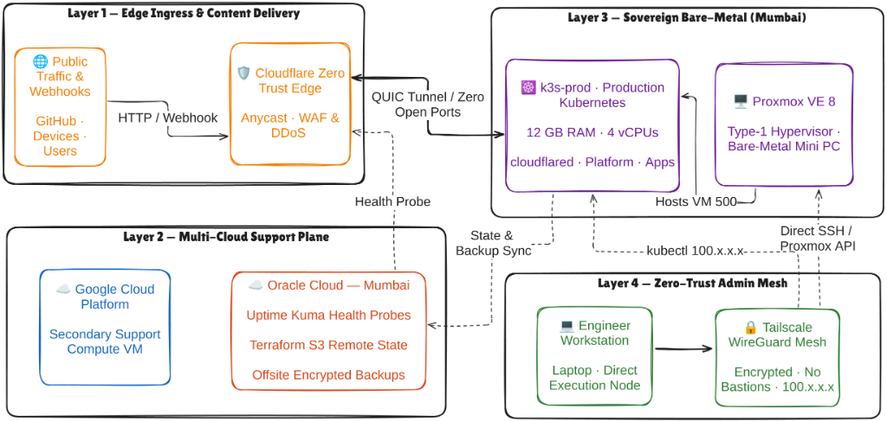
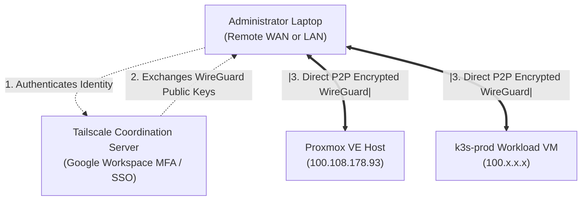

# 04. Zero-Trust Networking & Edge Ingress Architecture

> **Platform Standard:** Zero-Trust Ingress & Anycast Edge Traversal  
> **Ingress Protocol:** Outbound QUIC Multiplexed Tunnels (HTTP/3 over UDP)  
> **Administrative Mesh:** Tailscale Peer-to-Peer Encrypted WireGuard Fabric  
> **Firewall Posture:** Strictly Zero Inbound Ports Open on Home Router  

---

## 1. The Core Networking Challenge: Carrier-Grade NAT (CGNAT)

Residential Internet Service Providers (ISPs) universally assign non-routable private IPv4 addresses from the RFC 6598 Shared Address Space (`100.64.0.0/10`) behind Carrier-Grade NAT (CGNAT):

```text
[ On-Premise Host ]
         |
[ Home Wi-Fi Router ] (Private 192.168.1.1)
         |
[ ISP CGNAT Gateway Pool ] (RFC 6598 100.64.x.x) --> Shared across thousands of homes
         |
[ Public Internet ]
```

### Architectural Implications of CGNAT:
1. **Port Forwarding is Impossible:** The subscriber does not control a public IPv4 address. Traditional router NAT port-forwarding (e.g., exposing ports 80/443 to a local server) cannot be routed by the ISP.
2. **Dynamic Leases:** Public IPs rotated by ISPs break standard static DNS configurations.
3. **Attack Surface Minimization:** Even if a static IP was leased at high commercial cost, exposing a residential IP address directly to the internet invites automated port scanning, credential brute-forcing, and volumetric DDoS attacks.

---

## 2. Ingress Architecture: Cloudflare Zero Trust Anycast Tunnels

To solve the CGNAT barrier without paying for business leased lines or running fragile public cloud proxy relays, all public internet traffic traverses **Cloudflare Zero Trust Anycast Tunnels**:

```mermaid
flowchart LR
    subgraph PublicInternet["Public Internet"]
        User["User Browser / Webhook"]
    end

    subgraph CF_Anycast["Cloudflare Global Anycast Edge (Mumbai / Delhi / Chennai)"]
        EdgeDNS["DNS (vijaysingh.cloud)"]
        WAF["Edge WAF & DDoS Shield"]
        EdgeTerm["SSL Termination (TLS 1.3)"]
    end

    subgraph OnPremCluster["On-Premise K3s Cluster"]
        CF_Daemon["cloudflared Daemon\n(Outbound QUIC Tunnel)"]
        Traefik["Traefik Ingress Controller"]
        Services["Kubernetes Services & Pods"]
    end

    User -->|HTTPS| EdgeDNS
    EdgeDNS --> WAF
    WAF --> EdgeTerm
    EdgeTerm <==|Encrypted QUIC (Outbound Only)|==> CF_Daemon
    CF_Daemon --> Traefik
    Traefik --> Services
```





### Architectural Properties:
- **Outbound-Only Connection:** The in-cluster `cloudflared` daemon establishes and maintains outbound QUIC connections to the nearest Cloudflare Anycast edge PoP (Mumbai, Delhi, Chennai). The local home router allows outbound UDP traffic while keeping **100% of inbound ports closed**.
- **Edge Security & WAF:** Incoming requests are inspected, sanitized, and filtered against OWASP Top 10 vulnerabilities at Cloudflare's edge before ever reaching the on-premise cluster.
- **Ultra-Low Latency:** Edge termination occurs at local data centers within India, delivering sub-15ms round-trip response times for local clients.

---

## 3. Administrative Plane: Tailscale Encrypted Mesh

While public traffic arrives through Cloudflare, all operational administration is isolated into an out-of-band **Zero-Trust Administrative Mesh** powered by **Tailscale**:



- **Identity-First Access:** Access is authenticated against Google Workspace Single Sign-On (SSO) with hardware Multi-Factor Authentication (MFA).
- **Direct P2P Execution:** Eliminates intermediate jumpbox/bastion hosts. `kubectl`, SSH, and Ansible execute directly from the engineer's workstation with end-to-end WireGuard encryption.
- **NAT Traversal (STUN / DERP):** Tailscale automatically establishes direct peer-to-peer UDP connections using STUN hole-punching, falling back to encrypted DERP relay servers only if symmetric NAT prevents direct peering.

---

## 4. Dual-Plane Comparison: Ingress vs. Administration

| Dimension | Public Ingress Plane | Administrative Management Plane |
| :--- | :--- | :--- |
| **Technology** | Cloudflare Zero Trust Tunnels | Tailscale WireGuard Overlay Mesh |
| **Transport Protocol** | QUIC (HTTP/3 over UDP port 7844) | WireGuard (Encrypted UDP / STUN) |
| **Authentication** | Public TLS 1.3 / Edge WAF rules | Google Workspace SSO + Hardware MFA |
| **Target Audience** | External clients, webhooks, documentation viewers | Authenticated Platform Engineer |
| **Endpoints Exposed** | `*.vijaysingh.cloud` | `100.64.0.0/10` Carrier-Grade Tailscale IPs |
| **Inbound Firewall State** | **Zero Ports Open** | **Zero Ports Open** |

---

## 5. Network Security Posture & SLA Guarantees

1. **Immunity to Port Scanning:** Because all router ports are closed, automated Shodan/Censys scanners perceive the residential IP as a completely dead host.
2. **DDoS Protection:** Volumetric attacks are absorbed at Cloudflare's multi-terabit Anycast edge, never reaching the physical residential connection bandwidth limit.
3. **Transport Encryption:** 100% of public transit is encrypted with TLS 1.3; 100% of internal cluster traffic is segregated by Kubernetes network namespaces.
