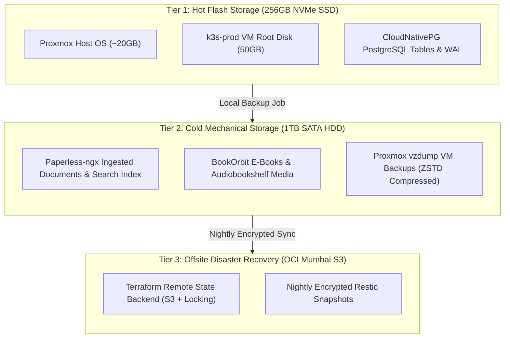

# 05. Dual-Tier Storage Architecture

> **Target Standard:** Hardware Storage Tiering & 3-2-1 Backup Topology  
> **Physical Media:** 256GB M.2 NVMe SSD + 1TB 2.5" SATA HDD  
> **Cloud Tier:** Oracle Cloud Infrastructure (OCI) S3-Compatible Object Storage  

---

## 1. Storage Economics & The I/O Starvation Dilemma

Single-node virtualization environments face a classic storage bottleneck: running database transactions alongside heavy background file operations on the same physical disk causes severe I/O contention (high `%wa` CPU wait state).

To resolve this on a single Mini PC, the storage architecture enforces a **3-Tier Hierarchy**:

---

## 2. Storage Tier Specifications

| Storage Tier | Physical Medium | Filesystem / Driver | IOPS & Throughput | Workloads Bound |
| :--- | :--- | :--- | :--- | :--- |
| **Tier 1 (Hot)** | 256GB M.2 NVMe | `local-lvm` (LVM-Thin) / `ext4` | High Random IOPS (>150k IOPS) | Proxmox base OS, K3s etcd consensus logs, CloudNativePG active database tables and WAL logs. |
| **Tier 2 (Cold)** | 1TB SATA HDD | Mount `/mnt/hdd` (`ext4`) | Sequential Throughput (~120MB/s) | Paperless document archive (`/mnt/data/paperless`), BookOrbit library, Audiobookshelf files, Proxmox daily snapshots. |
| **Tier 3 (Offsite)**| OCI Object Storage | S3-compatible REST API | Offsite High-Durability (11 9s) | Terraform remote state files, encrypted Restic backup repository. |

---

## 3. The 3-2-1 Backup Strategy

The platform adheres to the enterprise **3-2-1 Backup Standard**:
* **3 Copies of Data:** Production database + Local Proxmox backup dump + Cloud encrypted snapshot.
* **2 Different Media Types:** High-speed NVMe flash drive + Mechanical SATA hard drive.
* **1 Copy Offsite:** Replicated nightly to Oracle Cloud Infrastructure (OCI) in Mumbai, guaranteeing survival even in the event of physical host destruction, theft, or fire.
