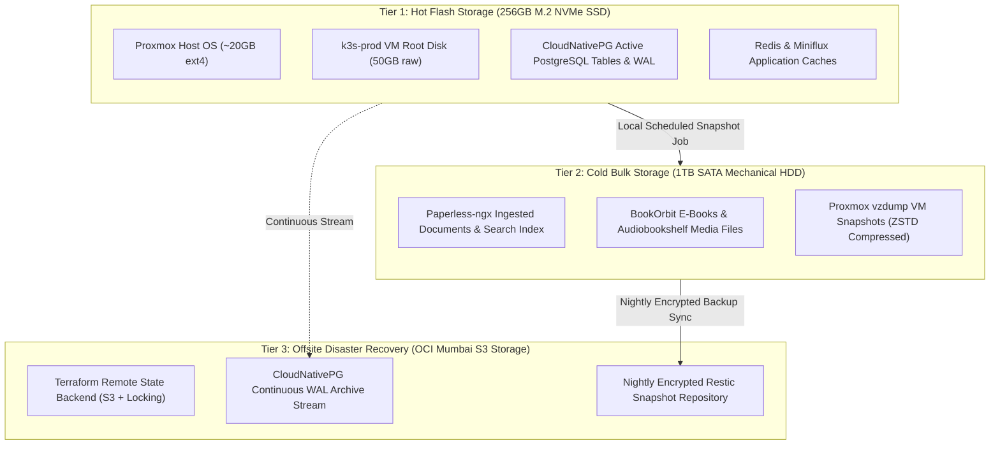

# 05. Dual-Tier Storage & Disaster Recovery Architecture

> **Platform Standard:** Hardware Storage Tiering & 3-2-1 Enterprise Backup Standard  
> **Physical Media:** 256GB M.2 NVMe PCIe SSD + 1TB 2.5" SATA Mechanical HDD  
> **Cloud Tier:** Oracle Cloud Infrastructure (OCI) S3-Compatible Object Storage (Mumbai)  
> **Target Recovery SLA:** RTO < 45 Minutes | RPO < 15 Minutes  

---

## 1. Storage Economics & The I/O Starvation Dilemma

Single-node virtualization environments face a classic hardware bottleneck: running high-frequency database transactions alongside heavy background file operations on the same physical disk causes severe I/O contention (manifesting as elevated `%wa` CPU wait states). 

When intensive workloads (such as Paperless Optical Character Recognition or media scanning) saturate disk bandwidth, database writes block, causing etcd consensus timeouts and application health-check failures.

To eliminate disk starvation on a single Mini PC, the storage architecture enforces a **3-Tier Storage Hierarchy**:



---

## 2. Storage Tier Technical Specifications

| Storage Tier | Physical Medium | Filesystem / Driver | IOPS & Throughput Profile | Target Workloads & Directories |
| :--- | :--- | :--- | :--- | :--- |
| **Tier 1 (Hot Flash)** | 256GB M.2 NVMe PCIe SSD | `local-lvm` (LVM-Thin Pool) / `ext4` | High Random IOPS (>150,000 IOPS), Latency < 0.1ms | Proxmox base OS, K3s datastore state, CloudNativePG active database tables and write-ahead logs (`/var/lib/postgresql/data`). |
| **Tier 2 (Cold Bulk)** | 1TB 2.5" SATA HDD (5400 RPM) | Mount `/mnt/hdd` (`ext4`) | High Sequential Throughput (~120MB/s) | Paperless document archive (`/mnt/data/paperless`), Audiobookshelf streaming audio, BookOrbit library, daily compressed Proxmox backups (`/mnt/hdd/dump`). |
| **Tier 3 (Offsite Cloud)**| OCI Object Storage (Mumbai) | S3 REST API Protocol | High Durability (11 9s), Geographically Isolated | Encrypted Restic backup snapshots, CloudNativePG cold database backups, Terraform remote state files. |

---

## 3. Dynamic Kubernetes Volume Mapping

Storage tiers are mapped directly into Kubernetes using discrete StorageClasses and persistent volume claims:

```text
Host Physical Drive
├── /dev/nvme0n1 (NVMe)  --> k3s-prod /var/lib/rancher/k3s/storage --> StorageClass: local-path (Default)
└── /dev/sda (SATA HDD)  --> Passthrough vm-500-disk-1 (/mnt/data)   --> StorageClass: local-path-hdd
```

### StorageClass Capabilities:
- **`local-path`:** Dynamically allocates persistent volume subdirectories on high-speed NVMe flash for every database or Redis StatefulSet.
- **`local-path-hdd`:** Statically binds heavy document and media directories directly to the high-capacity SATA disk, shielding the NVMe flash drive from storage exhaustion and excessive write wear.

---

## 4. The Enterprise 3-2-1 Backup Standard

The platform adheres strictly to the industry **3-2-1 Backup Standard**:

| Backup Principle | Architecture Implementation | Automated Mechanism |
| :--- | :--- | :--- |
| **3 Copies of Data** | 1. Production database & live storage<br>2. Local Proxmox backup snapshot<br>3. Offsite cloud encrypted snapshot | Continuous live writes + Daily local backups + Nightly cloud sync. |
| **2 Different Media Types**| 1. High-speed solid-state flash memory (NVMe)<br>2. Magnetic mechanical disk storage (SATA HDD) | Prevents simultaneous hardware degradation or controller failure. |
| **1 Offsite Location** | Oracle Cloud Infrastructure (OCI) in Mumbai | Guarantees survival against physical hardware destruction, fire, or theft. |

---

## 5. Automated Disaster Recovery Playbooks

1. **Daily Virtual Machine Snapshots:**
   - Every morning at 03:00 UTC, Proxmox VE executes a live snapshot backup of VM 500 using `vzdump`.
   - Backups are compressed using high-ratio **Zstandard (`zstd`)** and written to `/mnt/hdd/dump/`.
   - Backup retention enforces `keep-daily: 7, keep-weekly: 4`.

2. **Database Point-in-Time Recovery (PITR):**
   - CloudNativePG continuously streams Write-Ahead Logs (WAL) to offsite S3 object storage.
   - Enables restoring the database to any specific second within the last 7 days.

3. **Nightly Offsite Encrypted Synchronization:**
   - At 04:00 UTC, an automated Restic job deduplicates, encrypts (AES-256), and replicates all persistent document volumes to OCI S3.

---

## 6. Storage SLA & Verification Metrics

- **Recovery Point Objective (RPO):** < 15 Minutes (Maximum potential data loss window during catastrophic hardware failure).
- **Recovery Time Objective (RTO):** < 45 Minutes (Time required to flash a replacement machine, restore VM snapshot, and restore public ingress).
- **Storage Durability:** Multi-regional redundancy across bare metal and enterprise cloud object storage.
