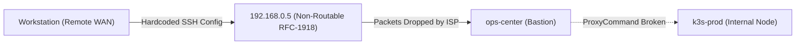

# Incident Post-Mortem: Asymmetric WAN Routing & Split-Horizon SSH Failure

> **Incident Classification:** Network Degradation & Remote Management Failure  
> **Incident ID:** INC-2026-01-08-P2  
> **Status:** Resolved & Permanently Remediated  

---

## Executive Metadata

| Attribute | Specification |
| :--- | :--- |
| **Incident Date** | 2026-01-08 |
| **Severity Level** | P2 (Major - Remote Infrastructure Management Unreachable) |
| **Affected System** | `ops-center` (Ansible Jump Host & Orchestration Control Plane) |
| **Incident Commander** | Vijay Singh (Platform & DevOps Engineer) |
| **Time to Detect (TTD)** | 2 Minutes (Ansible playbook execution aborted immediately) |
| **Time to Mitigate (TTM)** | 20 Minutes (SSH ProxyCommand configuration update) |
| **Time to Recover (TTR)** | 30 Minutes (Verification across multiple external WAN connections) |
| **Skills Deployed** | Packet Tracing, SSH Tunneling, Split-Horizon DNS Resolution, Tailscale WireGuard Overlay |

---

## 1. Executive Summary & Business Impact

While executing automated configuration management playbooks from an external network (remote coffee shop WAN), the administrative control workstation completely lost connectivity to the on-premise infrastructure. All Ansible tasks targeting `ops-center` failed with `UNREACHABLE`, while internal workloads reported `Connection closed by UNKNOWN port 65535`.

Because the management bastion host acts as the entry gateway for all internal Kubernetes and hypervisor tasks, this failure paralyzed remote operations, preventing deployments, emergency patches, and monitoring tasks from outside the physical home network.

Investigation revealed an asymmetric routing conflict caused by a **Split-Horizon SSH Configuration**: a local workstation override explicitly bound the bastion's hostname to an internal non-routable RFC-1918 LAN IP (`192.168.0.5`) rather than traversing the authenticated Tailscale WireGuard overlay (`100.x.x.x`).

---

## 2. Incident Timeline

| Timestamp | Elapsed Time | Event / Action Taken | Status |
| :--- | :--- | :--- | :--- |
| **10:14 UTC** | T+00m | Engineer initiates Ansible playbook run from remote WAN network. | Detection |
| **10:15 UTC** | T+01m | Playbook execution crashes: `fatal: [ops-center]: UNREACHABLE!`. | Impact |
| **10:18 UTC** | T+04m | Engineer verifies internet connectivity; ping to public DNS succeeds. | Triage |
| **10:22 UTC** | T+08m | Verbose SSH tracing (`ssh -vvv ops-center`) reveals attempt to connect to `192.168.0.5:22`. | Investigation |
| **10:26 UTC** | T+12m | Root cause confirmed: `~/.ssh/config` contained hardcoded LAN IP injected during early local provisioning. | RCA |
| **10:32 UTC** | T+18m | Workstation SSH config updated to bind `ops-center` to Tailscale IP (`100.x.x.x`). | Mitigation |
| **10:38 UTC** | T+24m | Ansible `group_vars` patched with dynamic ProxyCommand tunneling. | Hardening |
| **10:44 UTC** | T+30m | Playbook execution succeeds across external cellular and public Wi-Fi hotspots. | Resolved |

---

## 3. Technical Root Cause Analysis (RCA)

### Diagnostic Log Analysis
Verbose SSH diagnostics isolated the failure point instantly:

```text
OpenSSH_9.6p1, LibreSSL 3.3.6
debug1: Reading configuration data /Users/vsc/.ssh/config
debug1: /Users/vsc/.ssh/config line 12: Applying options for ops-center
debug1: Connecting to 192.168.0.5 [192.168.0.5] port 22.
debug1: connect to address 192.168.0.5 port 22: Operation timed out
ssh: connect to host 192.168.0.5 port 22: Operation timed out
fatal: [ops-center]: UNREACHABLE! => {"changed": false, "msg": "Failed to connect to the host via ssh: ssh: connect to host 192.168.0.5 port 22: Operation timed out", "unreachable": true}
```

### The Jump Host Paradox
Internal cluster nodes (such as `k3s-prod`) were configured to route through `ops-center` via SSH ProxyCommand:



Because the entry bastion was unreachable over public transit, all dependent internal nodes failed simultaneously, generating deceptive port-closed errors.

### The Split-Horizon Conflict
During initial bare-metal installation, a local Terraform template had populated `~/.ssh/config` with high-performance LAN IPs to accelerate file transfers. When the engineer transitioned to remote work, the local SSH resolver honored the static config file over DNS and WireGuard overlay routing, attempting to send private LAN packets out over the public internet.

---

## 4. Remediation & Permanent Architecture Fix

### Fix 1: Enforcing Zero-Trust Tailscale Host Bindings
The workstation SSH configuration was refactored to eliminate hardcoded RFC-1918 IP addresses in favor of deterministic Tailscale mesh addresses:

```sshconfig
# ~/.ssh/config
Host ops-center
    HostName 100.108.178.93
    User devops
    IdentityFile ~/.ssh/id_ed25519
    StrictHostKeyChecking accept-new
    ServerAliveInterval 30
    ServerAliveCountMax 3
```

### Fix 2: Codified Ansible ProxyCommand Routing
To guarantee that nested internal nodes route through the bastion regardless of network location, Ansible configuration was centralized in `inventory/group_vars/all.yml`:

```yaml
# inventory/group_vars/all.yml
ansible_ssh_common_args: >-
  -o ProxyCommand="ssh -W %h:%p -q -o StrictHostKeyChecking=accept-new devops@100.108.178.93"
  -o ServerAliveInterval=30
  -o ControlMaster=auto
  -o ControlPersist=10m
```

---

## 5. Architectural Outcomes & Preventative Policy

| Evaluation Metric | Baseline State (Pre-Incident) | Remediated State (Post-Incident) |
| :--- | :--- | :--- |
| **Remote WAN Execution** | 0% (Failed with timeouts) | 100% (Seamless over any public internet uplink) |
| **Inbound Router Ports** | 0 (Zero ports forwarded) | 0 (Zero ports forwarded - 100% WireGuard encrypted) |
| **Configuration Drift** | High (Ad-hoc local `~/.ssh/config` overrides) | Zero (Centrally managed via version-controlled inventory) |
| **Access Control Model** | Perimeter LAN dependent | True Zero-Trust (Identity-based overlay network) |

### Key Takeaway for Platform Engineering:
Never allow deployment tools to hardcode physical layer assumptions (like local subnets). Administrative tooling must operate against an immutable, authenticated overlay fabric that functions identically whether connected locally or from a remote coffee shop.