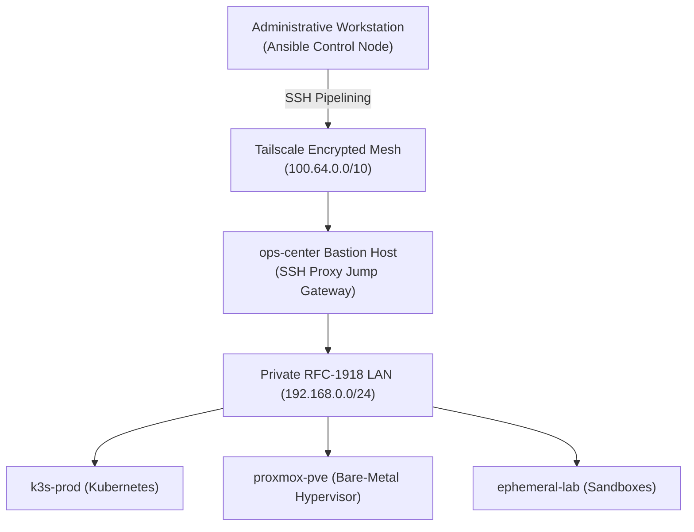

# Engineering Retrospective: Evolution from Imperative Scripts to Idempotent Ansible Automation

> **Platform Standard:** Historical Configuration Management Retrospective  
> **Milestone Era:** Milestone v2.0 Architecture  
> **Status:** Archival Reference (Foundation for modern GitOps)  

---

## Executive Overview

| Attribute | Specification |
| :--- | :--- |
| **Domain** | Configuration Management & Fleet Orchestration |
| **Target Infrastructure** | Heterogeneous Fleet: Proxmox Host, Operations Bastion, K3s Kubernetes Nodes |
| **Tooling Adopted** | Ansible Core 2.15+, Ansible Vault (AES-256), SSH Pipelining, Proxmox Community Collections |
| **Lead Engineer** | Vijay Singh (Platform & DevOps Engineer) |
| **Key Outcome** | Eliminated 100% of manual SSH drift; codified idempotent fleet patching and zero-trust jump host access |

---

## 1. The Problem: The Scalability Wall of Imperative Shell Scripts

Following initial infrastructure provisioning via Terraform, maintaining virtual machines using manual SSH logins and localized shell scripts (`setup.sh`, `install-docker.sh`) rapidly broke down:

1. **Configuration Drift:** When a system package failed on `node-1` but succeeded on `node-2`, nodes silently diverged in patch level, kernel modules, and security parameters.
2. **Lack of Idempotency:** Re-running a bash script frequently appended duplicate lines to `/etc/hosts` or failed on existing users, causing destructive pipeline aborts.
3. **Plaintext Credential Exposure:** Scripts required database passwords and API tokens passed as unencrypted environment flags or stored in plaintext files.
4. **Network Access Friction:** Target virtual machines resided in private subnets behind NAT without public IP addresses, requiring complex manual SSH tunneling.

---

## 2. Architectural Architecture: Agentless Ansible Fleet

To eliminate manual drift without burdening constrained 16GB host memory with background daemon agents (like Puppet or Chef), **Ansible** was implemented across the infrastructure:



---

## 3. Engineering Challenges & Technical Remediations

### Challenge 1: The "Chicken and Egg" NAT Connectivity Barrier
**Problem:** Workstations operating over external networks (or remote cellular connections) could not reach internal virtual machines on `192.168.0.0/24`. Opening SSH ports on the home router would violate Zero-Trust standards.

**Solution:** Implemented the **SSH Jump Host Pattern** leveraging OpenSSH `ProxyCommand` within Ansible group variables. All connections dynamically tunnel through the authenticated `ops-center` bastion over Tailscale:

```yaml
# inventory/group_vars/internal_nodes.yml
ansible_ssh_common_args: >-
  -o ProxyCommand="ssh -W %h:%p -q -o StrictHostKeyChecking=accept-new devops@100.108.178.93"
  -o ControlMaster=auto
  -o ControlPersist=15m
  -o PreferredAuthentications=publickey
```

### Challenge 2: In-Repository Secret Protection
**Problem:** Application configurations required sensitive API tokens, Proxmox root passwords, and Cloudflare credentials. Plaintext storage in GitHub was strictly prohibited.

**Solution:** Adopted **Ansible Vault with AES-256 Encryption**. All secrets were encapsulated in encrypted files (`vault.yml`) with zero plaintext values checked into Git:

```bash
# Encrypt individual sensitive variables
ansible-vault encrypt_string 'MySuperSecureDBPass123' --name 'db_password'

# Automated playbook execution using local ephemeral key file
ansible-playbook playbooks/site.yml --vault-password-file ~/.vault_pass
```

### Challenge 3: Physical Memory Contention via Zone Switching
**Problem:** The single physical Mini PC host possessed only 16GB of physical RAM. Running the production K3s cluster simultaneously with multi-node "Kubernetes The Hard Way" lab VMs consistently exceeded memory limits, threatening host stability.

**Solution:** Engineered an orchestration playbook (`manage_zones.yml`) utilizing the `community.general.proxmox` module to interact directly with the hypervisor API. The playbook programmatically suspends or boots entire architectural zones on demand:

```yaml
# playbooks/manage_zones.yml
- name: "Hypervisor | Toggle Operational Zones"
  hosts: localhost
  tasks:
    - name: "Suspend Ephemeral Lab VM to Preserve Production Memory"
      community.general.proxmox_kvm:
        api_host: "100.108.178.93"
        api_user: "root@pam"
        api_token_id: "{{ proxmox_token_id }}"
        api_token_secret: "{{ proxmox_token_secret }}"
        vmid: 201
        state: stopped
      when: active_mode == "production"
```

---

## 4. Operational Comparison Matrix

| Evaluation Dimension | Manual Shell Scripts (Pre-Ansible) | Idempotent Ansible Fleet (Milestone v2.0) | Modern GitOps Flux CD (Milestone v3.0) |
| :--- | :--- | :--- | :--- |
| **Execution Model** | Imperative, manual, step-dependent. | Idempotent, declarative playbooks. | Continuous reconciliation via Kubernetes Operator. |
| **Configuration Drift** | High (Unavoidable divergence). | Zero during playbook execution. | Zero (Continuous drift correction every 5m). |
| **Secret Management** | Insecure plaintext or manual export. | Encrypted via Ansible Vault (AES-256). | In-Git Mozilla SOPS with Age asymmetric encryption. |
| **Failure Recovery** | Manual troubleshooting per host. | Re-run playbook to restore desired state. | Automatic self-healing directly from Git commits. |

---

## 5. Architectural Retrospective

Ansible transformed the infrastructure from fragile artisanal servers into repeatable, standardized compute blocks. 

This foundation provided the operational discipline necessary to transition to **Milestone v3.0**, where host OS configuration remains codified in Ansible, while application and platform lifecycle management was elevated to declarative Kubernetes GitOps via **Flux CD v2**.