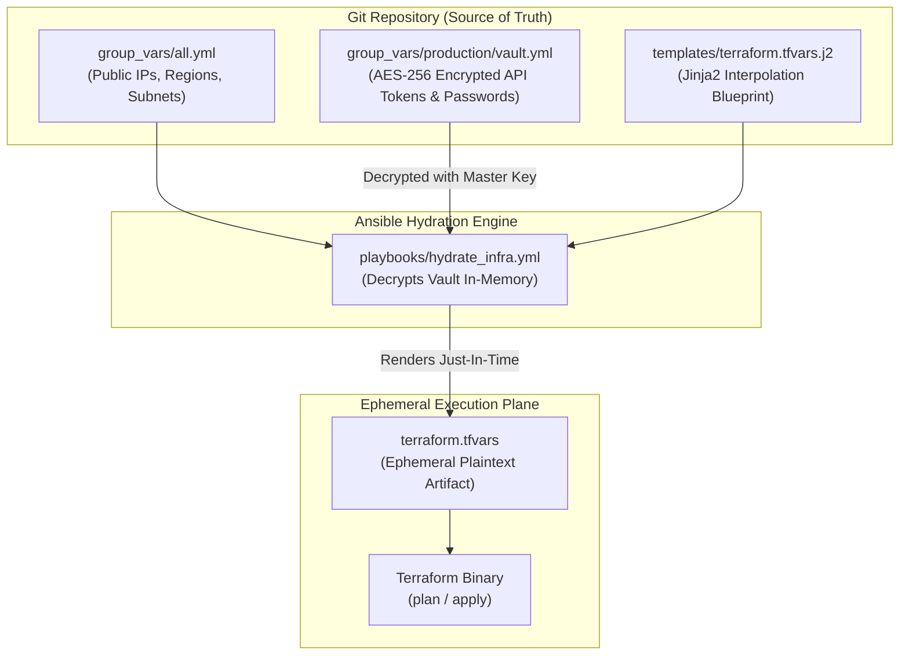
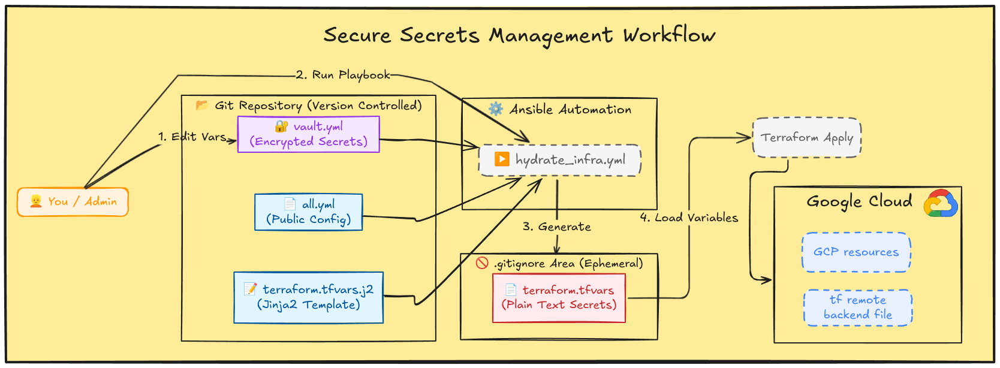

# Architecture Deep-Dive: Just-In-Time Secret Hydration Pattern (Pre-GitOps)

> **Platform Standard:** Historical Secret Management Architecture  
> **Milestone Era:** Milestone v2.0 Architecture  
> **Status:** Archival Reference (Precursor to modern GitOps Mozilla SOPS)  

---

## Executive Overview

| Attribute | Specification |
| :--- | :--- |
| **Domain** | Cryptographic Secret Lifecycle & Infrastructure Pipeline Security |
| **Target Systems** | Terraform State, Ansible Automation, Cloud VM Gateways |
| **Tooling Adopted** | Ansible Vault (AES-256), Jinja2 Templating, Ephemeral Pipeline Artifacts |
| **Lead Architect** | Vijay Singh (Platform & DevOps Engineer) |
| **Key Outcome** | Prevented 100% of credential leaks in Git while enabling fully automated Terraform execution |

---

## 1. The Core Engineering Conflict: Terraform vs. Version Control

As infrastructure orchestration scaled, a fundamental DevOps security challenge emerged:

1. **Declarative Requirement:** Terraform requires variables (API tokens, private keys, database passwords) available in plaintext files (`terraform.tfvars`) during the execution of `plan` and `apply`.
2. **Version Control Mandate:** Git repositories (especially public or collaborative portfolios) must **never** commit plaintext credentials.
3. **Tooling Incompatibility:** While Ansible Vault was used for server configuration, Terraform could not natively parse AES-256 encrypted Ansible Vault files.

### The "Split-Brain" Configuration Anti-Pattern
Initially, operators manually created `terraform.tfvars` directly on the remote operations VM. This introduced severe operational hazards:
- Configuration drift between local workstations and deployment environments.
- Untracked, unversioned modifications to infrastructure variables.
- Catastrophic recovery friction if the operations VM suffered disk corruption.

---

## 2. Architectural Decision Matrix: Secret Management Alternatives

Before engineering the Just-In-Time (JIT) Hydration bridge, four industry-standard patterns were evaluated:

| Architectural Option | Pros | Cons | Decision |
| :--- | :--- | :--- | :--- |
| **Option A: Environment Variables (`TF_VAR_*`)** | Native Terraform support; no secrets written to disk. | Tedious to manage across 30+ parameters; requires maintaining unversioned shell wrapper scripts. | **Rejected:** Fragile developer experience; poor auditability. |
| **Option B: HashiCorp Vault Cluster** | Industry gold-standard; dynamic lease rotation; deep audit trails. | Extreme resource overhead (~1-2GB RAM); requires unseal infrastructure; high complexity for a single-host homelab. | **Rejected:** Overkill for constraints; excessive memory footprint. |
| **Option C: Cloud Secret Manager (GCP / AWS)** | Fully managed; zero local compute overhead; fine-grained IAM. | Introduces hard cloud runtime dependency for on-premise infrastructure; recurring API cost. | **Rejected:** Violates sovereign offline operational mandate. |
| **Option D: Vault JIT Hydration Bridge** | Offline capable; zero compute overhead; reuses existing Ansible tooling; encrypted files version-controlled in Git. | Secrets exist briefly as ephemeral plaintext files on disk during build execution. | **Accepted for v2.0:** Optimal balance of security, resource efficiency, and ergonomics. |

---

## 3. The Hydration Bridge Architecture

The "Hydration Pattern" decouples public architecture definitions from sensitive cryptographic values, treating `terraform.tfvars` strictly as a **compiled build artifact**:





---

## 4. Implementation Details

### Separation of Concerns: Public vs. Secret State
Variables are strictly segmented to enable maximum transparency without compromising security:

```yaml
# 1. Safe to commit to public Git (group_vars/all.yml)
gcp_region: "asia-south1"
proxmox_gateway_ip: "192.168.0.1"
proxmox_node_name: "pve"
storage_pool_nvme: "local-lvm"
```

```yaml
# 2. Encrypted via Ansible Vault AES-256 (group_vars/production/vault.yml)
# $ANSIBLE_VAULT;1.1;AES256
# 38323631326466336437313063343461326135326532653539313364343136363066343534343834
proxmox_api_token_secret: "f43b8112-998b-4c22-9014-9982348a881a"
cloud_gateway_ssh_key: "ssh-ed25519 AAAAC3NzaC1lZDI1NTE5..."
```

### The Jinja2 Template Contract
```jinja
# templates/terraform.tfvars.j2
# AUTO-GENERATED BY ANSIBLE HYDRATION ENGINE - DO NOT EDIT MANUALLY
gcp_region          = "{{ gcp_region }}"
proxmox_api_url     = "https://{{ proxmox_gateway_ip }}:8006/api2/json"
proxmox_token_id    = "root@pam!terraform"
proxmox_token_secret= "{{ proxmox_api_token_secret }}"
```

---

## 5. Security Guardrails

1. **Global Gitignore Enforcement:** The pattern `**/terraform.tfvars` was globally codified in `.gitignore`, preventing accidental commits.
2. **Ephemeral Lifecycle:** Automated execution scripts ensure that `terraform.tfvars` is destroyed (`shred -u terraform.tfvars`) immediately following pipeline termination.
3. **No Direct Edits:** Human operators are prohibited from touching `.tfvars` files directly, preventing configuration drift.

---

## 6. Evolutionary Bridge to Milestone v3.0

While the Hydration Pattern was an elegant solution for Milestone v2.0, it still required an active compilation step before applying changes.

In **Milestone v3.0**, this workflow was elevated to **declarative GitOps**:
- Replaced Ansible Vault and Jinja templating with **Mozilla SOPS** and **Age asymmetric encryption**.
- Secrets are committed directly to Git alongside Kubernetes manifests (`secrets.enc.yaml`).
- The **Flux CD v2 Kustomize Controller** decrypts secrets directly in-memory inside the cluster, completely eliminating intermediate plaintext files on disk.