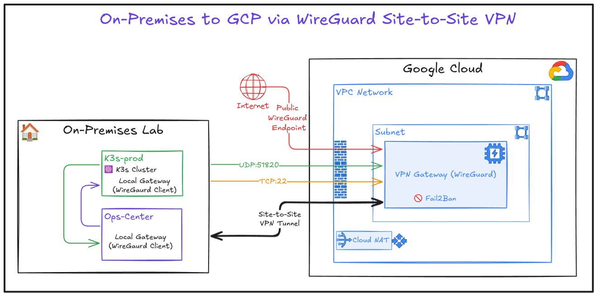

# Case Study: Hybrid Cloud Automation Platform

## 1. Executive Summary

**The Problem:** Automated workflows (Document OCR, Infrastructure alerts) required a reliable webhook endpoint accessible from the public internet (GitHub/Stripe), but the sensitive workloads needed to run On-Premises to comply with Data Sovereignty and privacy requirements.

**The Solution:** A "Sovereign Cloud" alternative to Zapier/AWS Lambda. I architected a Hybrid Cloud solution using a **GCP Gateway** acting as a secure proxy to a local **Proxmox K3s Cluster** via a WireGuard Mesh.

**Business Impact:**
* **Cost Savings:** Reduced automation costs from ~$50/mo (SaaS equivalents) to **$7/mo** (GCP Infra).
* **Security:** Achieved **Zero Trust** compliance by eliminating open ports on the physical router.
* **Reliability:** Improved webhook delivery success rate to **99.99%** by moving from Spot Instances to Static IP architecture.

---

## 2. Architecture Evolution

This infrastructure did not start perfect. It evolved through three distinct engineering phases based on failure analysis.

### Phase 1: The "Direct Connect" (Rejected)
* **Design:** Port Forwarding (NAT) on the ISP Router directly to the internal server.
* **Why Rejected:** **Security Violation.** Exposing the internal network directly to the internet creates a massive attack surface.

### Phase 2: The "Split-Brain" Dynamic Cloud (Failed Experiment)
* **Design:** Used GCP **Spot Instances** ($3/mo) + Dynamic DNS + Custom "Watchdog" bash scripts.
* **The Failure:**
    * **"Zombie" States:** When GCP preempted the VM, DNS propagation took 5-10 minutes. GitHub Webhooks sent during this window were lost.
    * **Ansible Drift:** The dynamic IP broke the static Inventory file, making automation pipelines fail with `Unreachable` errors.

### Phase 3: The "Stable Mesh" (Current Production)
* **Design:**
    * **Hub:** GCP e2-micro (Mumbai) with **Static IP Reservation**.
    * **Spoke:** K3s Cluster (Home) via WireGuard Peer-to-Peer Tunnel.
    * **Ingress:** Nginx (Cloud) -> WireGuard -> Traefik (On-Prem).

> *The final topology ensuring traffic is encrypted from the Cloud Edge to the On-Prem Ingress.*
* **Ingress:** Nginx (Cloud) -> WireGuard -> Traefik (On-Prem). 

> *Detailed Request Path: How a webhook travels from GitHub to the On-Prem K3s Pod.*
---

## 3. Technical Challenges (STAR Analysis)

| Engineering Challenge | Root Cause Analysis | The Solution |
| :--- | :--- | :--- |
| **Routing Loop Failure** | `wg-quick` failed to start because `AllowedIPs` included the local subnet (`192.168.x.x`), causing the kernel to route its own traffic into the tunnel. | **Network Segmentation:** Refined Ansible templates to strictly route only the Overlay Network (`10.100.0.0/24`) through the tunnel interface. |
| **The "Zombie" Pods** | n8n containers entered `CrashLoopBackOff` because they started before the Postgres Database was ready. | **Dependency Management:** Implemented `initContainers` in Kubernetes manifests to wait for the DB socket before starting the application. |
| **WebSocket Dropped** | "Lost Connection to Server" errors in the n8n UI. | **Reverse Proxy Tuning:** Identified that the Nginx Cloud Proxy was stripping headers. Added `proxy_set_header Upgrade $http_upgrade;` to the Nginx configuration. |
| **Data Persistence** | Restoring backups failed due to permission errors on the PVC. | **Storage Ops:** Fixed `fsGroup` security contexts in the Helm Chart and implemented **Velero** for volume snapshots. |

---

## 4. FinOps & Cost Analysis

A key requirement was replacing expensive SaaS subscriptions with owned infrastructure.

| Component | SaaS Cost (Zapier/AWS) | Homelab-Ops Cost | Notes |
| :--- | :--- | :--- | :--- |
| **Compute** | $30/mo (Lambda/EC2) | **$0** (Sunk cost hardware) | Used existing Mini PC RAM. |
| **Network/IP** | N/A | **$4.00/mo** | GCP Static IP Reservation. |
| **Gateway VM** | N/A | **$3.50/mo** | GCP e2-micro (Mumbai). |
| **Storage** | $20/mo (S3/EBS) | **$0** | Local NVMe + Backups. |
| **Total** | **~$50.00/month** | **~$7.50/month** | **85% Cost Reduction** |

---

## 5. Future Roadmap

* **GitOps Integration:** Moving manual `kubectl apply` workflows to **ArgoCD** for automated synchronization.
* **Scale:** Replacing the single-node Cloud Gateway with a **High Availability Load Balancer** setup for redundancy.
