# Engineering Case Study: Hybrid Cloud Event-Driven Automation Platform (n8n & WireGuard)

> **Platform Standard:** Historical Case Study & Hybrid Cloud Architecture  
> **Milestone Era:** Milestone v2.0 Architecture  
> **Status:** Archival Reference (Foundational workflow platform)  

---

## Executive Overview

| Attribute | Specification |
| :--- | :--- |
| **Role** | Lead Cloud & Platform Architect |
| **Technical Stack** | n8n Workflow Engine, WireGuard Site-to-Site Mesh, GCP Compute Engine, K3s, PostgreSQL |
| **Architectural Focus** | Data Sovereignty, Hybrid Event Routing, Zero-Trust CGNAT Traversal |
| **Cost Impact** | 85% FinOps expenditure reduction compared to commercial SaaS (Zapier / Make) |
| **Reliability Metric** | 99.99% Webhook delivery success rate post-remediation |

---

## 1. Executive Summary & Problem Statement

Modern platform operations require event-driven automation: triggering Optical Character Recognition (OCR) upon receipt of financial invoices, processing GitHub commit webhooks, and routing infrastructure alerts to incident channels. However, commercial cloud automation tools (such as Zapier, Make, or AWS Step Functions) present two critical enterprise barriers:

1. **Data Sovereignty & Privacy Violation:** Ingesting tax records, personal identification, and infrastructure credentials into multi-tenant public SaaS environments violated personal data sovereignty mandates.
2. **The CGNAT Barrier:** Hosting the automation engine on private bare-metal hardware isolated behind residential Carrier-Grade NAT prevented external third-party services (GitHub, Stripe, Telegram) from dispatching inbound HTTP POST webhooks.

### The Architectural Solution
A sovereign hybrid cloud automation platform was engineered: a hardened cloud gateway hosted in Google Cloud Platform (GCP Mumbai) received external webhooks, terminated SSL, and securely proxied encrypted payloads through a point-to-point WireGuard tunnel directly into an on-premise K3s Kubernetes cluster for local, private execution.

---

## 2. Architectural Evolution & Failure Analysis

The platform did not achieve production stability on day one; it evolved through three distinct engineering iterations driven by rigorous failure analysis:

```mermaid
flowchart LR
    subgraph PublicInternet["Public Internet"]
        WebhookSender["GitHub / External Webhooks"]
    end

    subgraph GCPCloud["GCP Edge (asia-south1 Mumbai)"]
        StaticIP["GCP Static IP (34.x.x.x)"]
        NginxProxy["Hardened Nginx Reverse Proxy"]
        WG_Hub["WireGuard Hub (10.100.0.1)"]
    end

    subgraph OnPremSovereign["On-Premise Sovereign Cluster"]
        WG_Spoke["WireGuard Spoke (10.100.0.2)"]
        Traefik["Traefik Ingress Controller"]
        n8nPod["n8n Automation Engine"]
        PostgresPod["PostgreSQL Database"]
    end

    WebhookSender -->|HTTPS POST| StaticIP
    StaticIP --> NginxProxy
    NginxProxy --> WG_Hub
    WG_Hub <==|Encrypted UDP Tunnel (WireGuard)|==> WG_Spoke
    WG_Spoke --> Traefik
    Traefik --> n8nPod
    n8nPod <--> PostgresPod
```

### Phase 1: The "Direct Connect" Anti-Pattern (Rejected)
- **Concept:** Configuring Port Forwarding (DNAT) on the residential router.
- **Why Rejected:** Severe security compromise. Exposing home router ports directly to the public internet invited automated port scanners, brute-force attacks, and DDoS vulnerabilities.

### Phase 2: The "Split-Brain" Dynamic Cloud (Failed Experiment)
- **Concept:** Provisioned ephemeral GCP Spot VM instances ($3/mo) paired with Dynamic DNS (DDNS) and custom bash recovery watchdogs (`watchdog-vpn.sh`).
- **Failure Modes:**
  - When GCP preempted the spot instance, DNS propagation required 5 to 10 minutes to update the new IP address. Webhooks dispatched during this window were permanently dropped.
  - Ephemeral IP churn caused Ansible static inventories to fail with `Host Unreachable` errors during routine maintenance runs.

### Phase 3: The Stable Cloud Relay Bridge (Milestone v2.0 Production)
- **Architecture:** Transitioned to an `e2-micro` instance in GCP Mumbai with a permanent **Static Public IP Reservation**.
- **Result:** Eliminated webhook drops entirely. If on-premise hardware went offline, Nginx queued requests or returned structured HTTP 502 responses instead of triggering DNS resolution timeouts.

---

## 3. High-Resolution Architecture Diagrams

---

## 4. Technical Challenges & STAR Engineering Analysis

| Challenge | Root Cause Analysis | Engineering Solution (Action) | Quantitative Result |
| :--- | :--- | :--- | :--- |
| **Kernel Routing Loop** | `wg-quick` failed to initialize because `AllowedIPs = 0.0.0.0/0` rerouted default internet gateway traffic into the tunnel, severing the host's physical uplink. | Refined WireGuard configuration to enforce strict **Split-Tunneling**: only traffic destined for the overlay subnet (`10.100.0.0/24`) is routed through `wg0`. | Zero packet loss; host preserves independent local LAN routing. |
| **Zombie Pod Lifecycle** | n8n application containers crashed in `CrashLoopBackOff` upon node reboot because the app started before PostgreSQL had finished initializing its tables. | Codified an explicit `initContainers` socket-wait loop in the Kubernetes deployment manifest, holding container boot until port 5432 responds. | Eliminated 100% of boot race conditions; flawless startup sequencing. |
| **WebSocket Dropping** | The n8n administrative user interface frequently disconnected with "Connection to server lost" alerts during long-running workflows. | Discovered that the cloud Nginx reverse proxy was terminating HTTP/1.1 persistent connections without WebSocket upgrade headers. Added `proxy_set_header Upgrade $http_upgrade` and `proxy_read_timeout 3600s`. | 100% persistent connection stability for interactive visual workflows. |
| **Storage Permissions Drift** | Restoring PostgreSQL backups onto persistent storage failed due to Linux UID/GID permission mismatches on the mounted volume. | Enforced standardized `securityContext` settings (`fsGroup: 1000`, `runAsUser: 1000`) across all Kubernetes volume mount definitions. | Deterministic, non-root data volume mounts across all storage pools. |

---

## 5. FinOps & Cost Optimization Analysis

A primary motivation for self-hosting was replacing predatory SaaS pricing models with predictable, owned infrastructure:

| Component | Commercial SaaS (Zapier / Make / AWS) | Homelab Hybrid Architecture (v2.0) | Sovereign Cloud Standard (v3.0) |
| :--- | :--- | :--- | :--- |
| **Compute Execution** | $30.00 / month (Execution tier limits) | $0.00 (Local Intel i5 hardware) | $0.00 (Local Intel i5 hardware) |
| **Static Public IP** | Included in SaaS subscription | $4.00 / month (GCP Static IP) | $0.00 (Cloudflare Anycast routing) |
| **Gateway Proxy VM** | Included in SaaS subscription | $3.50 / month (GCP e2-micro instance) | $0.00 (Cloudflare Zero Trust edge) |
| **Storage & Backups** | $20.00 / month (Cloud S3 storage limits) | $0.00 (Local NVMe + SATA HDD) | $0.00 (Local NVMe + Cloud Native DR) |
| **Total Monthly Cost**| **~$50.00 / month** | **~$7.50 / month (85% Savings)** | **~$0.00 / month (100% Savings)** |

---

## 6. Architectural Evolution to Milestone v3.0

While Milestone v2.0 successfully solved the CGNAT dilemma and protected data sovereignty, managing cloud virtual machines, static IP reservations, and custom WireGuard systemd services represented ongoing maintenance overhead.

In **Milestone v3.0**, this architecture was superseded by **Cloudflare Zero Trust Tunnels**:
- Replaced cloud VMs and WireGuard configs with an in-cluster `cloudflared` daemon initiating outbound QUIC connections to Cloudflare's Anycast edge.
- Reduced edge-to-cluster latency from ~45ms to **<15ms**.
- Completely eliminated the monthly $7.50 GCP cloud expenditure, achieving a true zero-cost, enterprise-grade edge topology.
