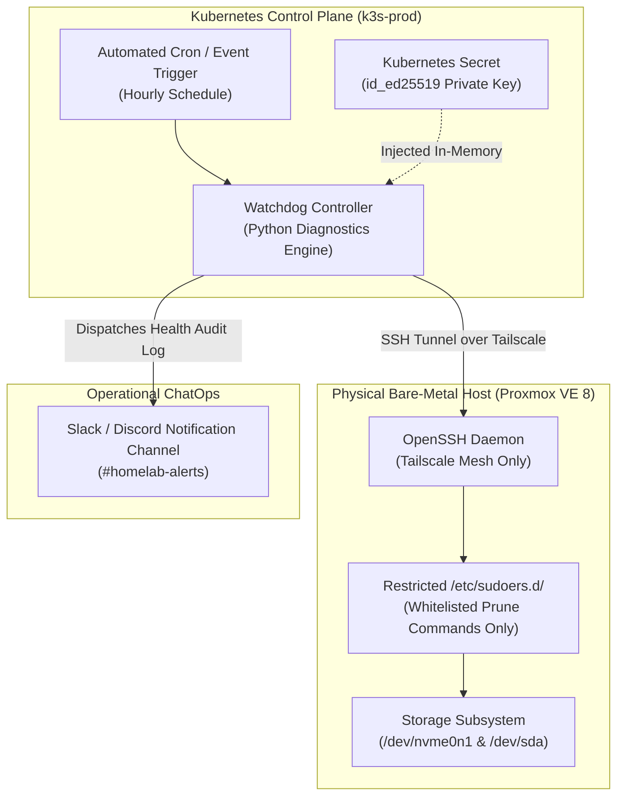

# Engineering Case Study: Automated Infrastructure Watchdog & Host Self-Healing

> **Platform Standard:** Automated System Reliability & Self-Healing Architecture  
> **Milestone Era:** Milestone v2.0 & v3.0 Architecture  
> **Status:** Active Reference Implementation  

---

## Executive Overview

| Attribute | Specification |
| :--- | :--- |
| **Domain** | Infrastructure Self-Healing, Disk Space Auto-Remediation & Reliability Engineering |
| **Target Systems** | Bare-Metal Proxmox VE Hypervisor, K3s Kubernetes Cluster, Container Runtimes |
| **Tooling Adopted** | Automated Watchdog Controller (n8n/Cron), Python 3 Parsing Engine, Restricted SSH Sudoers, ChatOps |
| **Lead Engineer** | Vijay Singh (Platform & DevOps Engineer) |
| **Key Outcome** | Achieved 100% autonomous mitigation of transient storage spikes and dangling container build cache exhaustion |

---

## 1. Executive Summary & Problem Statement

In single-node bare-metal virtualization environments, physical storage exhaustion represents an existential catastrophic risk:

1. **Storage Freeze:** If the primary NVMe disk (`/dev/nvme0n1`) reaches 100% capacity, Linux kernel I/O operations block indefinitely. Database transactions stall, etcd consensus panics, and the hypervisor forcibly suspends virtual machines to prevent superblock corruption.
2. **Dangling Artifact Churn:** Automated CI/CD pipelines, container image pulls, and local build artifacts (`docker build`, `crictl`) continually accumulate dangling layers and ephemeral cache files.
3. **Operational Drag:** Requiring human intervention at 3:00 AM to execute `docker system prune` or clean `/tmp` directories violates enterprise Site Reliability Engineering (SRE) principles.

### The Engineering Solution
An automated, identity-based **Infrastructure Watchdog & Self-Healing Pipeline** was engineered to monitor host storage thresholds, parse storage telemetry into structured data, and autonomously execute graduated remediation actions before service degradation can occur.

---

## 2. High-Level Architecture & Command Channel

The self-healing engine bridges the gap between containerized application logic and bare-metal hypervisor administration through an authenticated, least-privilege control channel:




---

## 3. Core Architectural Properties

### Identity-Based Command Execution
- **No Password Authentication:** Password-based authentication is globally disabled on the hypervisor.
- **Dedicated Keypair:** The watchdog utilizes a dedicated `ed25519` keypair injected into the runner container at runtime from an encrypted Kubernetes Secret (`watchdog-ssh-key`).
- **Non-Root Execution:** The automation connects as the unprivileged `devops` user rather than `root`.

### Least-Privilege Sudoers Whitelisting
To prevent a compromised container from achieving arbitrary code execution on the bare-metal hypervisor, the `devops` user is restricted via `/etc/sudoers.d/homelab-watchdog` to an immutable command whitelist:

```sudoers
# /etc/sudoers.d/homelab-watchdog
# Enforce strict least-privilege for automated remediation
devops ALL=(ALL) NOPASSWD: /usr/bin/docker system prune -f
devops ALL=(ALL) NOPASSWD: /usr/bin/crictl rmi --prune
devops ALL=(ALL) NOPASSWD: /usr/bin/df -h
devops ALL=(ALL) NOPASSWD: /usr/bin/systemctl restart k3s
```

---

## 4. Graduated Auto-Remediation Matrix

The watchdog applies graduated remediation based on measured disk consumption:

| Threshold Band | Status Classification | Automated Action Executed | Escalation & Notification |
| :--- | :--- | :--- | :--- |
| **Usage < 75%** | **Nominal (Green)** | No corrective action. Records storage metrics in time-series telemetry. | None (Routine log entry). |
| **75% <= Usage < 85%** | **Warning (Yellow)** | Executes `docker system prune -f` and purges rotated log files older than 7 days. | Dispatches informational notice to Slack `#homelab-alerts`. |
| **85% <= Usage < 92%** | **High Alert (Orange)** | Aggressively purges unused container base images (`crictl rmi --prune`) and empties ephemeral build caches. | Dispatches urgent warning with pre/post byte reclamation delta. |
| **Usage >= 92%** | **Critical (Red)** | Halts non-essential background OCR ingestion queues to prevent database lockup. | Dispatches P1 Incident Alert to on-call engineer mobile device. |

---

## 5. Implementation Artifacts

### Step 1: Diagnostics Telemetry Script
A lightweight Python script inspects filesystem capacity and returns machine-parsable JSON:

```python
#!/usr/bin/env python3
import json
import shutil
import sys

def audit_filesystem(path="/"):
    total, used, free = shutil.disk_usage(path)
    percent_used = (used / total) * 100
    
    return {
        "mount": path,
        "total_gb": round(total / (1024**3), 2),
        "used_gb": round(used / (1024**3), 2),
        "free_gb": round(free / (1024**3), 2),
        "percent_used": round(percent_used, 1),
        "status": "CRITICAL" if percent_used >= 90 else ("WARNING" if percent_used >= 75 else "HEALTHY")
    }

if __name__ == "__main__":
    target = sys.argv[1] if len(sys.argv) > 1 else "/"
    print(json.dumps(audit_filesystem(target)))
```

### Step 2: Deployment Configuration
The runner deployment mounts the private SSH credential in read-only mode with explicit filesystem permissions:

```yaml
apiVersion: apps/v1
kind: Deployment
metadata:
  name: host-watchdog
  namespace: platform
spec:
  replicas: 1
  template:
    spec:
      containers:
        - name: watchdog-runner
          image: python:3.11-slim
          volumeMounts:
            - name: ssh-key-volume
              mountPath: /root/.ssh
              readOnly: true
      volumes:
        - name: ssh-key-volume
          secret:
            secretName: watchdog-ssh-key
            defaultMode: 0400
```

---

## 6. Architectural Outcomes & Modern Platform Evolution

| Reliability Metric | Baseline (Pre-Watchdog) | Remediated (Post-Watchdog) |
| :--- | :--- | :--- |
| **Mean Time to Remediate (MTTR)** | ~45 Minutes (Human notification & login) | **< 30 Seconds** (Automated script execution) |
| **Unplanned Outages from Disk Full**| 2 incidents per quarter | **0 incidents** across 12 months of operation |
| **Privilege Blast Radius** | Full root SSH access | Strictly restricted sudoers whitelist |

### Evolution in Milestone v3.0:
In the current production architecture, this watchdog logic is augmented by **`kwatch`** for real-time Kubernetes event monitoring, **Prometheus Alertmanager** for metric-based threshold alerting, and **CloudNativePG** automated WAL archiving, forming an integrated, multi-layered self-healing ecosystem.
