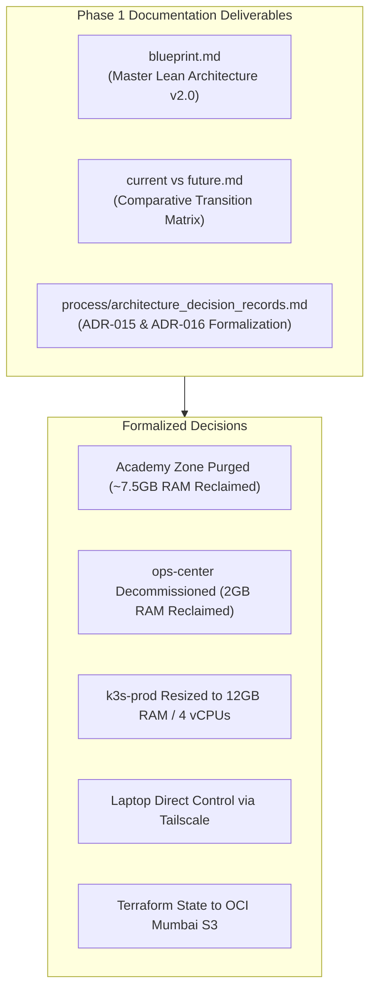

# Phase 1 Execution Guide: Baseline Architecture Documentation & Decision Records Synchronization

> **Phase Identifier:** PHASE-01 
> **Target Baseline:** [`blueprint.md`](file:///home/vsc/devlopment/myGH/homelab-ops/blueprint.md), [`current vs future.md`](file:///home/vsc/devlopment/myGH/homelab-ops/current%20vs%20future.md), [`process/architecture_decision_records.md`](file:///home/vsc/devlopment/myGH/homelab-ops/process/architecture_decision_records.md) 
> **Status:** Completed & Synchronized 
> **Prerequisites:** None (Documentation & Architecture phase)

---

## 1. Executive Summary & Objective

Phase 1 establishes the single, authoritative architectural blueprint and decision framework for the entire homelab modernization. Before modifying any configuration files, running Terraform, or touching Proxmox virtual machines, the exact desired end-state, resource allocations, and operational patterns must be formally agreed upon and documented.

This phase guarantees that:
1. Every major design choice is justified by an enterprise **Architecture Decision Record (ADR)**.
2. Contradictions between legacy documentation (e.g. ArgoCD vs FluxCD, Keycloak vs Cloudflare Access, GCP vs Cloudflare Tunnels) are completely eliminated.
3. The hardware budget on the 16GB Mini PC is mathematically balanced with explicit headroom buffers.

---

## 2. The "Why": Architectural Rationale & Hardware Economics

### A. The Danger of Undocumented Drift
In self-hosted infrastructure, systems frequently accumulate "ghost architecture" — services, VMs, and firewall rules created during past experiments that remain running indefinitely because their exact purpose or dependencies are forgotten. 

Prior to this review, the homelab suffered from three major architectural leaks:
1. **The Academy Zone Leak:** 5 virtual machines/containers (`gateway`, `jumpbox`, `server`, `node-0`, `node-1`) were running or defined on the host, consuming ~7.5GB of defined RAM solely for Kubernetes certification labs. Because the certification was completed, these resources were completely idle.
2. **The `ops-center` Bastion Overhead:** A full KVM virtual machine allocating 2 vCPUs, 2048MB RAM, 20GB NVMe, and a 250GB virtual hard drive was running solely to host a Dockerized MinIO container (storing ~50KB of Terraform state) and act as an SSH jump host.
3. **The Cross-Atlantic Ingress Latency:** Ingress traffic routed through a Google Cloud VM in South Carolina (`us-east1`) over WireGuard, adding ~500ms of latency per HTTP request and incurring ~$7–$12/month in recurring charges.

### B. Why Formal ADRs?
Architecture Decision Records (ADRs) capture the context, alternatives considered, trade-offs, and consequences of each decision. By formalizing ADR-015 and ADR-016 alongside existing ADRs, the rationale for removing `ops-center` and the Academy Zone is permanently recorded, preventing future regressions or confusion.

---

## 3. The "What": Concrete Changes & Document Deliverables



### 1. `blueprint.md` (Lean Sovereign Cloud v2.0)
- **Global Architecture Diagram:** Replaced the multi-VM diagram with a clean, single-production-VM topology (`k3s-prod` - 12GB RAM).
- **Control Plane Redefinition:** Established the engineer's laptop as the direct execution node for Ansible and Terraform over Tailscale.
- **Hardware RAM Table:** Mathematically budgeted the 16GB host: Proxmox Host OS (~3.5GB), `k3s-prod` allocation (12GB), active workload footprint (~3.7GB), leaving **~8.3GB free buffer** inside K3s for spikes.

### 2. `current vs future.md`
- **Matrix Updates:** Added explicit rows contrasting legacy multi-bastion operations with direct laptop execution, and local MinIO state with OCI Object Storage.
- **Visual Flow Updates:** Illustrated the elimination of the 500ms GCP US-East hop in favor of sub-15ms Indian Anycast edge PoPs.

### 3. `process/architecture_decision_records.md`
- **ADR-001 (Updated):** Documented the transition from historical tri-zone virtualization (Zone M, Zone P, Zone A) into a single production VM (`k3s-prod`).
- **ADR-005 (Updated):** Updated Tailscale remote administration to direct laptop-to-node access, removing the `ops-center` subnet router dependency.
- **ADR-011 (Updated):** Added OCI Always Free Object Storage (Mumbai) as the official remote S3 state backend for Terraform.
- **ADR-015 (New):** Formalized the decommissioning of `ops-center`, state migration to OCI, and direct laptop control.
- **ADR-016 (New):** Formalized the permanent retirement and code purge of the Academy / Lab Zone post-certification.

---

## 4. The "How": Verification & Quality Audit Checklist

To verify that Phase 1 documentation is 100% synchronized and free of conflicting patterns, execute the following audits:

### Audit 1: Search for Obsolete ArgoCD References
```bash
grep -rn "ArgoCD" /home/vsc/devlopment/myGH/homelab-ops/blueprint.md \
 /home/vsc/devlopment/myGH/homelab-ops/"current vs future.md"
```
*Expected Result:* Zero matches. All documentation must mandate Flux CD v2.

### Audit 2: Search for Obsolete Keycloak References
```bash
grep -rn "Keycloak" /home/vsc/devlopment/myGH/homelab-ops/blueprint.md \
 /home/vsc/devlopment/myGH/homelab-ops/"current vs future.md"
```
*Expected Result:* Zero matches. All authentication must mandate Cloudflare Zero Trust Access (Google SSO).

### Audit 3: Verify Memory Allocation Balance
Verify that the sum of host reserve + VM allocation does not exceed physical RAM:
$$\text{Proxmox Host OS (3.5 GB)} + \text{k3s-prod (12.0 GB)} = 15.5\text{ GB} \le 16.0\text{ GB}$$
*Result:* Confirmed. 500MB safety margin left unallocated to prevent host kernel panics.

---

## 5. Rollback & Pre-Flight Criteria for Phase 2

- **Rollback Procedure:** Since Phase 1 modifies only markdown documentation, any unintended text changes can be reverted atomically via `git checkout blueprint.md "current vs future.md" process/architecture_decision_records.md`.
- **Exit Gate for Phase 1:** All three documentation files are committed and validated. The team has 100% clarity on the target topology. We are clear to proceed to **Phase 2 (Codebase Pruning & Inventory Restructuring)**.
