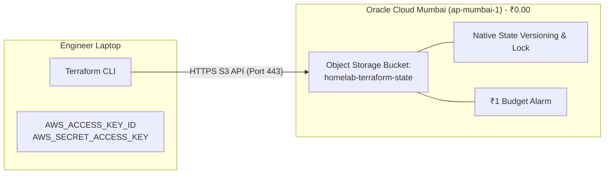

# Phase 3 Execution Guide: Off-Site State Backend Migration to OCI Always Free

> **Phase Identifier:** PHASE-03  
> **Target Components:** `infrastructure/on-prem/backend.tf`, Oracle Cloud (OCI) Mumbai (`ap-mumbai-1`)  
> **Status:** Ready for Execution  
> **Prerequisites:** Phase 2 Completed ([02-phase-2-codebase-pruning.md](file:///home/vsc/devlopment/myGH/homelab-ops/process/execution-phases/02-phase-2-codebase-pruning.md)), Active OCI Tenancy in `ap-mumbai-1`

---

## 1. Executive Summary & Objective

Phase 3 establishes an offsite, high-availability, state-locked **S3-compatible remote backend** for all on-premises Terraform state using **Oracle Cloud Infrastructure (OCI) Always Free Object Storage** in Mumbai (`ap-mumbai-1`).

This phase decouples Terraform state survival from the physical Mini PC hardware. Once completed:
1. Terraform state is protected against local hardware loss (fire, theft, drive death).
2. The local `ops-center` VM running MinIO is safely prepared for 100% deletion (Phase 4).
3. The remote backend operates at **₹0.00 / month cost** under OCI's 20GB permanent free tier ceiling.

---

## 2. The "Why": Architectural Rationale & Disaster Recovery

### A. The Co-Location Vulnerability
Previously, Terraform state was stored in a Dockerized MinIO container running on `ops-center` on the Mini PC's 1TB SATA drive. 
- **The Catastrophic Flaw:** If the Mini PC hardware dies, the state file dies with it. Rebuilding infrastructure requires manually importing 20+ Proxmox resources or recreating VMs from scratch with lost MAC addresses and IP conflicts.
- **The Circular Dependency:** You cannot use Terraform to recreate the hypervisor infrastructure if Terraform's own state backend lives inside a VM on that same hypervisor.

### B. Why OCI Always Free Object Storage (Mumbai)?
- **S3 API Compatibility:** OCI Object Storage provides an Amazon S3-compatible API endpoint, allowing standard Terraform `backend "s3"` blocks without proprietary plugins.
- **Regional Proximity:** Located in Mumbai (`ap-mumbai-1`), state read/write latency is sub-20ms from Indian residential broadband.
- **Zero Cost Guarantee:** OCI includes 20GB of permanent Object Storage, 10TB of free egress per month, and free versioning. A Terraform state file is ~50KB (less than 0.001% of the free quota).

---

## 3. The "What": Concrete Configuration Deliverables



1. **OCI Bucket:** `homelab-terraform-state` (Standard tier, Private, Versioning enabled).
2. **Terraform Backend File:** `infrastructure/on-prem/backend.tf` configured with the OCI S3 endpoint.
3. **FinOps Alert:** OCI Budget Alert set at ₹1.00 threshold to prevent unexpected billing.

---

## 4. The "How": Step-by-Step Technical Execution

### Step 3.1: Pre-Flight State Backup (Mandatory Safety Step)
Before touching any state configuration, take an immediate, dated local backup of your current Terraform state:
```bash
mkdir -p ~/homelab-backups/terraform-state
cd /home/vsc/devlopment/myGH/homelab-ops/infrastructure/on-prem

# If state currently exists locally:
cp terraform.tfstate ~/homelab-backups/terraform-state/terraform.tfstate.pre-oci.$(date +%Y%m%d) 2>/dev/null || true

# If pulling from MinIO:
terraform state pull > ~/homelab-backups/terraform-state/terraform.tfstate.minio.dump.$(date +%Y%m%d) 2>/dev/null || true
```

### Step 3.2: Generate OCI S3 Customer Secret Key
1. Log in to the **Oracle Cloud Console** (`cloud.oracle.com`).
2. Navigate to: **Identity & Security -> Users -> User Details -> Customer Secret Keys**.
3. Click **Generate Secret Key**:
   - Name: `homelab-terraform-key`
   - Copy the generated **Secret Key** immediately (it will not be shown again).
   - Copy the **Access Key** string displayed in the keys table.

### Step 3.3: Create the OCI Object Storage Bucket
1. Navigate to: **Storage -> Object Storage & Archive Storage -> Buckets**.
2. Select Compartment: `root` (or your homelab compartment).
3. Ensure Region is **India West (Mumbai)** (`ap-mumbai-1`).
4. Click **Create Bucket**:
   - Bucket Name: `homelab-terraform-state`
   - Default Storage Tier: `Standard`
   - Encryption: `Encrypt using Oracle-managed keys`
   - Object Versioning: `Enabled` (Crucial for state history and rollback)
5. Identify your **Object Storage Namespace** (displayed on the bucket details page, e.g. `ax7b9q...`).

### Step 3.4: Configure `infrastructure/on-prem/backend.tf`
Create or update [infrastructure/on-prem/backend.tf](file:///home/vsc/devlopment/myGH/homelab-ops/infrastructure/on-prem/backend.tf):

```hcl
terraform {
  backend "s3" {
    bucket                      = "homelab-terraform-state"
    key                         = "on-prem/terraform.tfstate"
    region                      = "ap-mumbai-1"
    endpoint                    = "https://<OCI_NAMESPACE>.compat.objectstorage.ap-mumbai-1.oraclecloud.com"
    skip_region_validation      = true
    skip_credentials_validation = true
    skip_requesting_account_id  = true
    skip_s3_checksum            = true
    skip_metadata_api_check     = true
    use_path_style              = true
  }
}
```
*(Replace `<OCI_NAMESPACE>` with your actual OCI namespace).*

### Step 3.5: Migrate State to OCI
Set your OCI Customer Secret credentials in your laptop terminal environment and execute the state migration:

```bash
cd /home/vsc/devlopment/myGH/homelab-ops/infrastructure/on-prem

# Export OCI S3 credentials
export AWS_ACCESS_KEY_ID="<YOUR_OCI_ACCESS_KEY>"
export AWS_SECRET_ACCESS_KEY="<YOUR_OCI_SECRET_KEY>"

# Initialize backend and trigger automated state migration
terraform init -migrate-state
```

When prompted:
```
Do you want to copy existing state to the new backend?
  Enter a value: yes
```

---

## 5. Verification & Validation Commands

### Check 1: Verify State List from OCI
```bash
cd /home/vsc/devlopment/myGH/homelab-ops/infrastructure/on-prem
terraform state list
```
*Expected Output:* Displays all active managed resources (e.g. `module.k3s_prod.proxmox_vm_qemu.vm`) fetched directly from OCI.

### Check 2: Execute Non-Destructive Plan
```bash
terraform plan
```
*Expected Output:* `No changes. Your infrastructure matches the configuration.`

### Check 3: Verify OCI Console Storage
In the OCI Console under bucket `homelab-terraform-state`, verify that object `on-prem/terraform.tfstate` exists with a recent timestamp.

---

## 6. Failure Modes & Rollback Strategy

| Failure Mode | Root Cause | Immediate Remediation |
| :--- | :--- | :--- |
| `HTTP 403 Forbidden` during `terraform init` | Incorrect OCI Customer Secret Key or Namespace | Verify namespace in endpoint URL matches the OCI Tenancy details page |
| `HTTP 301 Moved Permanently` | Region mismatch in S3 endpoint URL | Verify endpoint contains `ap-mumbai-1` matching the bucket's region |
| Accidental state corruption | Network interruption during upload | Restore immediately from local backup: `terraform state push ~/homelab-backups/terraform-state/terraform.tfstate.minio.dump.*` |

- **Rollback Procedure:** Revert `backend.tf` to point back to the local file or MinIO, and push the backup state file.
