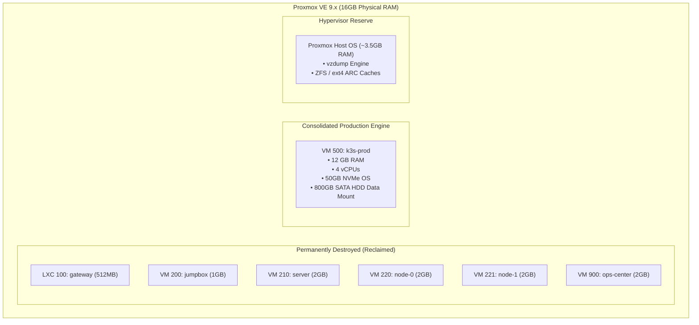

# Phase 4 Execution Guide: Proxmox Virtual Machine Consolidation & K3s-Prod 12GB Resizing

> **Phase Identifier:** PHASE-04  
> **Target Components:** Proxmox VE 9.x Hypervisor (`192.168.1.3` / Tailscale `100.108.178.93`), `k3s-prod` (VM 500)  
> **Status:** Ready for Execution  
> **Prerequisites:** Phase 3 Completed ([03-phase-3-oci-remote-state.md](file:///home/vsc/devlopment/myGH/homelab-ops/process/execution-phases/03-phase-3-oci-remote-state.md)) (Terraform state verified in OCI)

---

## 1. Executive Summary & Objective

Phase 4 executes the physical hardware consolidation on the Mini PC's Proxmox VE hypervisor. It permanently terminates the idle Academy Zone VMs and the legacy `ops-center` VM, freeing physical compute cores, RAM, and NVMe disk blocks.

Once reclaimed, these resources are consolidated into the single production workload engine: **`k3s-prod` (VMID 500)**, upgrading it to:
- **12,288 MB (12 GB) DDR4 RAM** (up from 8GB).
- **4 vCPUs** (up from 2 cores).
- **Secondary VirtIO SCSI Mount** mapping the **1TB SATA HDD** directly to the VM for cold media and document storage.

---

## 2. The "Why": Architectural Rationale & Resource Economics

### A. Ending the "RAM Juggling" Game
Previously, the total RAM defined across all VMs was:
$$\text{Lab VMs (7.5 GB)} + \text{ops-center (2.0 GB)} + \text{k3s-prod (8.0 GB)} = 17.5\text{ GB Allocated}$$
On a physical 16GB Mini PC, this over-commitment meant that running the lab while `k3s-prod` was active would cause severe host swap thrashing or kernel panics. The operator had to constantly run `manage_lab.yml` to toggle nodes on and off.

With the certification completed and `ops-center` state moved to OCI:
- Destroying the 5 lab VMs reclaims **~7.5GB defined RAM** and **~40GB NVMe storage**.
- Destroying `ops-center` reclaims **2GB RAM, 2 vCPUs, 20GB NVMe, and 250GB HDD virtual disk**.
- Allocating 12GB to `k3s-prod` gives production workloads 75% of the machine's hardware capacity, leaving **~8.3GB of active buffer** for Paperless OCR tasks and BookOrbit multi-user indexing.
- The remaining **3.5GB host RAM** provides ample breathing room for the Proxmox Debian kernel and high-throughput `vzdump` backup compression.

---

## 3. The "What": Hardware & Virtual Machine Inventory



---

## 4. The "How": Step-by-Step Technical Execution

### Step 4.1: Pre-Flight Safety Backup of `k3s-prod`
Before altering any virtual machine hardware specs, take a manual block-level snapshot of `k3s-prod`:
```bash
# Execute via SSH to Proxmox VE:
ssh root@192.168.1.3 "vzdump 500 --storage backup-hdd --mode snapshot --compress zstd"
```
*Verify that the `.vma.zst` file completes successfully in `/mnt/hdd/dump/`.*

### Step 4.2: MinIO Data Evacuation & n8n Backup Export (Mandatory Safety Step)
> [!CAUTION]
> **DO NOT destroy VM 900 (`ops-center`) until all data inside MinIO is evacuated!**
> `ops-center` hosts the Dockerized MinIO container which holds your **Terraform state** and **n8n backups**.

Before stopping or deleting `ops-center`, export all MinIO buckets to your local laptop:

```bash
# 1. Create local backup directory on your laptop
mkdir -p ~/homelab-backups/minio-export

# 2. Option A: Using AWS CLI / MinIO Client (S3 API)
# Export all buckets (Terraform state, n8n workflows & DB dumps)
aws --endpoint-url http://100.87.130.97:9000 s3 sync s3:// ~/homelab-backups/minio-export/

# 2. Option B: Direct volume copy via SSH from ops-center
ssh devops@192.168.1.50 "sudo docker cp minio:/data /tmp/minio-data-export"
scp -r devops@192.168.1.50:/tmp/minio-data-export ~/homelab-backups/minio-export/

# 3. Verification: Confirm n8n backups and state files are safely on your laptop
ls -lh ~/homelab-backups/minio-export/
```
*Verify that your n8n workflows, database dumps, and state files are non-empty and readable before proceeding.*

### Step 4.3: Stop and Destroy Obsolete Virtual Machines
Once all data has been evacuated and verified:

```bash
# 1. Stop and destroy Academy Zone LXC Gateway
ssh root@192.168.1.3 "pct stop 100 2>/dev/null || true"
ssh root@192.168.1.3 "pct destroy 100 --purge 2>/dev/null || true"

# 2. Stop and destroy Academy Zone VMs (200, 210, 220, 221)
for vmid in 200 210 220 221; do
  ssh root@192.168.1.3 "qm stop $vmid 2>/dev/null || true"
  ssh root@192.168.1.3 "qm destroy $vmid --purge --skiplock 2>/dev/null || true"
done

# 3. Stop and destroy legacy ops-center VM (900) ONLY AFTER Step 4.2 verification
ssh root@192.168.1.3 "qm stop 900 2>/dev/null || true"
ssh root@192.168.1.3 "qm destroy 900 --purge --skiplock 2>/dev/null || true"
```


### Step 4.4: Update Configuration Variables
In [configuration/inventory/group_vars/all/vars.yml](file:///home/vsc/devlopment/myGH/homelab-ops/configuration/inventory/group_vars/all/vars.yml), update the `k3s_prod` specifications:

```yaml
  # Zone P: Production
  k3s_prod:
    vmid: 500
    ip: "192.168.1.30"
    cores: 4
    memory: 12288
    disk_size: "50G"
    onboot: true
```

### Step 4.5: Apply Hardware Resize via Terraform
From your laptop, execute Terraform to apply the hardware resize to `k3s-prod`:

```bash
cd /home/vsc/devlopment/myGH/homelab-ops/infrastructure/on-prem

export AWS_ACCESS_KEY_ID="<YOUR_OCI_ACCESS_KEY>"
export AWS_SECRET_ACCESS_KEY="<YOUR_OCI_SECRET_KEY>"

terraform plan -out=tfplan-resize
terraform apply tfplan-resize
```
*Note: Proxmox will gracefully shutdown VM 500, adjust the memory allocation to 12,288MB and CPU cores to 4, attach the secondary data disk, and reboot the VM.*

### Step 4.6: Mount 1TB Cold HDD Inside `k3s-prod`
Once `k3s-prod` boots, configure the secondary virtual disk inside the guest OS:

```bash
# SSH into k3s-prod
ssh devops@192.168.1.30

# Identify the new secondary drive (typically /dev/sdb or /dev/vdb)
lsblk

# Format as ext4 if newly attached (only on initial setup!)
sudo mkfs.ext4 -L cold-storage /dev/sdb

# Create mount point and configure persistent fstab mount
sudo mkdir -p /mnt/hdd
echo "LABEL=cold-storage /mnt/hdd ext4 defaults,noatime 0 2" | sudo tee -a /etc/fstab
sudo mount -a

# Create standardized directories for sovereign workloads
sudo mkdir -p /mnt/hdd/{paperless,books,media,backups}
sudo chown -R 1000:1000 /mnt/hdd
```

---

## 5. Verification & Validation Commands

### Check 1: Verify Proxmox Clean State
```bash
ssh root@192.168.1.3 "qm list"
```
*Expected Output:* Only VM 500 (`k3s-prod`) is listed. VMIDs 100, 200, 210, 220, 221, and 900 are absent.

### Check 2: Verify `k3s-prod` Memory and CPU Sizing
```bash
ssh devops@192.168.1.30 "free -h && nproc"
```
*Expected Output:*
- `total` memory: `11G` or `12G`.
- `nproc`: `4`.

### Check 3: Verify Cold Storage Mount
```bash
ssh devops@192.168.1.30 "df -h /mnt/hdd"
```
*Expected Output:* Mounted to `/mnt/hdd` with ~800GB available space on ext4.

### Check 4: Host Memory Utilization
In the Proxmox Web GUI (`https://100.108.178.93:8006`), verify that total host RAM utilization is stable at **~78–82%** with zero active swap usage.

---

## 6. Failure Modes & Rollback Strategy

| Failure Mode | Root Cause | Immediate Remediation |
| :--- | :--- | :--- |
| `k3s-prod` fails to boot with "RAM limit exceeded" | Proxmox host lacks contiguous memory | Lower memory to 10240MB in `vars.yml` and re-run `terraform apply` |
| Secondary disk `/dev/sdb` not visible in VM | VirtIO SCSI controller missing in VM definition | Verify `data_disk_storage` block is enabled in `main.tf` |
| Accidental deletion of VM 500 | Human error during `qm destroy` | Restore immediately from Step 4.1 backup: `qmrestore /mnt/hdd/dump/vzdump-qemu-500-*.vma.zst 500` |

- **Rollback Procedure:** In the event of an unrecoverable VM corruption during resizing, restore the pre-flight `vzdump` backup taken in Step 4.1.
