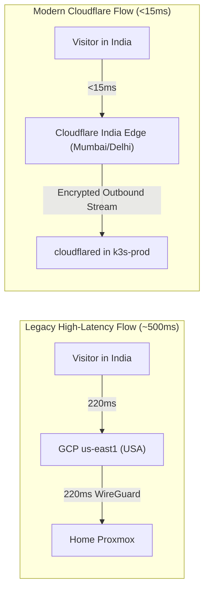

# Phase 5 Execution Guide: Cloudflare Ingress, GCP Detachment & GHCR Migration

> **Phase Identifier:** PHASE-05 
> **Target Components:** `kubernetes/platform/cloudflared/`, Cloudflare Zero Trust, GitHub Container Registry (`ghcr.io`), `infrastructure/gcp/` (detached) 
> **Status:** Ready for Execution 
> **Prerequisites:** Phase 4 Completed ([04-phase-4-proxmox-consolidation-k3s-resizing.md](file:///home/vsc/devlopment/myGH/homelab-ops/process/execution-phases/04-phase-4-proxmox-consolidation-k3s-resizing.md)), Cloudflare Authoritative DNS for `vijaysingh.cloud`

---

## 1. Executive Summary & Objective

Phase 5 achieves three paramount project objectives:
1. **Sub-15ms Ingress Latency:** Deploys **Cloudflare Zero Trust Tunnels (`cloudflared`)** inside `k3s-prod`, routing public traffic through Indian Anycast edge data centers (Mumbai, Delhi, Chennai) with zero open home router ports and automatic DDoS shield.
2. **GCP Gateway Detachment & VM Preservation:** Retires legacy WireGuard gateway routing from the Google Cloud Platform (GCP) Compute Engine instance (`us-east1`). The free-tier `e2-micro` VM is preserved clean and unencumbered for future workloads (alongside available Oracle Cloud Free Tier resources).
3. **Container Registry Decoupling:** Migrates container image storage and CI/CD pipelines to **GitHub Container Registry (`ghcr.io`)** at ₹0.00 cost.

---

## 2. The "Why": Architectural Rationale & Latency Physics

### A. The 500ms Cross-Atlantic Latency Trap
Previously, incoming requests traveled across the Atlantic Ocean twice:
$$\text{Visitor (India)} \xrightarrow{220\text{ms}} \text{GCP us-east1} \xrightarrow[\text{WireGuard}]{220\text{ms}} \text{Home Proxmox} \xrightarrow{220\text{ms}} \text{GCP} \xrightarrow{220\text{ms}} \text{Visitor}$$
Total round-trip latency was **~450ms–500ms per HTTP request**. When loading complex Single Page Applications (like n8n canvas or modern dashboards loading 40+ assets), compound page load times exceeded **20 to 30 seconds**.

### B. The Cloudflare Edge Advantage
With Cloudflare Tunnels:
- `cloudflared` initiates secure, outbound-only QUIC/HTTPS streams to Cloudflare edge nodes in Mumbai, Delhi, and Chennai.
- Public requests to `docs.vijaysingh.cloud` or `hooks.vijaysingh.cloud` terminate at the nearest Indian edge node in **<15ms**.
- Static assets (HTML, JS, CSS, images) are cached at edge PoPs, delivering **sub-50ms full page renders**.
- Home router firewall remains 100% closed: no open ports (80/443/51820), completely shielding your residential IP.




---

## 3. The "What": Concrete Deliverables

1. **Cloudflare Tunnel Deployment:** `kubernetes/platform/cloudflared/` deployment and token Secret.
2. **DNS & Public Hostname Mapping:**
- `docs.vijaysingh.cloud` $\to$ `http://traefik.kube-system.svc.cluster.local:80`
- `hooks.vijaysingh.cloud` $\to$ `http://traefik.kube-system.svc.cluster.local:80`
- `dash.vijaysingh.cloud` $\to$ `http://traefik.kube-system.svc.cluster.local:80` (Protected by Zero Trust Access)
*(Note: Prieya's website is published separately via GitHub Pages / free tier hosting).*
3. **GCP Gateway Detachment:** WireGuard routing deactivated on GCP VM; instance retained for future compute tasks.
4. **CI/CD Pipeline Update:** GitHub Actions workflows configured to build and push container images to `ghcr.io/${{ github.repository_owner }}/...`.

---

## 4. The "How": Step-by-Step Technical Execution

### Step 5.1: Create the Cloudflare Zero Trust Tunnel
1. Log in to the **Cloudflare One Zero Trust Dashboard** (`one.dash.cloudflare.com`).
2. Navigate to: **Networks -> Tunnels -> Add a Tunnel**.
3. Choose **Cloudflare (Recommended)** connector.
4. Name the tunnel: `homelab-k3s-edge`.
5. Under **Install and run a connector**, select **Kubernetes**.
6. Copy the generated **Tunnel Token string** (the base64 value in the command).

### Step 5.2: Deploy `cloudflared` to `k3s-prod`
Create the platform manifest in [kubernetes/platform/cloudflared/cloudflared.yaml](file:///home/vsc/devlopment/myGH/homelab-ops/kubernetes/platform/cloudflared/cloudflared.yaml):

```yaml
apiVersion: v1
kind: Namespace
metadata:
 name: cloudflared
---
apiVersion: v1
kind: Secret
metadata:
 name: tunnel-token
 namespace: cloudflared
type: Opaque
stringData:
 token: "<YOUR_CLOUDFLARE_TUNNEL_TOKEN>"
---
apiVersion: apps/v1
kind: Deployment
metadata:
 name: cloudflared
 namespace: cloudflared
 labels:
 app: cloudflared
spec:
 replicas: 1
 selector:
 matchLabels:
 app: cloudflared
 template:
 metadata:
 labels:
 app: cloudflared
 spec:
 containers:
- name: cloudflared
 image: cloudflare/cloudflared:latest
 args:
- tunnel
- --no-autoupdate
- run
- --token
- $(TUNNEL_TOKEN)
 env:
- name: TUNNEL_TOKEN
 valueFrom:
 secretKeyRef:
 name: tunnel-token
 key: token
 resources:
 limits:
 cpu: 300m
 memory: 128Mi
 requests:
 cpu: 50m
 memory: 64Mi
```

Apply the deployment to `k3s-prod`:
```bash
kubectl apply -f kubernetes/platform/cloudflared/cloudflared.yaml
```

### Step 5.3: Configure Ingress Routes in Cloudflare Dashboard
Under **Public Hostnames** in the Tunnel configuration:
1. `docs.vijaysingh.cloud` $\to$ Service: `http://traefik.kube-system.svc.cluster.local:80`
2. `hooks.vijaysingh.cloud` $\to$ Service: `http://traefik.kube-system.svc.cluster.local:80`
3. `dash.vijaysingh.cloud` $\to$ Service: `http://traefik.kube-system.svc.cluster.local:80`


### Step 5.4: Detach GCP Gateway & Retain Clean Free VM
Once the Cloudflare Tunnel is connected and verified:
1. Stop and disable WireGuard gateway routing on the GCP VM.
2. Remove any DNS A-records pointing to the GCP public IP.
3. Preserve the `e2-micro` instance in `us-east1` (covered under Always Free Tier) clean and unencumbered for future compute tasks.

### Step 5.5: Migrate Container Builds to GitHub Packages (`ghcr.io`)
Update your GitHub Actions CI workflows (e.g. `.github/workflows/paperless-ci.yaml`) to authenticate with `ghcr.io` natively:

```yaml
- name: Log in to GitHub Container Registry
 uses: docker/login-action@v3
 with:
 registry: ghcr.io
 username: ${{ github.actor }}
 password: ${{ secrets.GITHUB_TOKEN }}

- name: Build and push container image
 uses: docker/build-push-action@v5
 with:
 context: ./apps/paperless-custom
 push: true
 tags: ghcr.io/vsingh55/paperless-custom:latest
```

---

## 5. Verification & Validation Commands

### Check 1: Verify `cloudflared` Pod Health
```bash
kubectl -n cloudflared get pods
kubectl -n cloudflared logs deployment/cloudflared | grep "Registered tunnel connection"
```
*Expected Output:* Status `Running`, logs show 4 active connections to nearest edge servers in India.

### Check 2: Audit Response Latency via curl
```bash
curl -w "DNS: %{time_namelookup}s | Connect: %{time_connect}s | TTFB: %{time_starttransfer}s | Total: %{time_total}s\n" \
-o /dev/null -s https://hooks.vijaysingh.cloud
```
*Expected Output:* `Total: < 0.050s` (<50ms total response time).

### Check 3: Verify GCP Billing Termination
Check the Google Cloud Billing console or execute via `gcloud`:
```bash
gcloud compute instances list --project=homelab-vijay
gcloud compute addresses list --project=homelab-vijay
```
*Expected Output:* `Listed 0 items.` Zero active resources.

---

## 6. Failure Modes & Rollback Strategy

| Failure Mode | Root Cause | Immediate Remediation |
| :--- | :--- | :--- |
| `cloudflared` logs `Failed to dial QUIC connection` | Local router firewall blocks UDP 7844 | Add `--protocol http2` argument to `cloudflared` container args to fallback to TCP 443 |
| HTTP 502 Bad Gateway at edge | Traefik service unreachable from `cloudflared` namespace | Verify service name matches `traefik.kube-system.svc.cluster.local` |

- **Rollback Procedure:** If an issue occurs before GCP is destroyed, re-point Cloudflare DNS A-records to the GCP static IP. Once GCP is destroyed, Cloudflare Tunnel is the sole ingress; debug pod logs directly via `kubectl logs`.
