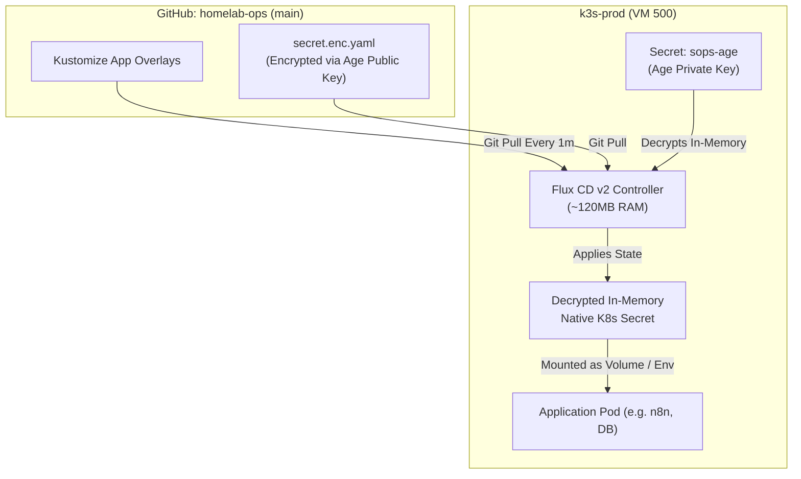

# Phase 6 Execution Guide: Flux CD v2 GitOps Engine Bootstrapping & Mozilla SOPS (Age) Secret Management

> **Phase Identifier:** PHASE-06  
> **Target Components:** `kubernetes/bootstrap/`, `kubernetes/platform/`, `kubernetes/apps/`, `.sops.yaml`, Flux CD v2 Controllers  
> **Status:** Ready for Execution  
> **Prerequisites:** Phase 5 Completed ([05-phase-5-gcp-decommissioning-cloudflare-ingress.md](file:///home/vsc/devlopment/myGH/homelab-ops/process/execution-phases/05-phase-5-gcp-decommissioning-cloudflare-ingress.md)), GitHub Personal Access Token (PAT) with repo permissions

---

## 1. Executive Summary & Objective

Phase 6 institutes enterprise-grade **GitOps Continuous Delivery** and **Cryptographic In-Git Secrets Management** on `k3s-prod`.

At the completion of this phase:
1. **Flux CD v2** functions as the cluster's autonomous control loop, continuously pulling and reconciling manifests directly from the GitHub repository (`homelab-ops`).
2. Configuration drift is completely eliminated (manual `kubectl apply` commands are superseded by Git commits).
3. Secrets (database passwords, API keys, webhook tokens) are encrypted in Git via **Mozilla SOPS** using an **Age keypair**, decrypted dynamically in-memory inside K3s.
4. The entire GitOps plane consumes only **~120MB RAM**, preserving maximum memory for applications.

---

## 2. The "Why": Architectural Rationale & Tool Selection

### A. Flux CD v2 vs. ArgoCD (The Memory Reality)
While ArgoCD provides a visual web dashboard, running the ArgoCD server, dex, repo-server, application-controller, and Redis instances consumes **~700MB–1.0GB of RAM**. 

On our 16GB Mini PC running 9 applications and 2 websites:
- **Flux CD v2** uses only **~120MB–150MB RAM** total across its controllers (`source-controller`, `kustomize-controller`, `helm-controller`).
- Flux integrates natively with **Mozilla SOPS** out-of-the-box via Kustomize decryption providers, eliminating third-party secret plugins.
- Flux operates as a pure Kubernetes controller without requiring an exposed web dashboard, reducing the cluster attack surface.

### B. Mozilla SOPS + Age vs. HashiCorp Vault
- **HashiCorp Vault** is massive over-engineering for a homelab, consuming >1GB RAM, requiring unseal keys, and introducing complex certificate renewal loops.
- **Mozilla SOPS with Age (`age-keygen`)** encrypts *only* the values in YAML files, leaving keys, names, and labels in plain text. This allows clean, readable GitHub Pull Request diffs while ensuring zero sensitive credentials ever leak into public or private Git history.



---

## 3. The "What": Concrete Repository Deliverables

1. **`.sops.yaml` (Repository Root):** Defines the creation rules mapping Age public keys to Kubernetes YAML files.
2. **`kubernetes/bootstrap/`:**
   - `flux-system/`: Flux CD core controllers and `gotk-sync.yaml`.
   - `root.yaml`: Root Kustomization pointing to platform and apps directories.
3. **`kubernetes/platform/kustomization.yaml`:** Orchestrates cluster-wide platform infrastructure (`cloudflared`, `traefik`, `cloudnative-pg`, `monitoring`).
4. **`kubernetes/apps/kustomization.yaml`:** Orchestrates all 9 application workloads and 2 websites.

---

## 4. The "How": Step-by-Step Technical Execution

### Step 6.1: Install CLI Tools on Laptop
Ensure `flux` and `age` are installed on your Fedora laptop:
```bash
# Install Flux CLI
curl -s https://fluxcd.io/install.sh | sudo bash

# Install Age
sudo dnf install -y age
```

### Step 6.2: Generate Master Age Keypair
Generate a dedicated Age keypair for `homelab-ops` on your laptop:

```bash
mkdir -p ~/.config/sops/age
age-keygen -o ~/.config/sops/age/keys.txt

# Display public and private keys
cat ~/.config/sops/age/keys.txt
```
*Note: The public key begins with `age1...`. The private key begins with `AGE-SECRET-KEY-1...`. Save both immediately in an external password manager (e.g. Bitwarden).*

### Step 6.3: Configure `.sops.yaml` at Repository Root
Create [.sops.yaml](file:///home/vsc/devlopment/myGH/homelab-ops/.sops.yaml) in the root of the repo:

```yaml
creation_rules:
  - path_regex: kubernetes/.*\.enc\.yaml$
    encrypted_regex: "^(data|stringData)$"
    age: "<YOUR_AGE_PUBLIC_KEY_HERE_age1...>"
```

### Step 6.4: Load Age Private Key into `k3s-prod`
Inject the Age secret key into the cluster so Flux can decrypt secrets in-memory:

```bash
# Create flux-system namespace
kubectl create namespace flux-system --dry-run=client -o yaml | kubectl apply -f -

# Inject Age secret key
cat ~/.config/sops/age/keys.txt | kubectl -n flux-system create secret generic sops-age \
  --from-file=age.agekey=/dev/stdin \
  --dry-run=client -o yaml | kubectl apply -f -
```

### Step 6.5: Bootstrap Flux CD v2 via GitHub
Run `flux bootstrap` targeting the repository:

```bash
export GITHUB_TOKEN="<YOUR_GITHUB_PAT>"

flux bootstrap github \
  --owner=vsingh55 \
  --repository=homelab-ops \
  --branch=main \
  --path=kubernetes/bootstrap \
  --personal
```
*Flux will commit its manifests to `kubernetes/bootstrap/flux-system/` and establish its reconciliation webhook.*

### Step 6.6: Configure Decryption in Root Kustomization
In [kubernetes/bootstrap/apps.yaml](file:///home/vsc/devlopment/myGH/homelab-ops/kubernetes/bootstrap/apps.yaml), configure Flux to automatically decrypt SOPS secrets:

```yaml
apiVersion: kustomize.toolkit.fluxcd.io/v1
kind: Kustomization
metadata:
  name: apps
  namespace: flux-system
spec:
  interval: 10m0s
  path: ./kubernetes/apps
  prune: true
  sourceRef:
    kind: GitRepository
    name: flux-system
  decryption:
    provider: sops
    secretRef:
      name: sops-age
```

### Step 6.7: Encrypt a Sample Secret
To create an encrypted secret in Git:

```bash
# 1. Create standard plaintext secret manifest
cat <<EOF > test-secret.yaml
apiVersion: v1
kind: Secret
metadata:
  name: test-secret
  namespace: default
type: Opaque
stringData:
  db-password: "SuperSecretPassword123"
EOF

# 2. Encrypt in-place using SOPS
sops --encrypt --in-place test-secret.yaml
mv test-secret.yaml kubernetes/apps/test-secret.enc.yaml
```

---

## 5. Verification & Validation Commands

### Check 1: Verify Flux Controller Health
```bash
flux check
```
*Expected Output:* `✔ all checks passed` across `source-controller`, `kustomize-controller`, and `helm-controller`.

### Check 2: Verify Kustomization Sync Status
```bash
flux get kustomizations
```
*Expected Output:*
```
NAME           REVISION        SUSPENDED  READY  MESSAGE
flux-system    main@sha1:...   False      True   Applied revision: main@sha1:...
apps           main@sha1:...   False      True   Applied revision: main@sha1:...
```

### Check 3: Verify In-Cluster In-Memory Decryption
```bash
kubectl get secret test-secret -o jsonpath='{.data.db-password}' | base64 -d
```
*Expected Output:* `SuperSecretPassword123` (Decrypted dynamically in-cluster, while remaining 100% encrypted in Git).

---

## 6. Failure Modes & Rollback Strategy

| Failure Mode | Root Cause | Immediate Remediation |
| :--- | :--- | :--- |
| Flux reports `failed to decrypt secret: no matching keys found` | Age secret key missing in `sops-age` secret | Re-run Step 6.4 to verify `age.agekey` matches the public key in `.sops.yaml` |
| Reconciliation stuck with Git auth error | GitHub PAT expired or lacks `repo` scope | Re-run `flux bootstrap` with an active PAT |

- **Rollback Procedure:** Revert the Git commit triggering the reconciliation failure (`git revert <sha> && git push`). Flux will detect the revert within 60 seconds and restore the previous known-good cluster state.
