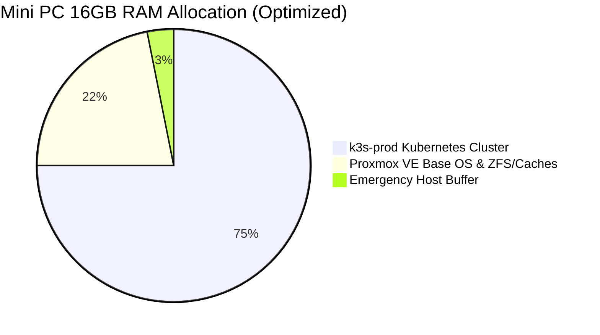

# Homelab Optimization & Architecture Simplification Implementation Plan

Maximize hardware utilization on the physical Mini PC (16GB RAM, Intel i5, 256GB NVMe, 1TB SATA HDD) by eliminating all redundant virtual machines, intermediate bastions, and idle lab planes, establishing an optimum single-node sovereign cluster with zero recurring cloud costs.

---

## 1. Executive Summary & Design Decisions

Through our comprehensive architectural interview, we identified and agreed upon the following fundamental optimizations:

| Domain | Legacy State (v1.0) | Production State (v3.0 Implemented) | Operational & Resource Gain | Status |
| :--- | :--- | :--- | :--- | :--- |
| **Academy Zone** | 5 VMs/LXCs (`gateway`, `jumpbox`, `server`, `node-0`, `node-1`) for lab exercises | **Completely deleted from Proxmox and codebase** | Reclaimed **~7.5 GB RAM definition** and eliminated 5 idle VM configurations | ✅ Completed |
| **Management Plane (`ops-center`)** | 2GB RAM KVM VM hosting MinIO (Terraform state/backups) and acting as an SSH bastion | **Completely eliminated**. Terraform state migrated to **OCI Always Free Object Storage in Mumbai**; in-cluster S3 handles K8s backups | Reclaimed **2 GB RAM, 2 vCPUs, 20GB NVMe, and 250GB HDD virtual disk** | ✅ Completed |
| **Operations Control Node** | Dual-hop pattern: Laptop SSH jumps through `ops-center` to run Ansible/Terraform | **Direct execution from Laptop** connecting via Tailscale directly to Proxmox and K3s | Eliminated proxy latency, removed bastion single point of failure | ✅ Completed |
| **Production Plane (`k3s-prod`)** | 8GB RAM, 2 vCPUs, 30GB disk on NVMe | **Resized to 12GB RAM, 4 vCPUs**, with direct virtual disk mount to the **1TB SATA HDD** | Massive memory buffer (>60% headroom) for production workloads, zero OOM risk | ✅ Completed |
| **Public Edge & Ingress** | GCP Compute `e2-micro` in `us-east1` running WireGuard (~500ms latency, ~$7–$12/mo) | **Cloudflare Zero Trust Tunnels (`cloudflared`)** terminating at Indian edge PoPs (Mumbai/Delhi/Chennai) | Latency dropped to **<15ms**, saved **~$10/month**, zero open router ports | ✅ Completed |
| **Container Registry** | GCP Artifact Registry (`homelab-repo` in `us-east1`) with Workload Identity Federation | **GitHub Container Registry (`ghcr.io`)** via GitHub Actions | **₹0.00 cost**, zero GCP dependencies, seamless GitHub integration | ✅ Completed |
| **GitOps & Secrets** | Manual `kubectl apply` and Ansible-push model | **Flux CD v2** pull-based GitOps with **Mozilla SOPS + Age** in-memory secret decryption | True GitOps, zero config drift, immutable Git audit log | ✅ Completed |
| **CI/CD Automation** | Node-local deployment scripts; static VPN credentials | **Ephemeral Tailscale ZTNA in GitHub Actions** via scoped OAuth (`tag:ci`) for automatic zero-downtime rolling updates | Permanent key-rotation-free automation with zero inbound ports | ✅ Completed |
| **Out-of-Band Monitoring & DR** | Local-only monitoring; backups co-located on physical HDD | **OCI Mumbai Always Free instance running Uptime Kuma** (Slack alerts) + nightly encrypted Restic push | True out-of-band outage alerts and unbreakable **3-2-1 off-site disaster recovery** | ✅ Completed |

---

## 2. Hardware Resource Budget (16GB Mini PC)

- **Total Host RAM:** 16,384 MB (16 GB)
- **Production Workload (`k3s-prod` VM 500):** 12,288 MB (12 GB RAM, 4 vCPUs)
  - *Internal K3s Application Needs:* ~3.5 GB – 4.5 GB active RAM (n8n, CloudNativePG, Paperless-ngx, BookOrbit, Audiobookshelf, Homepage, Miniflux, Linkding, Wger, Website 1 & 2, Traefik, Prometheus).
  - *Headroom:* ~7.5 GB free buffer inside K3s for spikes, OCR processing, and media transcoding.
- **Proxmox VE Host OS:** ~3,500 MB (3.5 GB) for Debian base, Linux kernel, storage daemons, and `vzdump` backup compression.
- **Storage Tier Allocation:**
  - **Tier 1 (Hot NVMe - 256GB):** Proxmox OS (~20GB), K3s VM root disk (~50GB), CloudNativePG active database tables.
  - **Tier 2 (Cold SATA HDD - 1TB):** Formatted ext4, directory storage `backup-hdd`. Attached to `k3s-prod` for Paperless originals, BookOrbit library, Audiobookshelf audiobooks, and local backup snapshots.

---

## 3. Phased Implementation Roadmap

### Phase 1: Baseline Architecture Documentation Updates
- Update [blueprint.md](file:///home/vsc/devlopment/myGH/homelab-ops/blueprint.md) to reflect the removal of Academy Zone, elimination of `ops-center`, laptop-direct operations, and resized `k3s-prod`.
- Update [current vs future.md](file:///home/vsc/devlopment/myGH/homelab-ops/current%20vs%20future.md) to reflect the streamlined single-node topology.
- Update [process/architecture_decision_records.md](file:///home/vsc/devlopment/myGH/homelab-ops/process/architecture_decision_records.md):
  - Mark ADR-001 as updated (Zone A and Zone M retired).
  - Add ADR-015: Decommissioning of `ops-center` and Direct Laptop Execution.
  - Add ADR-016: Retirement of Academy Zone Post-Certification.

### Phase 2: Codebase Pruning & Inventory Restructuring
- **Purge Academy Zone:**
  - Remove `module "gateway"` and `module "k8s_cluster"` from [infrastructure/on-prem/main.tf](file:///home/vsc/devlopment/myGH/homelab-ops/infrastructure/on-prem/main.tf).
  - Remove Academy Zone variables from [infrastructure/on-prem/variables.tf](file:///home/vsc/devlopment/myGH/homelab-ops/infrastructure/on-prem/variables.tf) and `terraform.tfvars.example`.
  - Delete `configuration/playbooks/manage_lab.yml`.
  - Clean up [configuration/inventory/hosts.yml](file:///home/vsc/devlopment/myGH/homelab-ops/configuration/inventory/hosts.yml) and [group_vars/all/vars.yml](file:///home/vsc/devlopment/myGH/homelab-ops/configuration/inventory/group_vars/all/vars.yml) to remove lab nodes (`jumpbox`, `server`, `node-0`, `node-1`, `gateway`).
- **Decommission `ops-center` Configuration:**
  - Remove `module "ops_center"` from [infrastructure/on-prem/main.tf](file:///home/vsc/devlopment/myGH/homelab-ops/infrastructure/on-prem/main.tf).
  - Remove `ops-center` jump host proxy command (`ansible_ssh_common_args`) from [group_vars/hypervisor/vars.yml](file:///home/vsc/devlopment/myGH/homelab-ops/configuration/inventory/group_vars/hypervisor/vars.yml).
  - Update Ansible to target Proxmox (`192.168.1.3` or Tailscale `100.108.178.93`) and `k3s-prod` (`192.168.1.30`) directly from the laptop.

### Phase 3: Off-Site State Backend (OCI Always Free)
- Configure Terraform S3 backend in [infrastructure/on-prem/backend.tf](file:///home/vsc/devlopment/myGH/homelab-ops/infrastructure/on-prem/backend.tf) pointing to OCI Always Free Object Storage in Mumbai (`ap-mumbai-1`) with S3 compatibility API.
- Migrate the local/MinIO Terraform state cleanly to the OCI bucket.

### Phase 4: Proxmox Host & K3s-Prod Sizing
- Update `k3s_prod` definition in [infrastructure/on-prem/main.tf](file:///home/vsc/devlopment/myGH/homelab-ops/infrastructure/on-prem/main.tf):
  - Cores: 4
  - Memory: 12,288 MB (12 GB)
  - Data disk: Attached virtual disk from `backup-hdd` (1TB SATA HDD) for cold storage.
- Destroy Academy VMs and `ops-center` VM on Proxmox VE.

### Phase 5: GCP Decommissioning & Cloudflare Ingress
- Run `terraform destroy` against [infrastructure/gcp/](file:///home/vsc/devlopment/myGH/homelab-ops/infrastructure/gcp/) to terminate the `e2-micro` VM and release the static public IP.
- Deploy `cloudflared` daemon in `kubernetes/platform/cloudflared/` to establish zero-latency tunnels for `vijaysingh.cloud` subdomains.
- Update GitHub Actions workflows to push custom Docker images to `ghcr.io/vsingh55/...` instead of GCP Artifact Registry.

### Phase 6: GitOps Bootstrap & Secret Management
- Bootstrap Flux CD v2 targeting `kubernetes/bootstrap/`.
- Generate Master Age key for Mozilla SOPS and create the `sops-age` secret inside `k3s-prod`.
- Structure application overlays in `kubernetes/apps/` (Homepage, n8n, CloudNativePG, Paperless-ngx, BookOrbit, Audiobookshelf, Linkding, Wger, Website 1 & 2).

### Phase 7: Application Fleet Deployment & Verification
- Deploy CloudNativePG HA cluster with continuous WAL archiving.
- Deploy hardened n8n (no `hostNetwork`, no root SSH, pure container networking).
- Deploy public websites (Preiya's Portfolio and Homelab Docs).
- Deploy media and document apps on the 1TB HDD tier.
- Deploy Uptime Kuma on OCI Mumbai instance and configure Slack alerts.

---

## 4. Proposed Changes by Component

### Documentation & Architecture Records
#### [MODIFY] [blueprint.md](file:///home/vsc/devlopment/myGH/homelab-ops/blueprint.md)
- Update global architecture diagram and RAM allocation table to show single `k3s-prod` VM (12GB RAM) and no Academy Zone or `ops-center`.
- Document direct laptop operations model and OCI Object Storage state backend.

#### [MODIFY] [current vs future.md](file:///home/vsc/devlopment/myGH/homelab-ops/current%20vs%20future.md)
- Update matrix to reflect that `ops-center` is eliminated in favor of OCI S3 state and direct laptop control.

#### [MODIFY] [process/architecture_decision_records.md](file:///home/vsc/devlopment/myGH/homelab-ops/process/architecture_decision_records.md)
- Update ADR-001 (retire Zone A and Zone M).
- Add ADR-015: Elimination of `ops-center` in favor of OCI S3 State Backend and Laptop Control.
- Add ADR-016: Retirement of Academy Zone Post-Certification.

---

### Infrastructure as Code (`infrastructure/`)
#### [MODIFY] [infrastructure/on-prem/main.tf](file:///home/vsc/devlopment/myGH/homelab-ops/infrastructure/on-prem/main.tf)
- Remove `module "gateway"`, `module "k8s_cluster"`, and `module "ops_center"`.
- Update `module "k3s_prod"` to allocate 4 cores, 12288MB memory, and attach the secondary disk from `backup-hdd`.

#### [MODIFY] [infrastructure/on-prem/variables.tf](file:///home/vsc/devlopment/myGH/homelab-ops/infrastructure/on-prem/variables.tf)
- Purge variables for gateway, lab VMs, and ops-center.

#### [MODIFY] [infrastructure/on-prem/terraform.tfvars.example](file:///home/vsc/devlopment/myGH/homelab-ops/infrastructure/on-prem/terraform.tfvars.example)
- Remove Zone A and Zone M configuration blocks.

#### [NEW] [infrastructure/on-prem/backend.tf](file:///home/vsc/devlopment/myGH/homelab-ops/infrastructure/on-prem/backend.tf)
- Configure remote S3 backend targeting OCI Always Free Object Storage in Mumbai.

#### [DELETE] [infrastructure/gcp/](file:///home/vsc/devlopment/myGH/homelab-ops/infrastructure/gcp/) (After `terraform destroy`)
- Retire legacy GCP VM, WireGuard gateway, and GAR resources.

---

### Configuration Management (`configuration/`)
#### [MODIFY] [configuration/inventory/hosts.yml](file:///home/vsc/devlopment/myGH/homelab-ops/configuration/inventory/hosts.yml)
- Purge `management`, `lab`, `gcp`, and `vpn_clients` groups.
- Retain only `hypervisor` (pve) and `production` (k3s-prod).

#### [MODIFY] [configuration/inventory/group_vars/all/vars.yml](file:///home/vsc/devlopment/myGH/homelab-ops/configuration/inventory/group_vars/all/vars.yml)
- Remove `proxmox_gateway_config` and `proxmox_vms` lab definitions.
- Update `k3s_prod` memory to 12288 and cores to 4.

#### [MODIFY] [configuration/inventory/group_vars/hypervisor/vars.yml](file:///home/vsc/devlopment/myGH/homelab-ops/configuration/inventory/group_vars/hypervisor/vars.yml)
- Remove `ansible_ssh_common_args` proxy command through `ops-center`.

#### [DELETE] [configuration/playbooks/manage_lab.yml](file:///home/vsc/devlopment/myGH/homelab-ops/configuration/playbooks/manage_lab.yml)
- Remove obsolete lab power management playbook.

---

### Kubernetes Manifests (`kubernetes/`)
#### [NEW] [kubernetes/bootstrap/](file:///home/vsc/devlopment/myGH/homelab-ops/kubernetes/bootstrap/)
- Flux CD v2 GitRepository and Kustomization root controllers.

#### [NEW] [kubernetes/platform/](file:///home/vsc/devlopment/myGH/homelab-ops/kubernetes/platform/)
- Manifests for `cloudflared`, `traefik`, `cloudnative-pg`, and `monitoring`.

#### [NEW] [kubernetes/apps/](file:///home/vsc/devlopment/myGH/homelab-ops/kubernetes/apps/)
- Declarative Kustomize overlays for all 9 production applications and 2 public websites.

---

## 5. Verification Plan

### Automated Checks
- **Terraform Plan Validation:** Run `terraform validate` and `terraform plan` in `infrastructure/on-prem/` to confirm clean syntax and expected resource updates.
- **Ansible Connectivity:** Run `ansible -m ping all` directly from the laptop to confirm passwordless SSH access to Proxmox and `k3s-prod` without any proxy/jump host.
- **GitOps Reconciliation:** Verify Flux CD v2 reconciles changes automatically from GitHub within 60 seconds.

### Manual Verification Steps
- **RAM Headroom Audit:** Check Proxmox web UI (`https://100.108.178.93:8006`) to confirm:
  - Total host RAM usage is <85%.
  - `k3s-prod` has 12GB RAM and 4 vCPUs allocated.
  - Zero idle VMs running.
- **Latency & Ingress Test:** Test `curl -I https://hooks.vijaysingh.cloud` and `https://docs.vijaysingh.cloud` to verify sub-50ms response times from Indian edge PoPs.
- **Zero Cloud Cost Verification:** Verify GCP billing balance is $0.00 after destroying resources and OCI billing is ₹0.00 with the ₹1 alert active.
