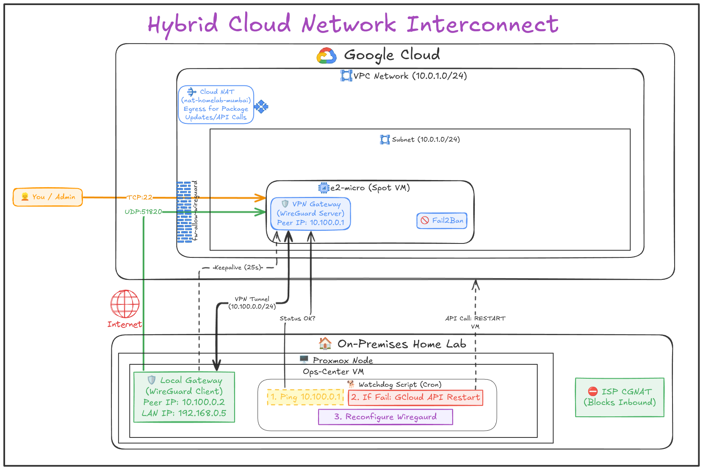
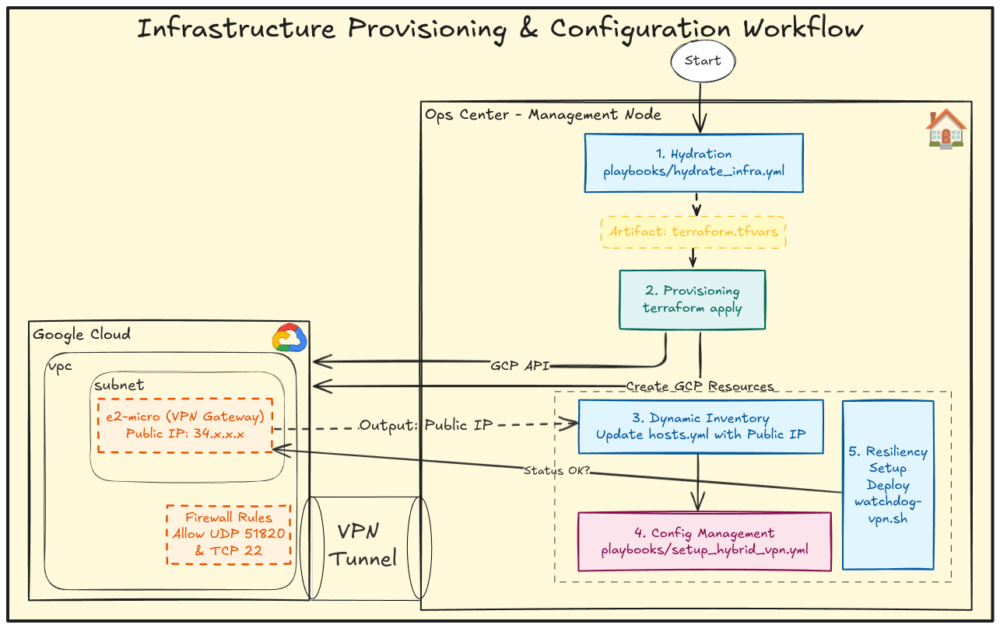

# Project 1 - Hybrid Cloud Network Interconnect

**Severity:** P2 (High - Network Interconnect Down)  
**Affected System:** WireGuard VPN Tunnel (Site-to-Site)  
**Severity:** P3 (Medium - Automation Failure)  
**Affected System:** `watchdog-vpn.sh` (GCloud CLI Authentication)  
**Status:** Production Ready ✅

---

## 1. Executive Summary
The goal was to extend my on-premises Proxmox laboratory (India) into the Public Cloud (GCP Mumbai) to create a "Sovereign Cloud" platform. Instead of using expensive Managed Services (Cloud VPN, Dedicated Interconnect), I engineered a cost-optimized, RFC-compliant Site-to-Site VPN using open-source tools.

## 2. Architecture Decisions
> Architecture Diagrams:

### 2.1 The Connectivity Layer: WireGuard vs. OpenVPN vs. IPsec
I evaluated three protocols for the tunnel:

| Protocol | Pros | Cons | Verdict |
| :--- | :--- | :--- | :--- |
| **IPsec (StrongSwan)** | Industry Standard | Complex config, high CPU overhead | ❌ Rejected |
| **OpenVPN** | Ubiquitous | Slower throughput, "chatty" protocol | ❌ Rejected |
| **WireGuard** | Kernel-level speed, modern cryptography, simple code | UDP blocking risks | ✅ **Selected** |

**Decision:** I chose WireGuard for its low attack surface (<4k lines of code) and high throughput on low-power VMs.

### 2.2 Infrastructure as Code: Terraform
To ensure the cloud environment is reproducible, I utilized Terraform.
* **Modularization:** Refactored resources into a Naming Convention standard (`[resource]-[env]-[region]`) to support future multi-region expansion.
* **State Management:** Migrated local state to **GCS (Google Cloud Storage)** to prevent state drift and enable collaboration.

### 2.3 Cost Optimization: The "Spot" Gateway
A dedicated Cloud VPN Gateway costs ~$25/month. To achieve near-zero cost:
* **Compute:** Used `e2-micro` Spot Instance (~$3/mo).
* **Trade-off:** Spot instances can be preempted.
* **Mitigation:** Designed the Ansible playbook to be idempotent. When the VM is preempted, I simply restart it and re-run Ansible to update the peer endpoint.

## 3. Technical Implementation Details

### 3.1 Network Topology
* **On-Prem CIDR:** `192.168.0.0/24`
* **Cloud CIDR:** `10.0.1.0/24`
* **VPN Overlay:** `10.100.0.0/24`

This strictly follows RFC 1918 to avoid IP overlap.

### 3.2 Security Hardening
* **Firewall:** The GCP Firewall is restricted to allow UDP/51820 only.
* **SSH Protection:** Implemented **Fail2Ban** on the Gateway to automatically ban IPs attempting brute-force attacks.
* **Identity:** Used Google Cloud OS Login for SSH access, eliminating the need to manage static SSH keys.
### 3.3 Automated Self-Healing (The Watchdog)
To mitigate the risk of Spot Instance termination, I implemented a Bash-based watchdog (`scripts/watchdog-vpn.sh`) with cronjob.
* **Logic:** Pings the tunnel IP every 15 minutes.
* **Remediation:** If down, it queries GCP API to check VM status. If `TERMINATED`, it issues a start command, captures the new Ephemeral IP, updates the Ansible inventory using `sed`, and re-triggers the configuration playbook.
* **Result:** Maximum downtime reduced from "until I notice" to ~15 minutes.

## 4. Challenges & Solutions

>**Challenge:** *WireGuard Handshake failures due to NAT.*

**Context:** My home ISP places the server behind a CGNAT (Carrier Grade NAT), making direct inbound connections impossible.

**Solution:** Configured `PersistentKeepalive = 25` on the Home (Client) side. This forces the home router to keep the NAT mapping open, allowing the Cloud (Server) to push packets back through the established tunnel.

>**Challenge:** Automated script failed due to GCloud authentication context. 

**Context:** Running the watchdog as root (via cron or sudo) caused gcloud to fail because credentials are stored in the user's home directory ($HOME/.config/gcloud). 

**Solution:** Configured the script to run as the unprivileged user (devops). Pre-provisioned the /var/log/ file with correct ownership chown devops:devops to allow logging without privilege escalation.

---
