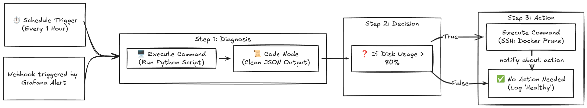

# Project: Homelab-Ops Self-Healing Infrastructure
> A Kubernetes-based automation platform designed to monitor, diagnose, and auto-remediate bare-metal infrastructure issues using industry-standard DevOps practices.

## Architecture

The system bridges the gap between containerized logic (K3s) and physical hardware (Proxmox) using a secure, identity-based command channel.



## Key Features

* **Custom Docker Image:** Built from scratch (`node:20-bullseye-slim`) to ensure Python 3 compatibility and unrestricted shell access.
* **Host Networking Bypass:** Kubernetes Pod configured with `hostNetwork: true` to bypass overlay network isolation and communicate directly with local LAN resources.
* **Identity-Based Access:** SSH Password authentication disabled. All automation uses a dedicated `ed25519` keypair managed via Kubernetes Secrets.
* **Principle of Least Privilege:** Automation user (`devops`) is restricted via `sudoers` to only execute remediation commands (`df`, `docker prune`), preventing system-wide compromise.

## Components

| Component | Role | Configuration Highlights |
| --- | --- | --- |
| **n8n** | Orchestrator | Custom Image, Python Integration, Webhook Triggers |
| **K3s** | Container Runtime | Lightweight Kubernetes, Traefik Ingress, Local Path Provisioner |
| **Proxmox** | Infrastructure | Hosting K3s VMs, Target for Remediation Scripts |
| **Python** | Logic Layer | Custom scripts (`remediate.py`) to parse system stats into JSON |

## ⚙️ Setup & Deployment

### 1. Build Custom Image

The standard n8n image is Alpine-based and restricted. We built a Debian variant to support Python scripting.

```bash
docker build -t homelab/n8n-custom:v6 ./apps/n8n/

```

### 2. Deploy to Kubernetes

The deployment uses `hostNetwork` to ensure reliable connectivity to the Proxmox host.

```yaml
spec:
  hostNetwork: true
  dnsPolicy: ClusterFirstWithHostNet
  containers:
    - name: n8n
      image: homelab/n8n-custom:v6

```

### 3. Secure Identity Injection

The SSH private key is injected into the container at runtime (Read-Only).

```bash
kubectl create secret generic n8n-ssh-key --from-file=id_rsa=~/.ssh/n8n_master

```

## The Self-Healing Workflow

1. **Trigger:** Scheduled Cron (e.g., every hour) or Webhook.
2. **Diagnose:** n8n executes Python script via SSH to check disk usage on Proxmox.
3. **Decision:**
* *If Usage < 80%:* Log status "Healthy".
* *If Usage > 80%:* Trigger Remediation.


4. **Remediation:** n8n executes `sudo docker system prune -f` on Proxmox to free space.
5. **Notification:** Sends report to Admin (Discord/Slack/Email).

## Security Hardening

* **Root Disabled:** Automation runs as `devops` user, not `root`.
* **Sudo Restrictions:** `/etc/sudoers.d/n8n-automation` limits command scope.
* **Network Allow-list:** Proxmox `hosts.allow` configured to trust only the Cluster Network.

---

*Maintained by Vijay Singh (vsingh55)*

