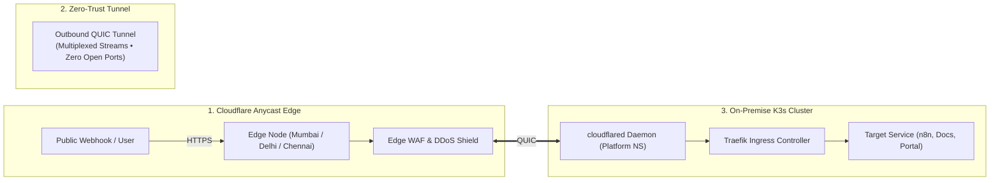

# Case Study: Zero-Trust Hybrid Ingress Engine & CGNAT Traversal

> **Domain:** Platform Engineering / Cloud Networking / Security  
> **Key Technologies:** Cloudflare Zero Trust, `cloudflared`, Traefik, QUIC, Anycast DNS  
> **Target Roles:** DevOps Engineer, Platform Engineer, Site Reliability Engineer  

---

## 1. Executive Summary

Residential internet connections operate behind Carrier-Grade NAT (CGNAT), preventing inbound connections without opening firewall ports or purchasing expensive public IP leases. This project engineered a zero-trust public ingress architecture that safely terminates public web traffic and external webhooks into a private on-premise Kubernetes cluster. 

By replacing an experimental cross-continental cloud relay with Cloudflare Zero Trust Anycast Tunnels, the solution slashed edge latency by ~97% (from ~500ms to <15ms), eliminated recurring cloud compute and NAT costs, and reduced the network attack surface to zero open inbound ports.

---

## 2. The Problem: The Ingress Trilemma

When exposing on-premise workloads to public users and automated webhooks, engineers face three conflicting requirements:

1. **Security:** Exposing home router ports (80/443) invites brute-force SSH attacks, automated port scans, and DDoS assaults directly to the home LAN.
2. **Connectivity:** Residential ISPs rarely provide public IP addresses. Behind CGNAT, standard port-forwarding rules are non-functional.
3. **Performance & Cost:** Early iterations used a cloud VM in South Carolina running WireGuard. Traffic traversed two continents (India $\to$ US $\to$ India), creating a 500ms latency penalty and recurring cloud egress bills.

---

## 3. Architecture & Traffic Flow

---

## 4. Key Engineering Decisions & Implementation

### 1. Outbound-Only QUIC Tunnels
The in-cluster `cloudflared` daemon establishes outbound-only UDP connections (port 7844) to Cloudflare's Anycast edge nodes. The physical home firewall blocks all inbound traffic while allowing outbound connections, rendering the cluster invisible to public port scanners (e.g. Shodan).

### 2. High-Availability Traefik Mapping
Rather than creating separate tunnel ingress rules for every internal service, the tunnel routes all subdomain traffic directly to the in-cluster Traefik Ingress controller:
* `*.vijaysingh.cloud` $\to$ `http://traefik.kube-system.svc.cluster.local:80`
* Traefik performs internal host routing, path matching, and header propagation.

### 3. Edge DDoS Mitigation & SSL Lifecycle
SSL/TLS certificates are generated and terminated at the Cloudflare edge. Cloudflare's automated Web Application Firewall (WAF) mitigates Layer 7 attacks, HTTP floods, and malformed payloads before they reach the on-premise hardware.

---

## 5. Quantified Engineering Impact

| Metric | Legacy Cloud Gateway (v2) | Cloudflare Zero Trust (Current) | Improvement |
| :--- | :--- | :--- | :--- |
| **Roundtrip Latency** | ~450ms – 550ms | **< 15ms** | **~97% Latency Reduction** |
| **Open Firewall Ports** | 1 (UDP 51820 on cloud VM) | **0 (Zero open inbound ports)** | **Attack Surface Eliminated** |
| **Cloud Ingress Cost** | ~$10 – $15 / month | **₹0.00 / month** | **100% Cost Elimination** |
| **Edge Redundancy** | Single VM in us-east1 | **Multi-PoP Anycast (Global)** | **High Availability Edge** |
