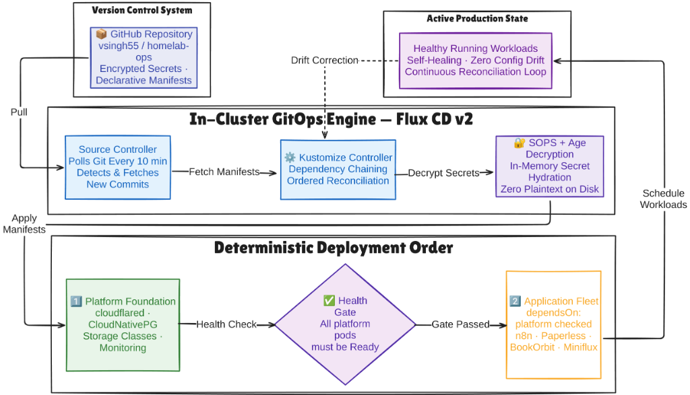

# Case Study: Declarative GitOps Continuous Delivery & In-Git Secrets

> **Domain:** Platform Engineering / GitOps / Secret Management 
> **Key Technologies:** Flux CD v2, Kustomize, Mozilla SOPS, Age Cryptography, GitHub 
> **Target Roles:** Platform Engineer, Cloud Native Architect, DevOps Engineer 

---

## 1. Executive Summary

Imperative deployments (`kubectl apply` executed manually from local terminals) create configuration drift, untracked changes, and potential security leaks. This project transformed the entire Kubernetes platform into a pull-based **GitOps Continuous Delivery Engine** powered by **Flux CD v2**. 

To maintain strict security without the operational overhead of an external secret vault cluster, declarative secrets are encrypted directly inside Git using **Mozilla SOPS and Age asymmetric cryptography**. Secrets are decrypted strictly in-memory by the Flux controller, ensuring zero plaintext exposure across the code repository and physical disks.

---

## 2. The Problem: Configuration Drift & Secret Management

1. **Deployment Drift:** When multiple engineers or ad-hoc scripts execute `kubectl apply`, cluster state quickly deviates from Git repository definitions. When outages occur, recreating the cluster from scratch is nearly impossible.
2. **Boot-Order Race Conditions:** Application workloads fail to start if required CRDs, storage classes, or database operators are still pending initialization.
3. **The Secret Leak Dilemma:** Storing unencrypted Kubernetes secrets in Git is a critical security vulnerability. Conversely, running an external HashiCorp Vault cluster on a 16GB host consumes ~1.5GB of precious RAM and requires complex unseal choreography.

---

## 3. GitOps Delivery & Secret Decryption Pipeline

---

## 4. Key Architectural Implementations

### 1. In-Git Asymmetric Encryption (SOPS + Age)
- Developers encrypt secrets locally using the public Age key (`.sops.yaml`).
- Encrypted files (`*.enc.yaml`) are committed directly to Git. Git history contains only cryptographically secure ciphertext.
- The Flux Kustomize controller holds the private Age key inside a protected Kubernetes secret (`sops-age`) and decrypts the secret directly into cluster memory during reconciliation.

### 2. Deterministic Stage Chaining (`dependsOn`)
To prevent race conditions during cluster bootstrap or node recovery:

- The `platform` Kustomization initializes CRDs, the CloudNativePG operator, and the `cloudflared` ingress daemon.
- The `apps` Kustomization explicitly declares `dependsOn: platform`. Applications are never scheduled until all platform health probes report ready.

### 3. Automated Self-Healing (10-Minute Loop)
If an unauthorized manual change or accidental deletion occurs in the cluster, Flux detects the difference within 10 minutes (or instantly upon webhook trigger) and automatically restores the cluster to the exact state committed to Git.

---

## 5. Quantified Engineering Impact

| Capability | Imperative Baseline (v2) | GitOps + SOPS (Current) | Impact |
| :--- | :--- | :--- | :--- |
| **Configuration Drift** | Frequent untracked manual edits | **0% Drift (Continuous Reconciliation)** | **Self-Healing Infrastructure** |
| **Secret Storage** | Plaintext in memory / Local disk | **Asymmetric In-Git Encryption (Age)** | **Zero Secret Leaks in Git** |
| **Boot Reliability** | Manual dependency timing | **Automated `dependsOn` Chaining** | **Zero Failed Workload Boots** |
| **Cluster Recovery Time** | Hours of manual script execution | **< 15 minutes (Automated Pull)** | **Rapid Disaster Recovery** |
