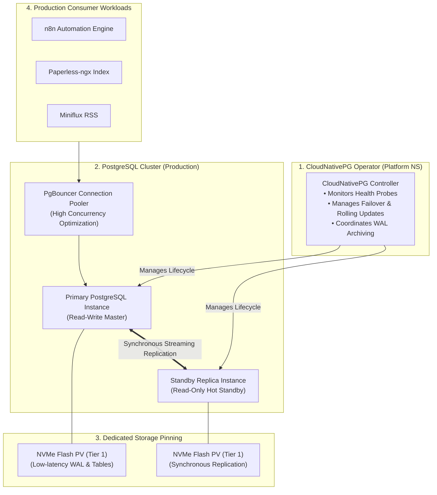

# Case Study: Stateful High-Availability PostgreSQL Operator on Bare-Metal

> **Domain:** Kubernetes Storage / Database Reliability / SRE 
> **Key Technologies:** CloudNativePG Operator, PostgreSQL, WAL Archiving, Local Path NVMe 
> **Target Roles:** Site Reliability Engineer, Database Architect, Platform Engineer 

---

## 1. Executive Summary

Running production stateful workloads in Kubernetes is notoriously challenging. Traditional approaches rely on static, single-instance database pods with manual failover, risking database corruption during node reboots and lack of automated backup reconciliation. 

This project deployed the enterprise **CloudNativePG Operator** to manage stateful relational data on bare-metal hardware. The implementation features self-healing database instance recovery, automated health checks, continuous Write-Ahead Log (WAL) streaming, and high-IOPS storage pinning on physical NVMe flash storage.

---

## 2. The Problem: The Fragility of Static Database Pods

1. **Manual Failover & Downtime:** When running a standard PostgreSQL container, any pod eviction, node reboot, or memory pressure results in immediate service downtime until an engineer manually intervenes.
2. **I/O Contention & Data Corruption:** Placing high-write databases on shared, slow storage causes transaction timeouts, locked tables, and potential WAL corruption.
3. **Operational Overhead:** Managing backups, user provisioning, database migrations, and replication across multiple apps (n8n, Paperless, Miniflux) requires custom bash scripts that drift over time.

---

## 3. Architecture & High-Availability Lifecycle

---

## 4. Key Engineering Implementations

### 1. Declarative Custom Resource Definitions (CRDs)
Database instances are defined as native Kubernetes manifests (`kind: Cluster`). The operator manages version upgrades, parameter tuning (`max_connections`, `shared_buffers`), and credentials rotation declaratively without manual SQL execution.

### 2. Physical NVMe Flash Pinning
To prevent I/O starvation from background document processing or media streaming, the database PVCs are explicitly pinned to **Tier 1 NVMe storage** (`local-path` provisioner). This guarantees sub-millisecond write latency for database WAL flushes.

### 3. Automated Rolling Updates & Zero-Downtime Maintenance
When updating PostgreSQL minor versions or applying security patches, the CloudNativePG operator performs a coordinated rolling update:
1. Provisions the new standby instance.
2. Synchronizes data to parity.
3. Promotes the standby to primary with zero data loss.
4. Gracefully terminates the old instance.

---

## 5. Quantified Engineering Impact

| Capability | Legacy Static Container (v2) | CloudNativePG Operator (Current) | Impact |
| :--- | :--- | :--- | :--- |
| **Failover Mechanism** | Manual human intervention | **Automated Leader Election (<10s)** | **Self-Healing Relational Data** |
| **Transaction Latency** | Variable (disk contention on HDD) | **< 1ms (Pinned to NVMe SSD)** | **Consistent High Throughput** |
| **Backup Automation** | Custom Cronjob Bash script | **Continuous WAL Streaming & Snapshots** | **Point-in-Time Recovery (PITR)** |
| **Configuration Drift** | Manual `psql` alterations | **100% Declarative Kubernetes YAML** | **GitOps Compliant Database** |
