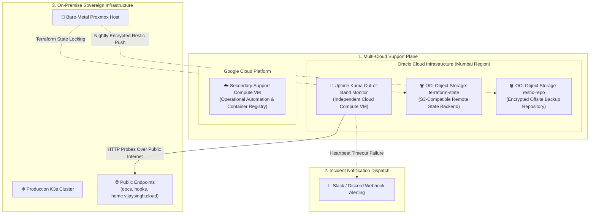

# Case Study: Multi-Cloud Resilience, Out-of-Band Observability & 3-2-1 DR

> **Domain:** Multi-Cloud Architecture / SRE / Disaster Recovery / FinOps  
> **Key Technologies:** Oracle Cloud (OCI Mumbai), Google Cloud (GCP), Uptime Kuma, Restic, Terraform S3  
> **Target Roles:** Cloud Architect, Site Reliability Engineer, FinOps Specialist  

---

## 1. Executive Summary

A monitoring system running inside the very cluster it monitors is fundamentally flawed: if the local network, electricity, or physical server suffers a catastrophic failure, internal monitoring goes dark and cannot alert the engineering team. Furthermore, co-locating backup files on the same physical host leaves systems vulnerable to disk failure or physical loss.

This project engineered a **Multi-Cloud Hybrid Support Architecture** leveraging **Oracle Cloud Infrastructure (OCI)** and **Google Cloud Platform (GCP)**. It decouples critical operational dependencies—external health monitoring, Terraform remote state locking, and encrypted 3-2-1 backup repositories—into out-of-band cloud environments while maintaining an ultra-lean, cost-optimized cloud footprint.

---

## 2. The Problem: The "In-Band Monitoring" & "Co-Located Backup" Trap

1. **The Blind Outage Trap:** If the homelab's ISP broadband disconnects or power drops, internal Prometheus and Grafana alerts are isolated locally and cannot reach external webhooks or mobile notifications.
2. **State Locking Vulnerability:** Storing Terraform state on local disks risks state corruption during concurrent runs and permanent infrastructure blindness if the local drive crashes.
3. **Disaster Recovery Failure:** Storing VM snapshots strictly on a local hard drive violates the **3-2-1 Backup Rule**, leaving the platform defenseless against physical fire, flood, hardware failure, or theft.

---

## 3. Multi-Cloud Hybrid Support Architecture

---

## 4. Key Engineering Implementations

### 1. Independent Out-of-Band Health Probing (Uptime Kuma on OCI)
An independent cloud compute instance in OCI Mumbai runs **Uptime Kuma** in a dedicated Docker runtime:
* Probes all public endpoints (`docs.vijaysingh.cloud`, `hooks.vijaysingh.cloud`, `home.vijaysingh.cloud`) over the public internet every 60 seconds.
* Pings home hypervisor heartbeat endpoints over the Tailscale mesh overlay.
* If response status drops or latency exceeds SLA boundaries, Uptime Kuma immediately dispatches high-priority alerts to Discord and Slack webhooks independently of local hardware status.

### 2. Off-Site Terraform Remote State Backend (S3 API)
* Terraform state files are decoupled from local workstations and stored in an OCI Object Storage bucket using standard S3 compatibility.
* State locking prevents race conditions and accidental concurrent state writes.

### 3. True 3-2-1 Disaster Recovery (Encrypted Restic Sync)
* **Nightly Snapshot:** Proxmox creates ZSTD-compressed VM snapshots on the local 1TB SATA drive.
* **Encrypted Cloud Sync:** A systemd-automated Restic pipeline encrypts snapshot dumps with AES-256 and synchronizes them to OCI Object Storage.
* **Result:** The system satisfies the gold-standard 3-2-1 rule: 3 copies of data, across 2 different physical media types (NVMe + SATA), with 1 copy stored in a geographically independent cloud datacenter.

---

## 5. Quantified Engineering Impact

| Capability | Legacy Single-Host Baseline (v2) | Multi-Cloud Hybrid Architecture (Current) | Impact |
| :--- | :--- | :--- | :--- |
| **Outage Notification** | Silent failure until manually discovered | **Instant Webhook Alert (<60s)** | **Immediate Incident Visibility** |
| **Terraform State Durability** | Trapped on local laptop disk | **Cloud S3 Object Storage with Locking** | **Zero Risk of State Loss** |
| **Disaster Recovery Posture** | Co-located local backups only | **Validated 3-2-1 Cloud Replication** | **Resilient to Total Hardware Loss** |
| **Cloud FinOps Efficiency** | Recurring expensive ingress gateways | **Optimized Multi-Cloud Footprint** | **Enterprise Resilience at Minimal Cost** |
