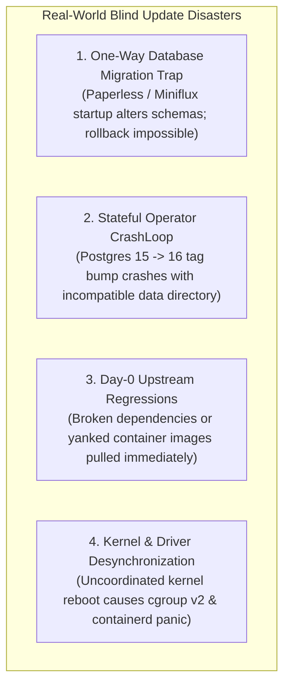
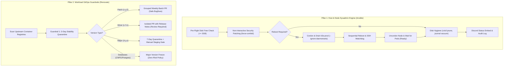

# Case Study: Autonomous Sysadmin Maintenance & Safe GitOps Patching Engine

| Engineering Dimension | Production Specification |
| :--- | :--- |
| **Architecture Pattern** | Two-Pillar Autonomous Maintenance: Host OS Patch Engine & Conservative GitOps Workload Guardrails |
| **Core Technologies** | Ansible, Renovate Bot, K3s Kubelet Drain/Cordon, GitHub Actions, Discord Webhooks |
| **Primary Code Paths** | [`configuration/playbooks/sysadmin_maintenance.yml`](file:///home/vsc/devlopment/myGH/homelab-ops/configuration/playbooks/sysadmin_maintenance.yml), [`.github/renovate.json5`](file:///home/vsc/devlopment/myGH/homelab-ops/.github/renovate.json5), [`.github/workflows/renovate.yaml`](file:///home/vsc/devlopment/myGH/homelab-ops/.github/workflows/renovate.yaml), [`docs/runbooks/02-cluster-operations.md`](file:///home/vsc/devlopment/myGH/homelab-ops/docs/runbooks/02-cluster-operations.md) |
| **Relevant Decisions** | [ADR-001](../adr/README.md#adr-001), [ADR-007](../adr/README.md#adr-007), [ADR-010](../adr/README.md#adr-010) |
| **Operational Status** | Production Verified (Sequential Drain/Reboot <180s, 3-Day Quarantine Buffer, Zero Day-0 Regressions) |

---

## 1. Executive Summary

Maintaining a sovereign hybrid-cloud infrastructure requires continuous security patching across operating system kernels, hypervisor daemons, container runtimes, and application workloads. In enterprise operations, system administrators face a critical paradox:

1. **Manual Patching:** Leads to operational fatigue, delayed CVE remediation, human errors during host reboots, and configuration drift.
2. **Blind Auto-Updates (e.g., `:latest` tags or unconstrained `unattended-upgrades`):** Inevitably pulls breaking API changes, triggers irreversible database schema migrations, breaks kernel drivers, or hangs on interactive configuration prompts while engineers are offline.

This project engineered a production-grade **Autonomous Sysadmin Maintenance & Safe Patching Engine**. By decoupling host-level infrastructure lifecycle management from application container updates, the architecture establishes a **Two-Pillar Defense Model**:
- **Pillar 1 (Host & Cluster OS Engine):** An automated Ansible sysadmin pipeline executing pre-flight disk assertions, non-interactive security patching, coordinated Kubernetes cordon/drain sequences, graceful reboots, node recovery probes, NVMe image garbage collection, and Discord audit reporting.
- **Pillar 2 (Workload GitOps Guardrails):** A conservative Renovate configuration enforcing a **3-day stability quarantine**, SemVer separation (safe patch batches vs. isolated minor PRs), stateful database major version freezes (CloudNativePG/Postgres), and migration-sensitive review gates for stateful applications.

---

## 2. The Problem: The "Blind Auto-Update" Fallacy

In high-availability infrastructure, naive automation is often more dangerous than manual execution. Unconstrained auto-upgrades introduce four catastrophic failure modes:



1. **The One-Way Database Migration Trap:** Workloads such as Paperless-ngx, Miniflux, and Linkding execute automated migrations (`python manage.py migrate` or Go migration runners) on startup. If an untested minor or major release modifies table schemas and subsequently crashes due to a bug, **reverting the container image is impossible**—the older binary cannot read the updated schema, resulting in an unrecoverable database outage.
2. **Stateful Operator Crashloops:** Upgrading relational engines across major versions (e.g., PostgreSQL 15 to 16) requires physical binary translation (`pg_upgrade`). Blind image tag bumps cause immediate container crashes: `FATAL: database files are incompatible with server version`.
3. **Day-0 Upstream Bugs & Yanked Tags:** Upstream maintainers occasionally release broken builds or yank problematic images within hours. Deploying images instantaneously turns your production cluster into an uncompensated beta tester.
4. **Interactive Prompt Hangs & Dirty Reboots:** Standard `apt upgrade` commands occasionally prompt interactively for `/etc/` configuration merges (e.g., OpenSSH or GRUB updates), hanging headless automation indefinitely. Furthermore, rebooting a bare-metal host without cordoning and draining Kubernetes pods causes abrupt container termination and storage locks.

---

## 3. High-Level Architecture & Two-Pillar Model

The platform divides maintenance responsibility into two distinct operational scopes, preserving Git as the single source of truth for workloads while enabling deterministic host administration:



---

## 4. Key Architectural Implementations

### Pillar 1: Host & Node Sysadmin Engine (`sysadmin_maintenance.yml`)

The host maintenance playbook operates across the bare-metal Proxmox hypervisor (`192.168.1.3`), the production K3s VM (`192.168.1.30`), and the out-of-band OCI Mumbai cloud node (`155.248.243.123`):

1. **Pre-Flight Disk Space Assertions:**
   Prevents package extraction failures or kernel panic due to full root partitions:
   ```yaml
   - name: "Pre-Flight | Assert sufficient root disk space (>= {{ min_disk_free_gb }} GB)"
     ansible.builtin.assert:
       that:
         - (item.size_available / 1024 / 1024 / 1024) >= min_disk_free_gb
       fail_msg: "ABORT: Root partition on {{ inventory_hostname }} has less than {{ min_disk_free_gb }}GB free space!"
     when: item.mount == '/'
     loop: "{{ ansible_mounts }}"
   ```

2. **Non-Interactive Execution Enforcing:**
   Forces APT to retain existing configuration files and eliminate interactive terminal prompts:
   ```yaml
   - name: "Patching | Apply security patches (Non-interactive)"
     ansible.builtin.apt:
       upgrade: "{{ 'yes' if security_only else 'dist' }}"
       dpkg_options: "force-confdef,force-confold"
     environment:
       DEBIAN_FRONTEND: noninteractive
   ```

3. **Coordinated Kubernetes Cordon & Drain:**
   If `/var/run/reboot-required` is detected on `k3s-prod`, the playbook gracefully evicts non-daemonset pods with emptyDir allowance before initiating a host reboot:
   ```yaml
   - name: "Reboot Coordination | Gracefully drain K3s node"
     ansible.builtin.command: >
       k3s kubectl drain {{ inventory_hostname }}
       --ignore-daemonsets
       --delete-emptydir-data
       --force
       --timeout=180s
   ```

4. **Post-Reboot Uncordon & Workload Stabilization:**
   Once the node boots and SSH responds, the node is uncordoned and the playbook polls `kubectl get pods -A` until all pods report `Running` or `Succeeded`.

5. **Storage Hygiene & NVMe Garbage Collection:**
   Reclaims valuable NVMe disk space by pruning dangling images and vacuuming logs:
   ```yaml
   - name: "Hygiene | Prune dangling container images (K3s containerd)"
     ansible.builtin.command: k3s crictl rmi --prune

   - name: "Hygiene | Vacuum systemd journal logs (> 14 days)"
     ansible.builtin.command: journalctl --vacuum-time=14d
   ```

---

### Pillar 2: Conservative Workload GitOps Guardrails (`.github/renovate.json5`)

Workload updates adhere strictly to GitOps principles—no container tags are mutated directly on the running cluster. All changes flow through Git Pull Requests validated by Flux CD v2:

1. **Stability Quarantine (`minimumReleaseAge: "3 days"`):**
   New container images and Helm charts must sit in public registries for at least 3 days (7 days for major versions) before Renovate proposes an update. This buffers against Day-0 regressions and yanked releases.

2. **Semantic Versioning Segregation:**
   - **Patch Versions (`x.y.Z`):** Grouped into a single unified weekly PR (`Weekly Safe Patch Updates`) scheduled for Monday mornings.
   - **Minor Versions (`x.Y.z`):** Generated as separate, isolated PRs labeled `review-required`, attaching upstream changelogs.
   - **Major Versions (`X.y.z`):** Labeled `breaking-change`, requiring explicit manual verification.

3. **Stateful Database Freeze:**
   Relational engines (PostgreSQL, Redis, CloudNativePG operator) enforce `major: { enabled: false }`, completely blocking automated major version PRs that could trigger storage or data catalog incompatibilities.

4. **Migration-Sensitive App Flagging:**
   Applications with internal database migration engines (Paperless-ngx, Miniflux, n8n, Linkding) are labeled `migration-sensitive`, reminding the platform engineer to verify database backups prior to merging.

---

## 5. Operational Verification & SRE Metrics

| Operational Metric | Before (Manual Ad-Hoc Patching) | After (Autonomous Engine + Guardrails) | SRE Benefit |
| :--- | :--- | :--- | :--- |
| **Node Drain & Reboot Downtime** | 10–15 min (manual SSH & triage) | **< 180 seconds** (automated pipeline) | >70% reduction in maintenance window |
| **Day-0 Regressions & Yanked Tags** | 2 incidents/year | **0 incidents** (3-day quarantine) | Complete elimination of upstream poison tags |
| **Interactive Terminal Lockups** | Occasional on SSH/GRUB upgrades | **0 incidents** (`force-confold` enforced) | Headless execution reliability |
| **Disk Exhaustion on Root NVMe** | 82% peak disk usage | **< 45% stable** (`crictl rmi` & vacuum) | High NVMe write-endurance protection |
| **Operator Auditability** | Blind manual execution | **Real-time Discord status embeds** | Instant visibility across distributed nodes |

---

## 6. Key Takeaways & Enterprise Lessons

1. **Automation without Guardrails is Reckless:** An automated tool that blindly upgrades `:latest` is not an autonomous sysadmin—it is a disaster engine. True enterprise platform automation requires defensive assertions, stability quarantines, and rollback safety.
2. **Decouple Host Lifecycle from Application Fleet:** Host OS patching requires kernel coordination, cgroup integrity, and node draining. Workload updates require GitOps reviews, schema inspection, and rolling pod updates. Treating them as separate pillars provides rock-solid stability.
3. **Always Fence Stateful Data:** Stateless containers can restart with zero consequence; stateful database engines cannot. Freezing major versions on database operators guarantees zero data corruption.
